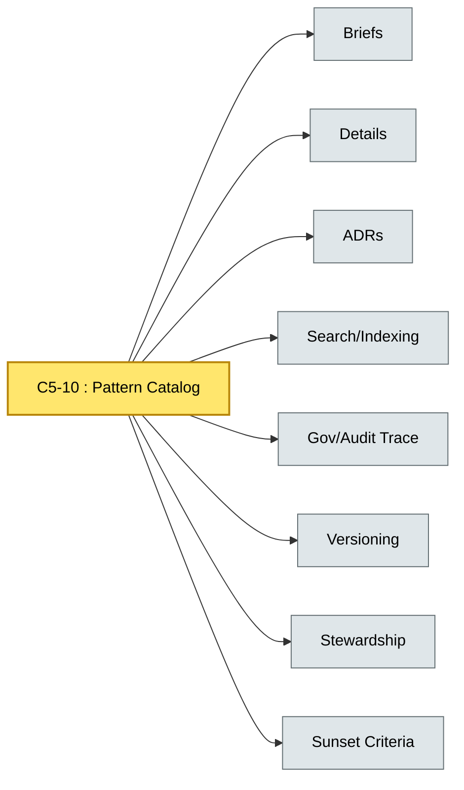

# [C5-10] Pattern Catalog — BRIEF
> **Category:** C5 — Patterns & Archetypes · **Difficulty:** ●/◑/○ · **Banking-relevant:** yes
> **One-liner:** The C5-10 Pattern Catalog is a unified, EA-maintained inventory of all patterns across C5, with cross-references, versioning, and governance metadata, so that enterprise architects and teams can search, compare, and govern pattern adoption at scale.
> **Why an EA cares:** It is the single source of truth for recurring architectural solutions; without it, teams reinvent patterns, violate ECG resolutions, and auditors cannot trace decisions to a centralized registry.

## Quick definition
A pattern catalog is a curated, version-controlled database of patterns, including briefs, details, adoption signals, and the relationships and lineage between them. It enables discovery (search by domain, maturity, compliance), governance (who owns the pattern, who approves it), and traceability (ADRs linked to patterns).

## Key ideas / terms
- **Pattern classification:** Sort by C5 category, problem domain, maturity.
- **EA governance:** Owner, steward, approval authority, versioning, sunset criteria.
- **Pattern lifecycle:** Birth, growth, maturity, decline, sunset.
- **Pattern versioning:** Semantic versioning; backward compatibility.
- **Pattern search:** Assign key words (keyword taxonomy) to enable lookups by *problem*, *technology*, or *compliance*.
- **Pattern stewardship:** Who writes, reviews, approves, and audits adopted patterns.
- **Pattern versioning:** Semantic versioning (major/minor/patch) for pattern definitions.
- **Legacy patterns:** patterns replaced by newer patterns, or preserved for compatibility or legacy reasons.
- **Sunset criteria:** Process to deprecate patterns when new concerns or tools emerge.
- **RFC-style review:** Process for proposing new patterns.
- **Pattern discovery:** Use cases; structured keywords; owner-of-applications; related-patterns
- **Pattern metrics:** Searchability, adoption rate (how many projects use pattern); fragmentation risk (disagreeing definitions); age (how long).
- **Pattern evolution:** Editorial workflow; lightweight-copyright.

## The mental model
C5-10 is the *index card system* of C1-C4 architecture documentation—it is the *metadata layer* that binds briefs, details, ADRs, and decision records together. It is not a replacement for briefs and details; it is the directory.

## One diagram (mandatory)

## When to use / when NOT to use
- ✅ **Use when:** You have 5+ patterns and need to govern, search, cross-reference, and audit.
- ⚠️ **Avoid when:** Only 2-3 patterns; the overhead of a database or catalog outweighs the benefit.

## Banking 💳 example
A global bank maintains a C5-10 pattern catalog in a Confluence-based system where each pattern card links to its brief, detail, ADR, and compliance requirements (PCI-DSS, DORA, MiFID II). When a new team proposes a Data Vault^2.0 adoption (vs. Data-lake), they query the catalog, see the versioned comparison and stewardship metadata, and link their ADR to ADR-071 before committing budget.

## Common confusions (don't mix these up)
- **Pattern Catalog vs. Architecture Decision Record (ADR):** Catalog is *directory*; ADR is *decision of a specific project*.
- **Pattern Catalog vs. Knowledge Base:** Catalog is a *structured, governed library of patterns*; knowledge base includes blog posts, whitepapers, and ad-hoc notes.

## Interview / recall prompt
"Explain the Pattern Catalog's purpose in 2 minutes without notes." → 1) Master index for all C5 patterns; 2) Links briefs, details, ADRs; 3) Provides governance and search; 4) Enables audits; 5) Must keep up with regulators and evolving compliance.

---
**Status:** ✅ Covered · See detail doc: `details/C5-10-pattern-catalog.md`
