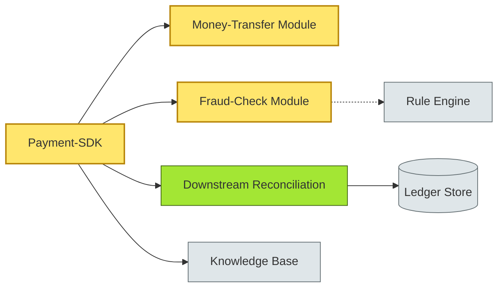

# [C6-01] SOLID, DRY, KISS — BRIEF

> **Category:** C6 — Design Philosophy & Quality Attributes · **Difficulty:** ● · **Banking-relevant:** yes
> **One-liner:** SOLID, DRY, and KISS are complementary grammar rules for maintainable object-oriented code that reduce technical debt in long-lived financial IT portfolios.
> **Why an EA cares:** Banking systems rarely retire; they mutate. SOLID boundaries protect core-banking modules from accidental breakage, DRY shared logic reduces duplicated fraud-rule code, and KISS keeps ad-hoc reporting pipelines from becoming unmaintainable.

## Quick definition

- **SOLID** (B of E and C) is a mnemonic for five object-oriented design principles that keep classes single-purpose and open for extension but closed for modification.
- **DRY** means every fact in a system lives in exactly one place; repetition is the enemy of consistency.
- **KISS** means prefer the simplest useful solution; complexity should be paid for, not borrowed.

## Key ideas / terms

- **Single Responsibility Principle:** A class should have one reason to change.
- **Open-Closed Principle:** Software entities should be open for extension, closed for modification.
- **Don't Repeat Yourself:** Every piece of knowledge must have a single unambiguous representation.
- **Keep It Simple, Stupid:** A system should be as simple as possible, but no simpler.

## The mental model

SOLID provides the *architecture grammar* (how parts are arranged), DRY provides the *content hygiene* (how facts are stored), and KISS provides the *editorial gate* (how much complexity is justified). Together they form the first line of defence against code rot in 15-year-old deposits-and-advances systems.

## One diagram (mandatory)

## When to use / when NOT to use

- ✅ **Use when:** building or refactoring long-lived domain services (loan-origination, funds-transfer, risk-aggregation).
- ⚠️ **Avoid when:** prototyping a sandbox proof-of-concept or writing throw-away ETL scripts where time-to-market dominates.

## Banking 💳 example

In a **CHAPS high-value-payment engine**, the `PaymentInstruction` entity should own only *transfer intent*; `ComplianceRuleEngine` owns *AML checks*; and `SettlementConfirmation` owns *post-trade matching*. If all three live in one monolithic class, a single change to the GBP-USD threshold testforces regression-test through the entire P&L path.

- **SOLID-B in action:** `TransferAmountBoundary` is a DTO with no domain logic; if a new R07 chasing limit arrives, only `TransferAmountBoundaryValidator` changes.
- **DRY in action:** fraud-rule JSON is loaded from a single `FraudRuleset v2.4`; downstream pricing, trade-capture, and customer-acceptance all reference it rather than embedding duplicate threshold constants.
- **KISS in action:** the night-time batch settlement process uses a simple state machine rather than a 3-service saga because the settlement window is < 2 hours and no partial refund is ever needed.

## Common confusions (don't mix these up)

- **SOLID vs architecture patterns:** SOLID is about class responsibilities; patterns (microservices, hexagonal, etc.) are about system topology. You can violate SOLID inside each service.
- **DRY vs single-source-of-truth:** DRY is a code rule; single-source-of-truth is a data-governance rule. DRY won't fix a shared view of a customer that two record types disagree on.
- **KISS vs oversimplification:** KISS means minimum complexity for the problem; it does not mean ignoring fraud-detection ML just to keep the UI clean.

## Interview / recall prompt
“Explain SOLID in 2 minutes without notes.” → Preview for redlining 1. Name all five principles by their letter. 2. Give one counter-example where violating SRP caused a production outage in a core-banking module. 3. Contrast solid versus fragile inheritance in an Active-Record-style ledger class.

---
**Status:** ✅ Covered · See detail doc: `[../details/C6-01-solid-dry-kiss.md](../details/C6-01-solid-dry-kiss.md)`
