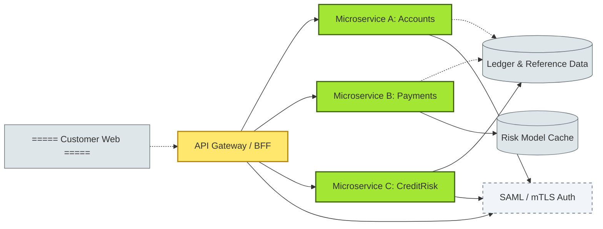

# [C6-02] Separation of Concerns — BRIEF

> **Category:** C6 — Design Philosophy & Quality Attributes · **Difficulty:** ◑ · **Banking-relevant:** yes
> **One-liner:** Separation of Concerns is the architectural discipline of dividing a system into distinct modules, each addressing a single functional area, so that a change in one concern never forces a regression in another.
> **Why an EA cares:** Banking middleware historically bundled security, pricing, persistence, and user-presentation; untangling those concerns caused a six-month delay during an Open-Banking PSD2 mandate because the security-audit team could not isolate the payment-services boundary.

## Quick definition

**Separation of Concerns** (SoC) is the principle that a software system should be partitioned into modules that address independent functional areas. Each module should expose a stable interface and hide its internal implementation.

## Key ideas / terms

- **Concern:** a specific functional interest (e.g. compliance, persistence, pricing, identity).
- **Boundary:** the set of interfaces or contracts that separate one module from another.
- **Vertically sliced vs horizontally layered:** vertical slices group related concerns by business capability; horizontal layers group by function (UI → Service → Data).
- **Meronomy:** one concern can contain sub-concerns (e.g. "trade-capture" contains "pricing" and "matching").

## The mental model

SoC is to architecture what a *separation of duties* policy is to internal control: it limits blast radius, simplifies audits, and lets different teams own different domains. In banking, concerns map directly to regulatory-audit boundaries (e.g. *AML* vs *credit-risk* vs *operations*).

## One diagram (mandatory)

## When to use / when NOT to use

- ✅ **Use when:** refactoring a monolith with > 50,000 LOC or enforcing regulatory segregation (e.g. payment steering must not share a database with AML).
- ⚠️ **Avoid when:** the product is a 3-week prototype or a single-team green-field service with < 3 exposed interfaces.

## Banking 💳 example

At a **Fortis-sized European retail bank**, the *Loans* product originally stored borrower data, credit-scoring logic, and interest-pricing tables in one Postgres schema. During the PSD2 mandate, the *Open-Banking* team could not audit the **CreditRisk** concern independently because a schema change to the worker-table accidentally deleted the **AML-monitoring** signal table. Re-architecting to physically separate `loans-service`, `aml-service`, and `payments-service`, each with its own schema, allowed the security team to sign off on **aml-service** without reviewing pricing logic.

- **SoC**: `InterestRateCalculator` lives in the pricing micro-service; it never sees borrower PII.
- **SoC boundary**: a gRPC contract between `LedgerService` and `Neo4j`-based BI feedback-loop; Neo4j never operates the settlement ledger.

## Common confusions (don't mix these up)

- **Cohesion vs Separation of Concerns:** Cohesion measures how closely items inside a module belong together; SoC measures how distinct modules are from each other. High cohesion can coexist with poor SoC, and vice versa.
- **SOLID's Single Responsibility vs SoC:** SRP is a *class-level* micro-concern (one reason to change); SoC is a *system-level* macro-concern (one business capability per module). Two classes can violate SRP while the system still respects SoC.
- **Hard boundary vs soft boundary:** A hard boundary requires multi-process or multi-database deployment; a soft boundary is a logical layer. Over-hardening creates performance overhead; under-hardening causes accidental coupling.

## Interview / recall prompt
“Explain SoC in 2 minutes without notes.” → 1. Name 3 concerns in a transfers-and-payments stack. 2. Explain why the interest-rate table must not live in the same schema as the AML-watch-list. 3. Sketch the difference between a layered onion and a vertical slice.

---
**Status:** ✅ Covered · See detail doc: `[../details/C6-02-soc-abstraction.md](../details/C6-02-soc-abstraction.md)`
