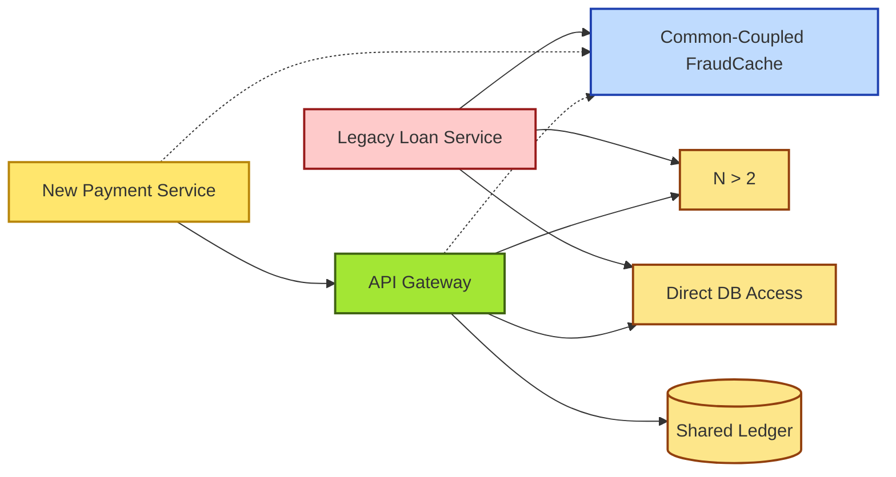

# [C6-03] Coupling & Cohesion — BRIEF

> **Category:** C6 — Design Philosophy & Quality Attributes · **Difficulty:** ◑ · **Banking-relevant:** yes
> **One-liner:** Coupling measures how tightly modules depend on each other; cohesion measures how strongly the elements inside a module belong together; together they dictate maintainability and testability in long-lived financial systems.
> **Why an EA cares:** The UK Tier-1 bank's *real-time payments* project spent six months untangling cross-concern data coupling before a single feature could ship, because the loan and payment layers shared a single relational schema.

## Quick definition

- **Coupling:** the degree of interdependence between software modules; high coupling means one module cannot change without affecting another.
- **Cohesion:** the degree to which elements inside a module belong together; high cohesion means a module has a single, well-defined responsibility.

## Key ideas / terms

- **Data coupling:** passing primitives or DTOs; least harmful.
- **Stamp coupling:** one module passes a complex object; receiver uses only one field; risk of interface breakage.
- **Control coupling:** one module passes a flag that controls another's behaviour — common in `if (visa) {}` branches in payment gateways.
- **Common coupling:** shared global or static state (e.g. a static `FraudScoreCache`).
- **Content coupling:** one module directly accesses another's internal data (`PaymentEngine.balance = value`).
- **Adhesion / Coupling-by-Abstraction:** message-bus contracts can create link coupling; interface name changes force downstream rebuilds.

## The mental model

Coupling is *between*, cohesion is *within*. In banking, low coupling + high cohesion = each bounded context can inspect, deploy, and test independently; this is the *operational-resilience* design that surviving 15-year-old core banking libraries all share.

## One diagram (mandatory)

## When to use / when NOT to use

- ✅ **Use when:** evaluating a micro-service mesh, defining interface contracts, or choosing between a monolith and a modular monolith.
- ⚠️ **Avoid when:** applying textbook coupling taxonomy to a single-unit test where coupling is intentionally by-design for performance.

## Banking 💳 example

In the **Faster Payments** scheme, the *outgoing* payment service needed to check the *borrower-limit* before executing a debit.  
- **Crude coupling:** `OutgoingPaymentService` directly called `LoanAccountDAO.getLimit()`.  
- **Refactored:** `OutgoingPaymentService` depends on `CreditLimitProvider` interface; a `StaticCacheAdapter` is injected for hot paths.  
- **Result:** the credit-risk team could change `LoanAccount` schema (dividing the principal column into `principal_cents` + `interest_accrued`) without the payments team touching a single line of payment-flow code.

### Cohesion in a compliance micro-service

A `ComplianceCheckEngine` with 60% cohesion-by-responsibility contains: KYC document validation, AML name-screening, sanctions list look-up, and transaction pattern analysis. Each of those is a *full vertical concern*. Breaking them into 4 micro-services improved cohesion from ~0.55 to ~0.88 and reduced the *blast radius* when a *sanction-list API* changed naming conventions.

## Common confusions (don't mix these up)

- **Coupling vs cohesion:** They are orthogonal. You can have low coupling + low cohesion (many unrelated classes in modules) or high coupling + high cohesion (one tightly-knit family of classes relied on by everything).
- **Coupling vs dependency:** "Dependency" is a weaker word; *coupling* implies a **degree** of affect (data vs content vs common).
- **Low coupling as always good:** Sometimes data coupling is deliberately high (e.g. in-memory batch processors) for performance.

## Interview / recall prompt
“Explain coupling and cohesion in 2 minutes without notes.” → 1. Define both. 2. Sketch the difference between *data coupling* and *common coupling*. 3. Give a banking example where high coupling caused an outage.

---
**Status:** ✅ Covered · See detail doc: `[../details/C6-03-coupling-cohesion.md](../details/C6-03-coupling-cohesion.md)`
