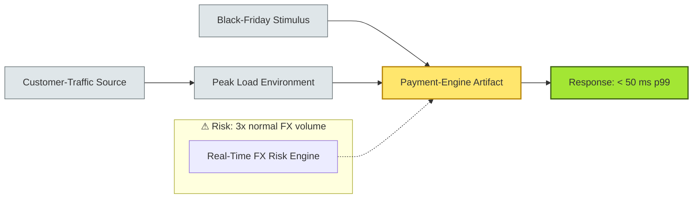

# [C6-04] Quality Attributes — BRIEF

> **Category:** C6 — Design Philosophy & Quality Attributes · **Difficulty:** ● ◑ ◐ · **Banking-relevant:** yes
> **One-liner:** Quality-attribute scenarios are concrete, examplable requirements (e.g. "99.99% of Faster Payments settle in < 30 seconds during a Black-Friday peak") that turn vague "-ilities" into architecturally testable commitments.
> **Why an EA cares:** Without quality-attribute scenarios, architecture is opinion; with them, it is a *contract* the CFO can review and the CRO can trust when signing off on a digital bank proposal.

## Quick definition

A **quality attribute** (QA) is a non-functional requirement that describes the characteristics of a system as a whole. The *standard* set includes Availability, Performance, Security, Operability, Scalability, Usability, and so on. A **quality-attribute scenario** speculates a stimulus, source, environment, artifact, and response.

## Key ideas / terms

- **-ility acronym list:** A, S, P, O, L, U (e.g. *Availability, Security, Performance, Operability, Scalability, Usability*).
- **Quality-Attribute Scenario (QAS):** a single concrete scenario in QAW format: *stimulus → source → environment → artifact → response*.
- **Tactical vs strategic:** Tactical QAs are *targeted* (e.g. "200 TPS"); strategic QAs are *top-level* (e.g. "Survive a Black-Friday peak").
- **QA in banking maps to regulations:** PSD2 (security), DORA (resilience), AML rules (observability), PCI-DSS (data protection), EU taxonomy (ESG reporting latency).

## The mental model

Quality attributes are the *currency* of architecture: every design decision is a *spend* of one attribute to *earn* another. A *Themed* payment rail may *buy* performance by *spending* security complexity (idempotency, distributed locking).

## One diagram (mandatory)

## When to use / when NOT to use

- ✅ **Use when:** evaluating a vendor, comparing architectures, or deciding between monolith and micro-services for a *core-banking* module.
- ⚠️ **Avoid when:** writing an internal onboarding document where *-ilities* are intentionally kept vague; QAs in such contexts are often gamed.

## Banking 💳 example

A **UK retail bank** was choosing between a *monolithic* transaction-processing module and a *micro-service mesh* for *faster payments*.  
- *Monolith:* coupled, easier to reason about; performance-tune single JVM; but a single log4j brute-force attack can reach *all* payment pipelines.
- *Micro-service:* network hops add latency; resilience must be *built in*; but a compromise of the *FX-pricing* service does not directly affect *debit* routing.

The EA wrote 12 QAs:
1. *Tactical:* "99.99% of Faster Payments settle in < 30 seconds under 5× normal volume."  
2. *Tactical:* "PII must never transit any queue; only encrypted events at rest."  
3. *Strategic:* "System must survive 24 hours of 3× peak after a single AZ failure without customer-facing degradation."

These QAs drove a *hybrid* decision: *payment-gateway* remained in the monolith for *latency*, but *fraud-risk*, *FX-pricing*, and *channel-provisioning* became micro-services with a *side-car* resilience pattern.

## Common confusions (don't mix these up)

- **Quality attribute vs non-functional requirement:** QAs are a *pre-defined set* (the 7-icon list); non-functional requirements is the *broader set* that also includes usability, maintainability, etc.
- **Strategic vs tactical QAs:** Strategic is "high-level" (Gistic); tactical is "measurable" (e.g. "60 TPS").
- **Quality attribute tests vs stress tests:** A QAT runs a *specific scenario* (stimulus + expected threshold); a stress test asks "how much can it take before it breaks."

## Interview / recall prompt
"Explain quality attributes in 2 minutes without notes." → 1. Name the *seven* QAs. 2. Write the *stimulus-source-environment-artifact-response* for *faster payments*. 3. Contrast a *tactical* and *strategic* QA for the same scenario.

---
**Status:** ✅ Covered · See detail doc: `[../details/C6-04-quality-attributes.md](../details/C6-04-quality-attributes.md)`
