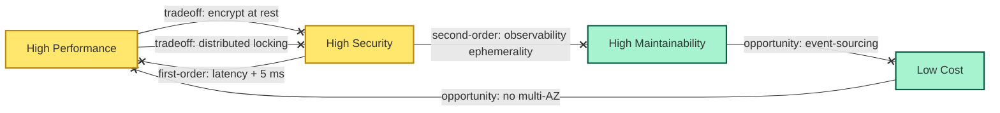

# [C6-05] Trade-offs — BRIEF

> **Category:** C6 — Design Philosophy & Quality Attributes · **Difficulty:** ◑ · **Banking-relevant:** yes
> **One-liner:** A trade-off is a *forced, conscious choice* between competing quality attributes, where any gain in one necessarily causes loss in another; architecture is the *negotiated settlement* of these conflicts.
> **Why an EA cares:** A copy-and-paste adoption of *AWS ECS* instead of *Kubernetes* for a *low-volume* bank was praised for *speed-to-market* but cost *6-month* feature-freeze because ECS offered *fewer observability signals*, hiding a *capacity-planning* trade-off that only surfaced during *DORA* stress testing.

## Quick definition

A **trade-off** is the act of *balancing* two or more competing requirements where improvement in one degrades another. In architectural decision-making, every choice is a trade-off — there is no *free lunch*.

## Key ideas / terms

- **Pareto frontier:** the set of optimal configurations where you cannot improve one QA without sacrificing another.
- **Satisficing:** good enough is acceptable; *optimal* is theoretical and often not worth the cost.
- **Opportunity cost:** the *value of the next-best alternative* that is forgone.
- **First-order effect vs second-order:** a *first-order* trade-off is *today* (e.g. *latency*); a *second-order* trade-off can appear *months* later (e.g. *maintainability* due to missing observability).

## The mental model

Architecture is *not* a *design* but a *negotiation*: every decision moves you along the **Pareto frontier**. The EA's job is to *make the trade-off visible*, *name the alternatives*, and *commit to the place on the frontier* (e.g. *high security at the cost of lower performance*).

## One diagram (mandatory)

## When to use / when NOT to use

- ✅ **Use when:** evaluating architecture patterns, selecting *cloud vs on-prem*, or deciding *micro-services vs monolith* for a *regulatory system*.
- ⚠️ **Avoid when:** both alternatives are *dramatically* unequal in cost; in such cases the "trade-off" is actually a *dominated* alternative.

## Banking 💳 example

A **French retail bank** (funding in *EUR*) evaluating *Embedded Finance* for *instant-credit* offers on its *e-commerce dashboard*.  
- *Option A: SaaS embedded widget* (PayFit-type API wrapped in an *iframe*): fast to market; low *development* cost; but *latency* is controlled by a *third party*, and *data residency* may conflict with *French GAAP* requirements for *loan-acceptance records*.
- *Option B: Native micro-service* (own *loan-decision* engine): high *initial* cost; full *observability*; but 6-month *time-to-market*.

**Trade-off:** The SaaS widget was selected *on paper* because the *plugin* was "cheaper". The *second-order* cost was that *Survos* (the data-processor) had a *single-tenancy* bug that leaked *credit-reference scores* across accounts — a *security → maintainability → compliance* trade-off that cost €4M in fines.

A better *trade-off* decision:
- *Accept* 6-month delay (operation) to gain *security* and *compliance* (regulated).
- *Mitigate* cost by using a *shared marketplace* (e.g. *TrueLayer* embedded finance) with a *pre-vetted* data-processor, reducing both *time-to-market* and *security risk*.

## Common confusions (don't mix these up)

- **Trade-off vs contingent decision:** A *contingent decision* is "if X then Y"; it is not necessarily a *trade-off*. A *trade-off* is an *equilibrium* between covarying attributes.
- **Trade-off vs risk assessment:** Risk assessment asks "what's the probability of Y?" while trade-off asks "what do I give up by choosing X?" The latter includes *opportunity cost*, the former does not.
- **Pareto optimal vs dominated:** A *dominated* choice is simply *worse* than another alternative on every QA; the EA should *reject* it rather than "trade-off" it.

## Interview / recall prompt
"Explain architectural trade-offs in 2 minutes without notes." → 1. Define a trade-off. 2. Sketch the *performance vs security* trade-off for a *real-time-fraud* check. 3. Explain why *micro-services* vs *monolith* is *not* a single trade-off but a *spectrum*.

---
**Status:** ✅ Covered · See detail doc: `[../details/C6-05-tradeoffs.md](../details/C6-05-tradeoffs.md)`
