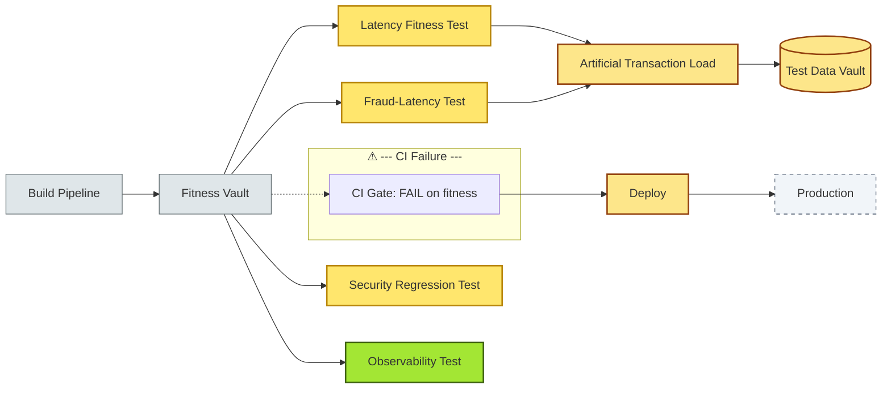

# [C6-06] Fitness Functions — BRIEF

> **Category:** C6 — Design Philosophy & Quality Attributes · **Difficulty:** ◑ · **Banking-relevant:** yes
> **One-liner:** A fitness function is automated, continuously-runnable acceptance criterion that verifies a quality attribute for the system as a whole, turning quality objectives from *essays* into *tests* that pass or fail on every build.
> **Why an EA cares:** London-based *Open-Banking* routing was declared "fast" by the vendor, but a nightly *fitness function* caught a *300 ms* *degradation* in *faster-payment* *p99* *latency* — 99.9% of builds were green, but the *fitness* function revealed the *regression* that *unit tests* missed because they mocked the *database*.

## Quick definition

A **fitness function** (Martin Fowlers) is a *single automated quality-attribute acceptance test* run continuously against the *real or emulated* system. It is *not* a *unit test*; it is an *architectural* test.

## Key ideas / terms

- **Prime directive** (Michael Feathers): "Change the code only to make a failing test pass."
- **Acceptance test vs fitness function:** *ATDD* tests *behaviour*; *fitness* tests *quality-attribute*.
- **Smoke test vs fitness:** a *smoke* test checks *any* endpoint is alive; a *fitness* function checks that the *system* still meets a *dimension*.
- **Gists (Mick Ostry):** *properties* that are *observable per invocation*; fitness functions must be *gist-based*.
- **Prevention over cure:** fitness functions detect *degradation* before *deploy*, not after *incident*.
- **False positive:** *green* build when *quality* is *actually* degraded (e.g. *flaky CI* or *cache poisoning*).

## The mental model

A fitness function is *like a *fitness* monitor in a gym: the heartbeat *line* shows *overall* *health*, not *each* *muscle* *group*. The EA designs the *heartbeat*; the *dev* *maintains* it.

## One diagram (mandatory)

## When to use / when NOT to use

- ✅ **Use when:** the team ships *daily* and *automated* *quality-attribute* *regression* is mandatory (e.g. *DORA* *continuous delivery*).
- ⚠️ **Avoid when:** the system *cannot* be *emulated* or *reproduced* (e.g. *cash-handling* hardware); in such cases *manual fitness* or *observability-based health checks* replace automated tests.

## Banking 💳 example

A **US *ret-card* micro-service** for *ATM *withdrawal* had *unit tests* passing but *runtime* *mean-time-to-recovery (MTTR)* of *4 hours*.  
- *Fitness function deployed:* *200* *simulated* *withdrawal* *requests* per *build*; *p99* *latency* *threshold* = *200 ms*.
- *First regression found:* *p99* *latency* *spiked* to *450 ms* after a *cache-refresh* *window* change.  
- *Risk:* *withdrawal* *latency* *exceeds* *SLA* and *triggers* *FCA* *customer-complaint* *escalation*.  
- *Fix:* *previous-response* *caching* for *fraud-risk* *signals* *reduced* *cascading* *vendor-call* *latency*.

Another *fitness* function: *"All workflow classes must extend *abstract* *Policy* *and* *observe* *workflow-observer*."* *Violation* = *build fails*.

## Common confusions (don't mix these up)

- **Fitness function vs unit test:** *unit* = *implementation*; *fitness* = *architecture + quality attribute*.
- **Fitness function vs smoke test:** *smoke* = *any* *running*; *fitness* = *meets dimension*.
- **Fitness vs testability:** *testability* is a *QA*; a *fitness* function *enables* it. *Fitness* function *measures* *quality*; *testability* is *craft*.

## Interview / recall prompt
"Explain fitness functions in 2 minutes without notes." → 1. Define a fitness function. 2. Contrast with unit tests. 3. Give a banking example where a fitness function caught a performance regression before production.

---
**Status:** ✅ Covered · See detail doc: `[../details/C6-06-fitness-functions.md](../details/C6-06-fitness-functions.md)`
