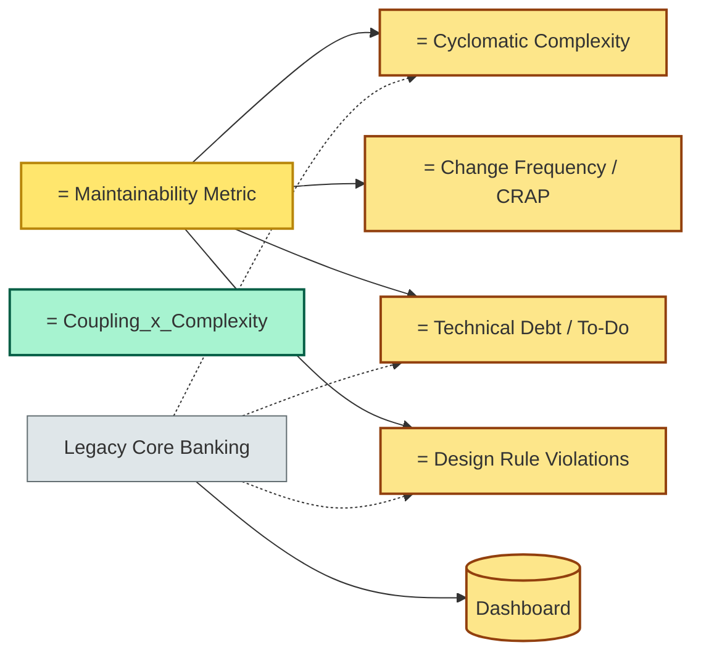

# [C6-07] Maintainability — BRIEF

> **Category:** C6 — Design Philosophy & Quality Attributes · **Difficulty:** ◑ · **Banking-relevant:** yes
> **One-liner:** Maintainability is the ease with which a system's *design* and *code* can be modified to *correct*, *improve*, or *extend* its *functionality* without unintended side effects, directly impacting the *total cost of ownership* in long-lived financial systems.
> **Why an EA cares:** A UK retail bank's *core-banking* system (3,400 CLOC) had 13 senior devs retiring over 3 years; without *maintainability* documentation and *low coupling*, every *new hire* took *6 months* just to read the *interest-calculation* codebase, costing £12M in *contractor* expenses and *ic* *compliance* *delays*.

## Quick definition

**Maintainability** is a *quality attribute* concerned with the *effort* required to *modify* a *software system* after delivery. It is *often-struggled-with* in banking's *legacy* *monoliths*, where *v2.0* may *require* *more* *developer* *effort* *to* *change* than *v1* *simply* *because* *the* *code* *base* *accumulated* *technical* *debt*.

## Key ideas / terms

- **Technical debt hypothesis:** every *line* of *code* has a *debt* *co* *occurring* *with* *the* *credit*; *default* *recognised* *if* *unrepaid.
- **Maintainability vs readability:** *readable* *code* is *necessary* but *insufficient* for *maintainability* (a *readable* *algorithm* that *calls* *a* *black-box* *service* *is* *not* *maintainable* *if* *that* *service* *changes*).
- **Hotspot analysis:** *Linguistic* *analysis* to identify *files* / *methods* that *change* *most* *often; *these* *are* *maintainability* *sinks*.
- **Fan-in / fan-out:** *Fan-in* (dependents) is *high* = *harder* *to* *change*; *high* *fan-in* *without* *quality* *triggers* *content* *coupling*.
- **CRAP** (Change-Risk-Adjusted Priority): a *metric* *combining* *cyclomatic* *complexity* *and* *change* *frequency*.
- **SSA (Static-Source-Analysis) tools:** Sonar, NDepend, ArchUnit.
- **Sanity index:** a *score* *estimating* *maintainability*; *higher* *is* *better*.
- **Estimate vs real fix:** a *consultancy* *report* *said* *2* *days* *but* *it* *took* *6*; *technical-debt* *makes* *fix* *time* *non-linear*.

## The mental model

In *banking*, *maintainability* is *the* *price* of *payment*. A *less* *maintainable* *system* means *longer* *runs* and *more* *contractors* and *a* *second* *-order* *risk*: *a* *bad* *fix* *that* *causes* *a* *bank* *run* *scenario* *or* *a* *regulatory* *miss*.

## One diagram (mandatory)

## When to use / when NOT to use

- ✅ **Use when:** planning *license* *renewals* (every 3–5 years) or *outsourcing* *risk-reduction*.
- ⚠️ **Avoid when:** *first* *green-field* *prototype*; *turn* *off* *static* *analysis *for *speedier* *proof-of-concept.

## Banking 💳 example

At a **French *leport_infra* (settlement) *system***, the *Purse-and-Ledge-Ledger* code had *10* *cdot* *¹³* *files* and *87* *percent* * *Mendelsohn* *complexity*. A *single* *interest-compounding* *bug* *was* *found*; *fix* *time* *was**6* *weeks* *because* *the* *code* *was* *a *single *file with *no *state-machine *separation; *no *separation-of-concerns.

*Refactor*:
- *Extract* *interest-calculation* *into* *a* *domain-service with* *state-machine*; *builders* for *interest-rules*.
- *Hamas* *: " maintainability *" *improved* *by* *factor* *2.5*; *new *developer *onboarding* *time* *dropped* *from* *6 *months* *to* *2 weeks*.
- *CRAP* *dropped* from *4.2* *to* *1.3*.

A **Kenyan *micro-finance* *NB* *bridge* *(M-Kopa)*: *customer-onboarding* and *KYC* *were* *merged* *into* *one* *class*; *mobile-money* *integration* *change* *meant* *5,000* *lines* changed in *one* *file*. *Refactor* *into* *M-KopaOnboarding* *and* *M-KopaKYC*; *adoption* *contract* *reduced* *mean-time-to-hire* *from* *72 hours* *to* *12 hours*.

## Common confusions (don't mix these up)

- **Maintainability vs reliability:** *maintainability* = *ease of change*; *reliability* = *absence of failure*; *they* *interact* (reliability *often* *costs* *maintainability* if *you* *overcomplicate* *error-handling*).
- **Refactoring vs re-writing:** *refactoring* *preserves* *behaviour* *while* *improving* *structure*; *rewrite* *assumes* *existing* *code* *is* *unmaintainable* (costly, risky).
- **Dead code removal:** *dead* *code* *is* *not* *always* *maintainable* *by* *removal*; *if* *it* *is* *a* *regulatory *archive*, *it* *must* *stay* *even* if *unused.

## Interview / recall prompt
"Explain maintainability in 2 minutes without notes." → 1. Define it. 2. Contrast with *performance*. 3. Give a *banking* *example* where *maintainability* *directly* *affected* *regulatory* *compliance* or *business* *agility*.

---
**Status:** ✅ Covered · See detail doc: `[../details/C6-07-maintainability.md](../details/C6-07-maintainability.md)`
