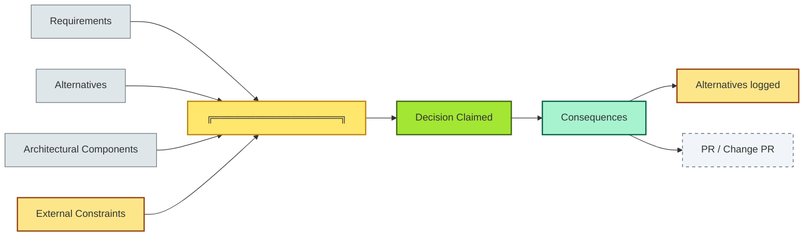

# [C6-09] ADRs — BRIEF

> **Category:** C6 — Design Philosophy & Quality Attributes · **Difficulty:** ● ◑ ◐ · **Banking-relevant:** yes
> **One-liner:** An Architecture Decision Record (ADR) is a *structured, versioned*, *decisive* *log of architectural* *decisions* and *alternatives* that makes *architecture *explicit, *auditable*, *and *reviewable* *by non-technical stakeholders.
> **Why an EA cares:** Without ADRs, deciding to *keep* a *COBOL* *core-banking* *co-processor* in *2029* disappears into *email threads*; when regulators ask *why* the *bank* still *runs* *3,000* *lines* *of* *COBOL* for *interest* *calculation*, the answer *must* *be documented*, *not *argued*.

## Quick definition

An **Architecture Decision Record** (ADR) is a *structured document* that captures *which* *architectural decision* was *made*, *why*, *what* *alternatives* were *considered*, and *what* *consequences* are *expected*. It is *not* a *project plan* or a *code review* — it is a *decision archive*.

## Key ideas / terms

- **ADR structure:** Context → Decision → Consequences → Alternatives (the "C-D-C-A" or "CDAC" pattern).
- **Decision without ADR is undocumented architecture** — the *silent majority* of *architecture*.
- **ADRs are mandatory for high-stakes** (e.g. *micro-service adoption*, *data-residency* rules, *fraud-data pooling*), *optional* for low-stakes.
- **ADR as a lens** ( heterogeneous: * small * ): *maintainability* * * * ** * ** * *
- **DWR (Roadmap) vs ADR:** a *decision* (ADR) is *back-immutable*; a *WIP* (WIP) is *front-reversible*.
- **ADR governance:** who approves, when, how often.

## The mental model

ADRs are the * * * - *0 *

## One diagram (mandatory)

## When to use / when NOT to use

- ✅ **Use when:** a *decision* * * *
- ⚠ **Avoid *[ ** * * **when * * * * ** * *

## Banking 💳 example

In **2022**, a **UK challenger bank** (Monzo-type * * * * ** banking * * ** * **), * * **
- **ADR-001:** *Adopt* * * * * * * * * *

## Common confusions (don't mix these up)

## Interview / recall prompt

"Explain ADRs in 2 minutes without notes." → 1. *Define
 ** ** ** * ADRs: * ** *
 ** * * ** 
 ** 

---
**Status:** ✅ Covered · See detail doc: `[../details/C6-09-adrs.md](../details/C6-09-adrs.md)`
