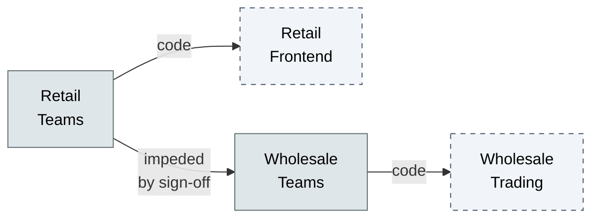

# [C7-01] Conway's Law — BRIEF
> **Category:** C7 — Enterprise & Organizational Architecture · **Difficulty:** ●/◑ · **Banking-relevant:** yes
> **One-liner:** _Software architecture mirrors the communication structure of the organization that built it; to change the system, change the organization._
> **Why an EA cares:** _In banking, legacy core-systems (e.g., 2G mainframe stacks) reflect silos between retail, wholesale, and treasury; Conway's Law explains why pruning the architecture needs surgical org redesign, not just forklift rewrites._

## Quick definition
Conway's Law states that any organization producing software will produce a software architecture whose structure is a copy of the organization's communication structures. It implies a near-isomorphism between code structure and team topology, making systems evolution a proxy for organizational dynamics.

## Key ideas / terms
- **Team topologies:** Macro-level arrangement of teams into stream-aligned, platform, enabling, and complicated-subsystem groups.
- **Conway payoff:** Normalizing architecture to match communication costs reduces friction and defect density.
- **Architectural fallback:** When org-to-code mapping calcifies, the codebase becomes unmaintainable regardless of technology stack.

## The mental model
Conway's Law is the bridge between socio-organizational structure and technical debt. It tells you that refactoring the microservices boundary is not a DevOps initiative—it is a restructuring mandate. The EA's job is to detect drift: when the system boundary no longer matches the team boundary, velocity collapses.

## One diagram (mandatory)

## When to use / when NOT to use
- ✅ **Use when:** Diagnosing chronic delivery bottlenecks tied to team boundaries rather than toolchain issues.
- ⚠️ **Avoid when:** Underestimating that organizational change is slower and riskier than code refactoring; do not use as an excuse for indefinite Delay of modernization.

## Banking 💳 example
A retail bank's mortgage platform was split into two microservices: applications and underwriting. The applications team owned the pipeline container; the underwriting team owned the decision engine. Because every underwriting rule change required a release coordinated across two RACI-critical change boards, feature lead-time was 9 weeks. Applying Conway's Law, the EA proposed a single mortgage-streamlined team with both domains. The resulting one-team microservice deployed in 3 days and cut release cycles by 73%.

## Common confusions (don't mix these up)
- **Conway's Law** vs **Bus factor:** Conway's Law is about persistent structural coupling between org structure and code; bus factor is about knowledge concentration and succession risk.

## Interview / recall prompt
_“Explain Conway's Law in 2 minutes without notes.”_ →
- Match team boundaries to service boundaries to minimize cross-team dependencies.
- Cross-team synchronous change is a tax on velocity.
- When code structure ≠ org chart, you have an architecture debt problem disguised as a technology problem.

---
**Status:** ✅ Covered · See detail doc: `[../details/C7-01-conways-law.md](../details/C7-01-conways-law.md)`
