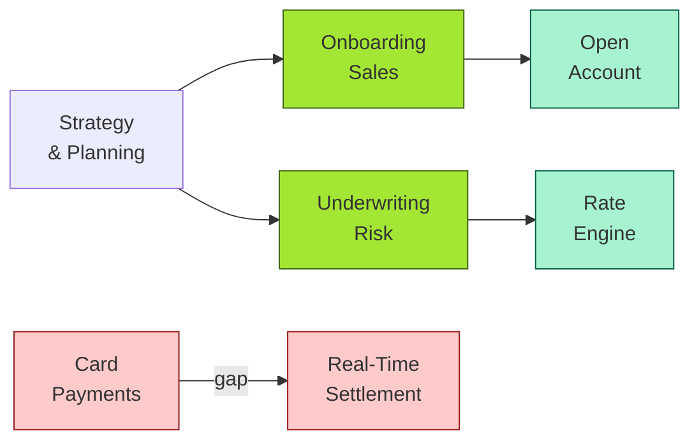

# [C7-02] Capability Mapping — BRIEF
> **Category:** C7 — Enterprise & Organizational Architecture · **Difficulty:** ◑/○ · **Banking-relevant:** yes
> **One-liner:** _Capability mapping is the practice of articulating, organizing, and linking business capabilities to value, architecture, and execution so that EA drives portfolio decisions rather than technology preferences._
> **Why an EA cares:** _A bank's retail, wholesale, and treasury "capabilities" are often collections of GRC policies, API enablers, and process steps—without a single source of truth linking them, portfolio budgeting becomes political and IT spend drifts from strategic bets._

## Quick definition
Capability mapping is the strategic practice of identifying what an organization *can do* (capabilities), structuring them into a hierarchy (capability taxonomy), and relating them to organizational units, IT services, and value streams to drive evidence-based investment and structural change.

## Key ideas / terms
- **Capability funneled:** Starting with high-level business outcomes and drilling down to atomic capabilities and programs.
- **Capability Maturity Indicator:** A metric (e.g., average time-to-market, error rate) that quantifies how well a capability is delivered.
- **Capability texture:** The "perceived quality" of a capability—often an opinion expressed by a business leader and captured for gap analysis.

## The mental model
Capability mapping is the *strategic map* of an enterprise. Where value-stream mapping focuses on flow, capability mapping focuses on *structure*. It answers: "What can we do?" before answering "How do we do it?" EA uses capability maps to say "we do not currently have the 'instant payment authorization' capability at all," which is a more honest starting point than "our APM stack is slow."

## One diagram (mandatory)

## When to use / when NOT to use
- ✅ **Use when:** Building or updating a 3–5 year enterprise architecture roadmap; responding to regulator-mandated digitisation; evaluating M&A due diligence.
- ⚠️ **Avoid when:** Used as a one-time exercise without integration into budgeting cycles; or when the hierarchy is flat—too many capabilities and no granularizing discipline.

## Banking 💳 example
A Tier-1 UK bank mapped its Retail Banking Capability Set into 9 capabilities (e.g., "Mortgage Origination," "Current Account Operations," "Card Issuance"). The process revealed a critical gap: "Real-Time Cross-Border Payout" had no dedicated capability owner. The nearest proxy was "SWIFT MT103 Operations," owned by Treasury, but with no 24/7 service-level granularity. The EA drove the creation of an independent non-bank payment capability, funded directly from a CHF 25M strategic-capital allocation for cross-border growth.

## Common confusions (don't mix these up)
- **Capability mapping** vs **Value stream mapping:** Capabilities are *what the org can do* (nouns); value streams are *how value flows* (verbs and events).
- **Capability** vs **Business function:** A function is an administrative cluster (e.g., "Customer Support"); a capability is an end-to-end ability to produce an outcome (e.g., "Issue a Card").

## Interview / recall prompt
_“Explain capability mapping in 2 minutes without notes.”_ →
- It is the EA's strategic map of what the bank can do.
- It links business outcomes to IT investment through a common taxonomy.
- It uncovers hidden capabilities, overlaps, and gaps vs the strategic roadmap.

---
**Status:** ✅ Covered · See detail doc: `[../details/C7-02-capability-mapping.md](../details/C7-02-capability-mapping.md)`
