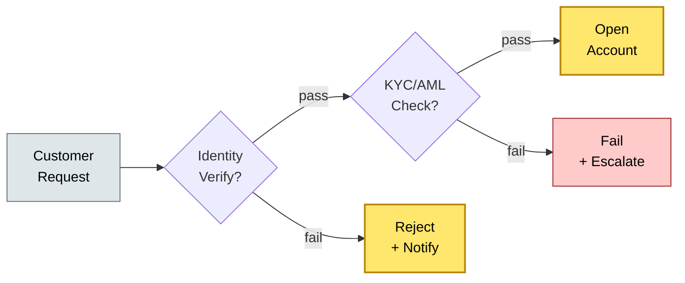

# [C7-03] Value Stream — BRIEF
> **Category:** C7 — Enterprise & Organizational Architecture · **Difficulty:** ◑/○ · **Banking-relevant:** yes
> **One-liner:** _Value stream mapping is the practice of visualizing the sequence of events that creates and delivers financial value to a customer, exposing waste, waste, and non-value-adding steps for continuous improvement._
> **Why an EA cares:** _Payment-settle value streams in banks are measured in seconds and carry regulatory audit trails; without a VSM, a CIO cannot prove to a regulator that "approval latency" has been reduced by 40%._
> |

## Quick definition
Value Stream Mapping (VSM) is a lean-management method that visualizes all the steps in a process required to deliver a product or service. In enterprise architecture, it is used to map the flow of value from customer need to financial outcome, identifying wait times, handoffs, rework, and non-value-adding activities.

## Key ideas / terms
- **Value stream:** The end-to-end sequence of activities that delivers a product or service to a customer, measured by *cumulative lead time*.
- **Cumulative lead time:** The total elapsed time from request to delivery, including wait time (the largest component).
- **Batch size:** The quantity of units processed in a single batch; smaller batches reduce wait time but increase transaction costs.
- **Demand-driven:** Pull-based flow triggered by customer demand rather than forecast.

## The mental model
Value streams are the *verbs* of architecture; capabilities are the *nouns*. You use value streams to audit flow, throughput, and quality; you use capabilities to audit structural coherence. In banking, the physical value stream (e.g., "Open a Current Account") is rarely different from the digital one—onboarding is digitally mediated, but compliance and due diligence still create physical friction.

## One diagram (mandatory)

## When to use / when NOT to use
- ✅ **Use when:** Onboarding new capabilities; responding to regulator-mandated "time-to-value" metrics; digital-transformation programme scoping.
- ⚠️ **Avoid when:** Applied without customer context—internal-only process maps often optimize the wrong stream; or when used as a one-off without measuring cumulative lead time.

## Banking 💳 example
A regional UK bank mapped its "Retail Current Account Opening" value stream. The cumulative lead time was 42 days, of which 34 days was *wait time* (government ID verification via postal service, manual identity checks by branch staff). The "value-adding" time was 8 minutes. The bank partnered with a digital identity provider (e.g., Onfido or Yoti) and allowed video-call verification, cutting cumulative lead time to 3 days. The cost per account dropped 40%; conversion from enquiry to application rose 22%.

## Common confusions (don't mix these up)
- **Value stream** vs **Value stream mapping (VSM):** A value stream is the *thing* (the flow of events); VSM is the *method* (the mapping process).
- **VSM** vs **Process mapping:** Process mapping is internal and activity-oriented; VSM is external/customer-facing and focused on waste and lead time.

## Interview / recall prompt
_“Explain value stream mapping in 2 minutes without notes.”_ →
- It maps the entire flow of value, not individual steps.
- It measures *cumulative lead time* to find waste.
- It highlights non-value-adding wait time as the primary lever.

---
**Status:** ✅ Covered · See detail doc: `[../details/C7-03-value-stream.md](../details/C7-03-value-stream.md)`
