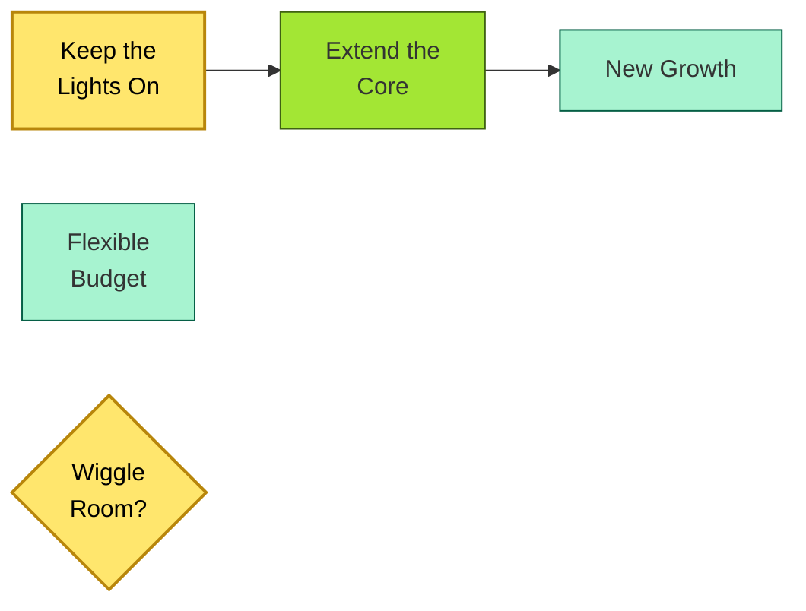

# [C7-04] Portfolio Roadmap — BRIEF
> **Category:** C7 — Enterprise & Organizational Architecture · **Difficulty:** ◑/○ · **Banking-relevant:** yes
> **One-liner:** _A portfolio roadmap is a time-phased, capability-centric plan of transformation that sequences IT investments, organizational changes, and risk mitigation to deliver an optimal future state within budget and time constraints._
> **Why an EA cares:** _Banks cannot replace core systems in one year; the portfolio roadmap is how the EA proves that a phased, risk-managed sequence of incremental bets delivers solvency, compliance, and growth without breaching capital floors._

## Quick definition
A portfolio roadmap is a time-phased, multi-horizon plan that sequences strategic, tactical, and opportunistic investments of an enterprise or program. In enterprise architecture, it is the executable artifact that links business-strategy objectives → capabilities → solution investments → releases.

## Key ideas / terms
- **Three horizons:** Horizon 1 (keep the lights on), Horizon 2 (extend the core), Horizon 3 (create new growth).
- **Wiggle rooms:** Optional investment paths (optional, contingent) for pivot or ambition.
- **Paces:** Incremental delivery vehicles in SAFe and LeSS that align capability delivery to business cadence.
- **Real options:** Optionality in the roadmap (e.g., pilot, wait, expand, abandon) to manage uncertainty.

## The mental model
The portfolio roadmap is the *translation* of strategy into executable sequence. It is not a Gantt chart of projects; it is a *portfolio theory* tool that treats each initiative as having an expected return (strategic value) and risk (known unknowns, unknowns). In banking, the EA uses it to defend against over-optimistic product-roadmap claims: "We cannot launch 5 new digital products in 18 months without draining 20% of the core-admin budget."

## One diagram (mandatory)

## When to use / when NOT to use
- ✅ **Use when:** Annual planning cycles; regulatory-capital [planning](https://wikilinks.opencode.ai) and tech-budget allocations; M&A integration roadmaps.
- ⚠️ **Avoid when:** Treated as a static document; or when used without governance, scoring, and re-prioritization cadence.

## Banking 💳 example
A regional UK bank nearing its 7-year core-administration renewal (FICO presentment module) used the portfolio roadmap to sequence a 5-year plan:
- **Years 1–2:** Extend core with microservices (payments, account-information APIs) while stabilizing operations (Horizon 1).
- **Years 3–4:** Replace FICO with CoreLogic (Horizon 2) and introduce open banking.
- **Years 5:** Launch embedded-finance marketplace for SMEs (Horizon 3).
The roadmap included 3 wiggle rooms: a real-time-payment speed-up (if TCH volume exceeded 50M transactions), a wholesale-lending API program (if regulatory sandbox changes), and a sustainability-linked bond platform (if market demand).

## Common confusions (don't mix these up)
- **Portfolio roadmap** vs **Solution roadmap:** A portfolio roadmap is *what* and *when* at the capability/initiative level; a solution roadmap is *how* at the feature/product level.
- **Portfolio roadmap** vs **Strategic plan:** A strategic plan is the *why* (mission, vision, values); the portfolio roadmap is the *how* (sequenced, resourced, risk-managed).

## Interview / recall prompt
_“Explain portfolio roadmap in 2 minutes without notes.”_ →
- It sequences strategic initiatives across time horizons.
- It aligns capabilities to investments and risk.
- It treats uncertainty as real options, not fixed predictions.

---
**Status:** ✅ Covered · See detail doc: `[../details/C7-04-portfolio-roadmap.md](../details/C7-04-portfolio-roadmap.md)`
