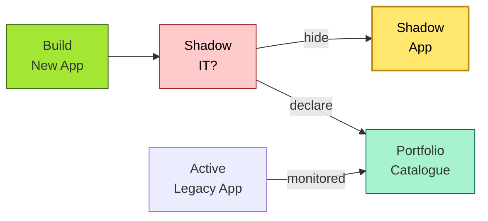

# [C7-05] App Rationalization — BRIEF
> **Category:** C7 — Enterprise & Organizational Architecture · **Difficulty:** ◑/◑ · **Banking-relevant:** yes
> **One-liner:** _Application rationalization is the systematic cataloguing, assessment, and disposition of an application portfolio to eliminate redundancy, reduce cost, and align capability delivery with strategic priorities._
> **Why an EA cares:** _Banks often run 200+ applications—20–30% redundant—because business units secretly build shadows; a rationalized portfolio is the prerequisite for any real-time-payment, CoreLogic-to-replace, or cloud-migration initiative._

## Quick definition
Application rationalization is the practice of assessing every application in a portfolio against criteria (business need, usage, cost, risk, technical quality) to determine whether to retain, retire, replace, merge, or consolidate it. It is a portfolio-management discipline that underpins all transformation initiatives.

## Key ideas / terms
- **TAC (total cost of ownership):** The sum of license, operation, maintenance, support, and opportunity costs over the application's lifecycle.
- **Shadow IT:** Unauthorized applications deployed by business units without EA knowledge.
- **Deliberate attrition:** The gradual reduction of an application's user base until it is obsolete and can be retired.
- **Application portfolio catalogue:** A single source of truth listing every application, its owner, technology stack, business purpose, and cost.

## The mental model
Application rationalization is the *fire-break* of enterprise architecture. In banking, where applications carry compliance and security debt, the portfolio is not just an efficiency problem— it is a *risk exposure*. A shadow-IT application handling customer PII without encryption is a single breach away from a DORA-reportable incident.

## One diagram (mandatory)

## When to use / when NOT to use
- ✅ **Use when:** Post-M&A integration; legacy-system replacement; budget-reduction mandates; security-posture hardening.
- ⚠️ **Avoid when:** Used as a one-off "find-me-in-3-months-you-own-this" effort without a decision framework; or when political protection of "owned" applications overrides objective criteria.

## Banking 💳 example
A Dutch retail bank rationalized 214 applications and found:
- **12%** were pure duplicates (2 provider vs. 2 legacy reconciliation tools).
- **23%** were for "sunset" products (e.g., old savings-bond product discontinued in 2019, 0 active users, but still TAC-CHF 1.2M/year).
- **18%** were wrappers around a third-party service, charging 2x the price.
- **9%** were shadow-IT applications handling customer data (on-premise Excel database with PII).

The bank retired 31, replaced 12, consolidated 18, and accepted 24 as "deliberate attrition." The 5-year cost avoided was CHF 8.7M; 6 shadow applications were either eliminated or migrated to an approved vendor, reducing breach surface area by 34%.

## Common confusions (don't mix these up)
- **App rationalization** vs **Application decommissioning:** Rationalization is the *decision framework*; decommissioning is the *execution* of retirement.
- **App rationalization** vs **Application modernization:** Rationalization decides *whether* to act; modernization is *how* to improve an existing app.

## Interview / recall prompt
_“Explain app rationalization in 2 minutes without notes.”_ →
- It is a structured audit of every application.
- Decisions are retain, retire, replace, merge, or accept as-is.
- It cuts cost, risk, and technical debt at the portfolio level.

---
**Status:** ✅ Covered · See detail doc: `[../details/C7-05-app-rationalization.md](../details/C7-05-app-rationalization.md)`
