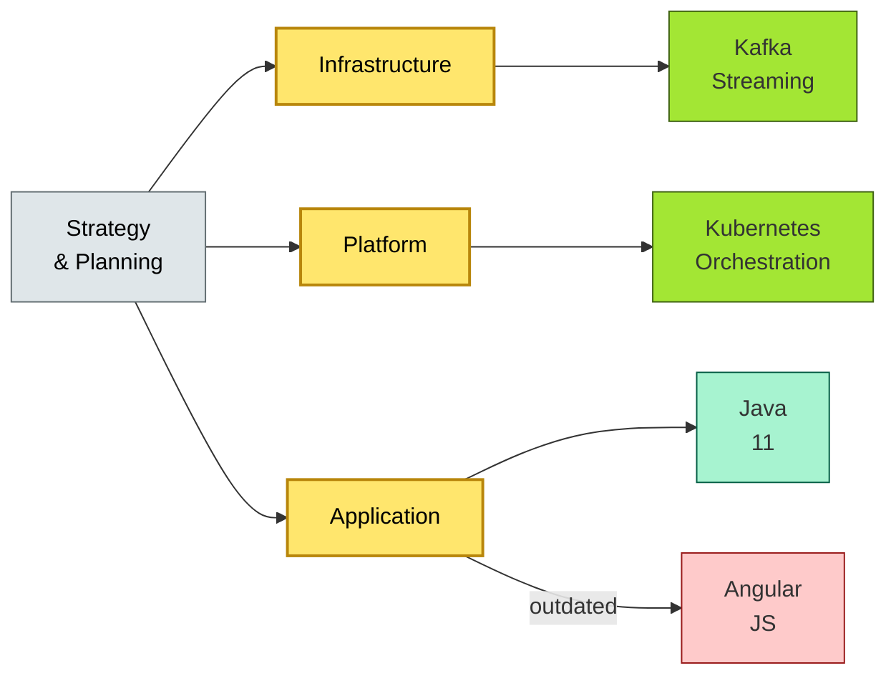

# [C7-06] Technology Landscape — BRIEF
> **Category:** C7 — Enterprise & Organizational Architecture · **Difficulty:** ◑/◑ · **Banking-relevant:** yes
> **One-liner:** _The technology landscape is the enterprise-wide model of technologies, infrastructure, and architectural assets that supports business capabilities, drives governance, and enables investment decisions._
> **Why an EA cares:** _A bank's technology landscape is often a graveyard of outdated frameworks (Java EE, Angular, .NET) and hidden microservices; without a living landscape, any digital bet, cloud migration, or DORA audit is guesswork cast in darkness._

## Quick definition
A technology landscape (aka *technology ecosystem map*, *solution landscape*, or *technology repository*) is a structured inventory of all technologies (languages, frameworks, databases, platforms, middleware, cloud services) used across the enterprise, their version, ownership, and strategic alignment.

## Key ideas / terms
- **Technology portfolio management:** The practice of managing the technology *assets* (not just applications) to optimize cost, risk, and agility.
- **Technology set:** A group of closely related technologies (e.g., Java 11-SE—no-bytecode, GraalVM, Spring).
- **Technology constellation:** A cluster of technologies that serve the same functional purpose (e.g., "RDBMS" as a constellation: PostgreSQL, Oracle, SQL Server, Snowflake).
- **Technology driver:** A technology with a strong strategic property (e.g., Kafka = event streaming; Kubernetes = container orchestration).

## The mental model
A technology landscape is the *structural* complement to application rationalization: while rationalization asks "what do we have for which business purpose?" the landscape asks "what do we have for which *technical* purpose, and what does it depend on?" It is the grid on which all modernization plans are projected.

## One diagram (mandatory)

## When to use / when NOT to use
- ✅ **Use when:** Building a modernization roadmap; evaluating cloud migration; defending against "tech floor" and "DORA audit" requirements; proactive cloud optimization.
- ⚠️ **Avoid when:** Treated as a static snapshot; or when the focus is on *all* technologies in equal detail without cascading to *critical* or *supported* subsets.

## Banking 💳 example
A German Sparkasse rationalized its technology landscape and discovered:
- **6,400** deployed software components across 340 sites.
- **12,000** version numbers (an average of 3.4 per "application").
- **980** unique technology/tool names.
- **1,022** were unidentified (*zombie technologies*): 59% internal, 41% third-party.
- **3** were commercial online banking products (imposed by Sparkassen-IT).
- **2** were internet-banking SaaS.

The bank replaced a 1,839-install, 24-year-old web reimbursement tool with a modern web service. The modernization plan decoupled the legacy reimbursements from the net-banking module. The outcome: 1,839 sites reduced, SMT costs dropped significantly, and the new system supported mobile payments and instant invoicing.

## Common confusions (don't mix these up)
- **Technology landscape** vs **Architecture repository:** A repository (e.g., Micro Focus) captures business model elements (applications, data, infrastructure) but not *every* technology/tool name. The landscape is more granular and operational.
- **Technology landscape** vs **Technology stack analysis:** The landscape *includes* stacks; stack analysis is the *deep-dive* on a specific cluster (e.g., "our Java 8 stack").

## Interview / recall prompt
_“Explain technology landscape in 2 minutes without notes.”_ →
- It is the map of every tech the organization uses.
- It shows clusters, versions, and dependencies.
- It is the foundation for modernization, migration, and risk governance.

---
**Status:** ✅ Covered · See detail doc: `[../details/C7-06-technology-landscape.md](../details/C7-06-technology-landscape.md)`
