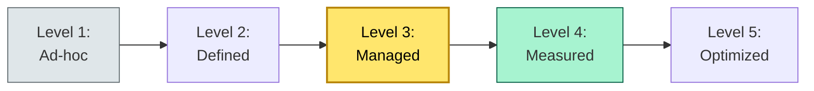

# [C7-07] Maturity Model — BRIEF
> **Category:** C7 — Enterprise & Organizational Architecture · **Difficulty:** ◑/○ · **Banking-relevant:** yes
> **One-liner:** _A maturity model is a staged framework that measures the capability, process, or period of an enterprise's architecture, allowing an EA to baseline, target, and track architectural improvement over time._
> **Why an EA cares:** _Banks need maturity metrics for the FCA's Consumer Duty, DORA's ICT risk management, and Basel III's operational-risk capital—without a baseline, there is no defensible way to prove "we are more mature now than in 2022."_

## Quick definition
A maturity model is a framework that describes the "maturity" of an enterprise's capabilities, processes, or organizational structures. It typically uses staged levels (e.g., level 1 Ad-hoc to level 5 Optimized) and assesses current state against target state.

## Key ideas / terms
- **Current-state assessment:** The baseline measurement against which improvement is tracked.
- **Target-state:** The desired future maturity level and the capabilities required.
- **Gap analysis:** The delta between current and target states.
- **Maturity-driven planning:** The practice of using maturity levels to prioritize improvement initiatives.

## The mental model
Maturity models are the *scoreboards* of enterprise architecture. They give leadership a single, defensible number ("we are level 3 on digital operational resilience") that satisfies regulators, satisfies auditors, and satisfies the board. In banking, where "maturity" is increasingly a *regulatory expectation*, a well-designed model is the difference between "compliance theater" and "measured improvement."

## One diagram (mandatory)

## When to use / when NOT to use
- ✅ **Use when:** Regulatory compliance (DORA, FCA Consumer Duty), benchmarked improvement, portfolio governance, or due diligence.
- ⚠️ **Avoid when:** Used as a one-off score without defining criteria; or when the model is *not* aligned with business outcomes.

## Banking 💳 example
A Dutch neobank developed a 5-level maturity model for "Digital Operational Resilience" in preparation for the 2025 DORA deadline:
- **Level 1 (Ad-hoc):** No formal ICT risk-classification framework; no second-opinion on third-party ICT risks; no incident-response plan.
- **Level 2 (Defined):** ICT risk classification defined; fallback-testing manual; incident response plan exists but not tested.
- **Level 3 (Managed):** ICT risk management executed; fallback-testing automated; incident response tested annually.
- **Level 4 (Measured):** Continuous monitoring and improvement; incident response time <1h for critical incidents; third-party risk-management measures documented and monitored.
- **Level 5 (Optimized):** Predictive risk management using ML; self-healing systems; automated resilience testing.

At first, the neobank was assessed at Level 1 for ICT risk management. After 18 months, with targeted investments (SRE team, automated failover, third-party risk management tool), it reached Level 3, satisfying the DORA *Interim Report* (5.12.2025) and *Final Report* (27.12.2025).

## Common confusions (don't mix these up)
- **Maturity model** vs **Capability model:** A capability model is the *taxonomy* (what you *have*); a maturity model is the *measurement* (how *well* you use it).
- **Maturity model** vs **Capability maturity assessment:** The first is the framework; the second is the *application* of the framework to a specific capability.

## Interview / recall prompt
_“Explain maturity model in 2 minutes without notes.”_ →
- It is a staged framework for measuring how well you do something.
- It has levels (ad-hoc → defined → managed → measured → optimized).
- It is used for baseline, target-setting, and progress tracking.

---
**Status:** ✅ Covered · See detail doc: `[../details/C7-07-maturity-model.md](../details/C7-07-maturity-model.md)`
