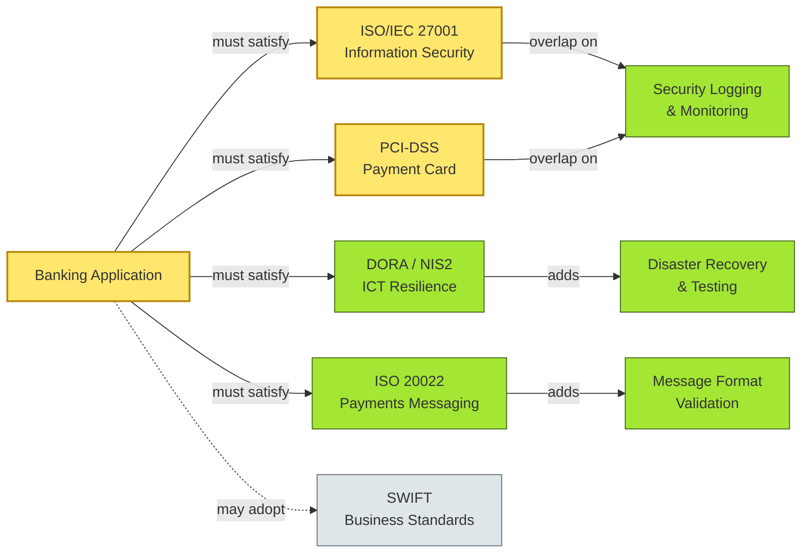

# [C8-02] Standards — BRIEF
> **Category:** C8 — Reference Architecture, Standards & Principles · **Difficulty:** ◑ · **Banking-relevant:** yes
> **One-liner:** Standards are mandatory, externally or internally prescribed specification criteria—ranging from ISO/IEC and PCI-DSS to internal coding conventions—that reduce interoperability risk and demonstrate due diligence to regulators and auditors.
> **Why an EA cares:** Standards shrink integration surface area and carry audit weight; without them, a bank cannot prove to the EBA or NYDFS that its system boundaries are defensible.

## Quick definition
A **standard** is an explicit, testable specification—often external (ISO, IEEE, IBBR) or internal—that constrains the form, interface, or behavior of a component, interface, or process. In banking IT, standards operate at multiple levels: *technical* (message formats, encryption algorithms), *operational* (runbook templates, incident classification), and *regulatory* (PCI-DSS, DORA, BCBS 239).

## Key ideas / terms
- **De facto standard:** market-adopted convention with no formal body (e.g., REST/JSON over HTTP as the de facto API standard).
- **De jure standard:** formally ratified by a standards organization (e.g., ISO 20022 for payments messaging).
- **Mandatory standard:** non-negotiable for a given context; deviation triggers regulatory or contractual penalty.
- **Endorsed standard:** strongly recommended but with a documented waiver path; deviations require justification.
- **Technical debt from unsupported standards:** running on a deprecated standard (e.g., TLS 1.0) introduces audit findings and insurance premium increases.

## The mental model
Standards are the *contract* between your architecture and the outside world: vendors, regulators, partners, and future maintainers. Unlike reference architecture (which is internal and opinionated), standards are *externally auditable* and often *legally binding*. The EA’s job is not to pick standards arbitrarily but to map every system boundary to a standard class, identify class overlaps (where one component must satisfy ISO 27001 *and* PCI-DSS), and maintain a standards register that feeds both design reviews and audit evidence.

## One diagram (mandatory)

## When to use / when NOT to use
- ✅ **Use when:** integrating with a correspondent bank, issuing a card program, or running change control for a regulated system—you need auditable compliance.
- ⚠️ **Avoid when:** evaluating a minor internal utility with no customer-facing surface; a convention or guideline is sufficient.

## Banking 💳 example
A bank launching a co-branded credit card in Germany must satisfy PCI-DSS for cardholder data, the Schufa credit-bureau data format (an internal standard with legal weight), and BaFin licensing conditions. The EA maps the card-issuance microservice to three standard classes. When BaFin audits, the EA presents the standards register showing that the service implements Schufa 4.1, PCI-DSS 4.0, and ISO/IEC 27001 Annex A.12.1, all covered by automated policy checks.

## Common confusions (don't mix these up)
- **Standard** vs **Reference architecture:** standards are *prescriptive and external*; reference architecture is *prescriptive and internal*.
- **Mandatory standard** vs **Mandatory regulatory requirement:** a mandatory standard is a *specification*; the regulatory requirement is the *legal obligation* that the standard helps satisfy.

## Interview / recall prompt
“Explain standards in 2 minutes without notes.” →
- They are explicit, testable criteria.
- They can be external (ISO) or internal (coding conventions).
- They reduce integration risk and improve audit defensibility.
- Overlap (e.g., ISO 27001 + PCI-DSS) should be exploited, not duplicated.
