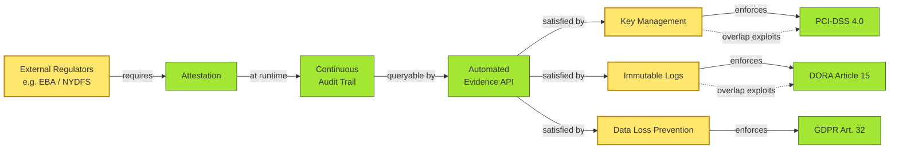

# [C8-04] Compliance & Regulation — BRIEF
> **Category:** C8 — Reference Architecture, Standards & Principles · **Difficulty:** ● · **Banking-relevant:** yes
> **One-liner:** Compliance is the verifiable alignment of a system, process, or control with external laws, regulations, and contractual obligations; architecture for compliance means designing *in* controls rather than bolting them on after launch.
> **Why an EA cares:** Regulators (EBA, NYDFS, BoE, DORA) now demand architecture evidence; a one-page control map is not enough—they want to see *how the architecture itself enforces* the control.

## Quick definition
**Compliance** is the sustained, auditable alignment of an organization’s design, operations, and governance with externally imposed legal, regulatory, and contractual requirements. In banking IT, *architecture for compliance* means embedding attestation, segregation of duties, and auditability directly into the architecture so that controls are emergent properties of the design, not post-launch add-ons.

## Key ideas / terms
- **Hard compliance:** driven by law; deviation is illegal (Basel III capital rules, Banking Act, Criminal Finances Act).
- **Soft compliance:** contractual or market-driven (SWIFT GSN, vendor SLA terms, procurement policy).
- **Regulatory overlap:** when one control line satisfies multiple regimes (e.g., PCI-DSS + DORA; GDPR + BCBS 239).
- **Attestation:** a formal, periodic statement by an internal or external party that a control is effective and your bank is compliant.
- **Auditability by design:** architecture decisions should leave machine-readable evidence (config-as-code, policy-as-code, automated scans) that auditors can query.

## The mental model
Compliance is the *law* a bank must obey; architecture compliance means the *law is written into the plumbing*. Instead of a control owner writing a policy document and then an auditor coming to check it, the architecture itself—through API gateways that enforce rate limits, encryption key management that rotates automatically, and event streams that are immutable—*produces* evidence continuously. The EA’s job is to map each architectural mechanism to a regulatory requirement and ensure the evidence is queryable at any time.

## One diagram (mandatory)

## When to use / when NOT to use
- ✅ **Use when:** designing a new payments pipeline, core-banking microservice, or resident data platform—verify that the architecture can satisfy DORA, PCI-DSS, or BCBS 239 without retrofitting.
- ⚠️ **Avoid when:** actioning a one-off keyboard-punch request from legal; an architecture review is not the right place for a legal interpretation.

## Banking 💳 example
A bank launching a UK crowdfunding platform must comply with FCA Consumer Duty (product governance), AML/KYC (MLRs), and GDPR (DSARs). The EA designs a compliance layer: a policy-engine gateway that intercepts every data-access request and evaluates it against a living ruleset (Consumer Duty product-risk scoring, MLR transaction-monitoring thresholds, GDPR data-minimization rules). Every request and decision is logged to an immutable audit stream. When the FCA requests attestation, the EA points to the evidence API showing 99.7% of requests passed the product-governance rules and 0% bypassed AML screening—*by design*, not by luck.

## Common confusions (don't mix these up)
- **Compliance** vs **Security:** security is the *capability*; compliance is the *alignment* (a secure system can still be non-compliant if it misses a specific control mapping).
- **Compliance** vs **Resilience:** resilience is about surviving failure; compliance is about *proving* you met requirements.
- **Attestation** vs **Audit:** attestation is a *statement* (you say you comply); audit is the *test* (someone else verifies you).

## Interview / recall prompt
“Explain compliance architecture in 2 minutes without notes.” →
- Compliance is verifiable alignment with external requirements.
- Architecture for compliance embeds controls so they are emergent, not retrofitted.
- Auditability must be design-time, not run-time discover.
- Cross-regime overlap (PCI-DSS + DORA) should be exploited, not duplicated.
