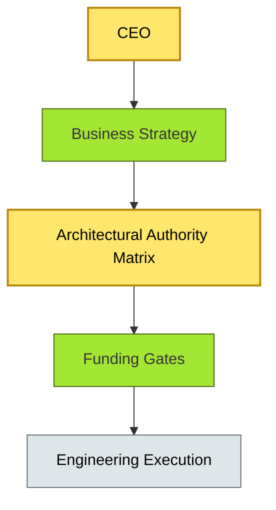

# [C9-01] EA Practice Governance — BRIEF
> **Category:** C9 — Governance, Management & Strategy · **Difficulty:** ● · **Banking-relevant:** yes
> **One-liner:** EA practice governance is the integrated set of policies, authority maps, and decision rights that directs how architectural decisions are made, funded, measured, and enforced across the enterprise.
> **Why an EA cares:** In a bank, technology choices have legal, liquidity, and capital consequences—uncoordinated architecture risks regulatory censure, duplicated spend, and failed digital journeys.

## Quick definition
EA practice governance is the organizational framework that assigns who can decide what, how resources flow to architectural initiatives, and how compliance and quality are verified. It is not governance *about* the bank (that is risk management); it is governance *of* the architecture function itself.

## Key ideas / terms
- **Architectural Authority Matrix (AAM):** A role-to-decision matrix that names who can approve, fund, or veto architectural changes.
- **EA Value Realization:** The discipline of tracking whether delivered architecture actually produced the claimed business outcomes.
- **Decision Rights:** The formal or informal delegation of specific choices (e.g., "data-platform standards") to a named owner, separate from general IT authority.

## The mental model
EA practice governance sits between business strategy and engineering execution. It turns abstract investment priorities into concrete decision rights, budgets, and quality gates. Think of it as the constitution of the architecture function: it does not build systems, but it determines which systems are allowed to be built and under what conditions.

## One diagram (mandatory)

## When to use / when NOT to use
- ✅ **Use when:** The bank is scaling EA across multiple business lines, geographies, or regulatory jurisdictions and decision conflicts are surfacing.
- ⚠️ **Avoid when:** There is no investment portfolio to govern, or the architecture function is still informal and solving one-off problems.

## Banking 💳 example
A multinational retail bank with operations in eighteen countries needs a single EA practice governance model to approve any core-banking or payments-platform change. Without it, the Brazil IT team adopts a local card-management vendor that cannot integrate with the global SWIFT gateway; the UK compliance team blocks a cloud migration because no enterprise-level risk appetite was defined. An AAM assigns "global payments platform standard" decision rights to the Enterprise Architecture Board, with regional implementation authority to Country IT leads.

## Common confusions (don't mix these up)
- **EA Practice Governance** vs **Risk Management Governance:** The former governs the architecture function; the latter governs business risk exposure.

## Interview / recall prompt
"Explain EA practice governance in 2 minutes without notes." →
- It is the constitution of the EA function.
- It defines decision rights, funding, and compliance.
- It separates architecture decisions from general IT management.
- It prevents regulatory, duplicated, and conflicting technology choices.
- The AAM is the key artifact.

---
**Status:** ✅ Covered · See detail doc: `[details/C9-01-ea-practice-governance.md](../details/C9-01-ea-practice-governance.md)`
