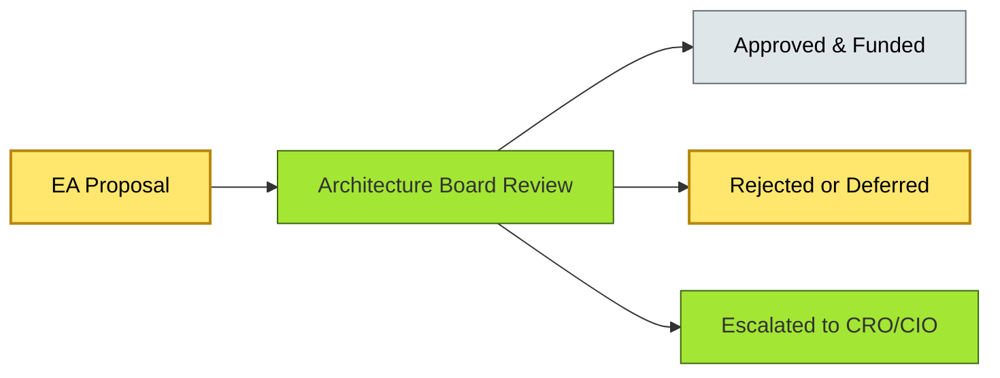

# [C9-02] Architecture Board — BRIEF
> **Category:** C9 — Governance, Management & Strategy · **Difficulty:** ● · **Banking-relevant:** yes
> **One-liner:** An Architecture Board is a standing, chartered decision body of senior business, IT, and risk stakeholders that reviews, approves, and prioritizes material architectural proposals.
> **Why an EA cares:** In banking, the Architecture Board is the single choke-point that prevents rogue platforms from violating Basel, DORA, or PCI-DSS requirements and ensures IT spend is portfolio-balanced.

## Quick definition
An Architecture Board is a cross-functional governance body with a written charter that meets on a regular cadence to evaluate architectural proposals against strategy, risk, cost, and compliance criteria. It is the "court of last appeal" for enterprise-wide architectural decisions.

## Key ideas / terms
- **Charter:** The document that defines the board’s purpose, scope, membership, decision rights, and escalation rules.
- **EA Decision Review Board (EDRB):** A specific flavor of Architecture Board focused on IT-architecture-only proposals.
- **Escalation Path:** The formal route for proposals that lack full approval authority or that require CEO/CRO intervention.

## The mental model
Apply Conway’s Law: the board’s composition mirrors the organization’s information-flow bottlenecks. A board that omits risk or business-line voices will produce architecture that looks good on paper but is rejected in production. The board is not a rubber-stamp committee; it is a quality-filter that raises the cost of bad decisions.

## One diagram (mandatory)

## When to use / when NOT to use
- ✅ **Use when:** A bank has multiple investment streams (core banking, fintech partnerships, cloud migration) and needs a single arbiter to resolve competition for resources and standards.
- ⚠️ **Avoid when:** Proposals are highly distributed and low-risk; an Architectural Standards Working Group may be more efficient at that scale.

## Banking 💳 example
A Tier-1 European retail bank launches a mortgage-origination transformation and a real-time payments hub simultaneously, both needing data-lake access. The Architecture Board, chaired by the CIO with the CRO and the Chief Data Officer as members, reviews both proposals, notices shared data-domain overlap, and mandates a unified customer-360 data model, avoiding redundant ETL pipelines and dual data-storage contracts.

## Common confusions (don't mix these up)
- **Architecture Board** vs **Technical Review Board:** The former decides *what* and *why*; the latter decides *how*.

## Interview / recall prompt
"Explain the Architecture Board in 2 minutes without notes." →
- It is a cross-functional, standing decision body.
- It has a written charter defining scope, members, and criteria.
- It reviews, approves, or escalates architectural proposals.
- It is the choke-point for enterprise-wide architectural decisions.
- It must include risk and business voices, not just IT.

---
**Status:** ✅ Covered · See detail doc: `[details/C9-02-architecture-board.md](../details/C9-02-architecture-board.md)`
