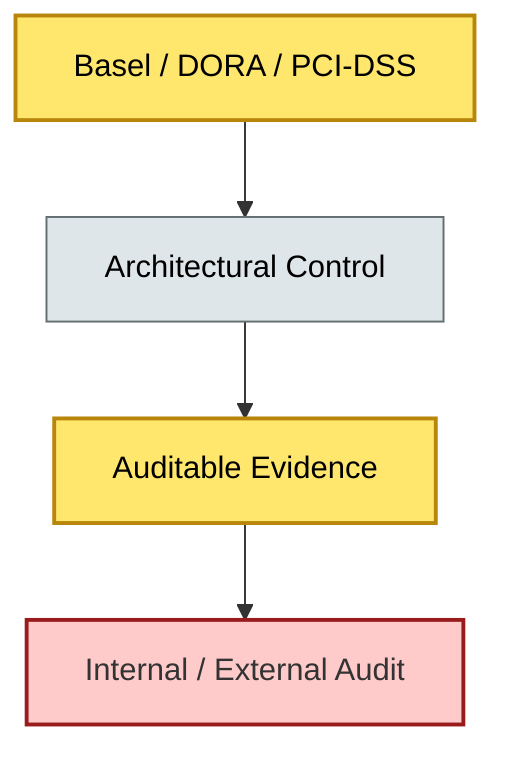

# [C9-03] Compliance & Audit — BRIEF
> **Category:** C9 — Governance, Management & Strategy · **Difficulty:** ●● · **Banking-relevant:** yes
> **One-liner:** Compliance and audit in enterprise architecture is the set of controls, evidence, and verification activities that prove architectural decisions meet regulatory, legal, and contractual requirements.
> **Why an EA cares:** In banking, a non-compliant architecture is an illegal architecture—regulators can levy fines, restrict operations, or revoke licenses; the EA function must therefore design for provable compliance from the start.

## Quick definition
Compliance and audit in EA involves embedding regulatory controls (e.g., Basel, DORA, SOX, PCI-DSS, GDPR) into architecture patterns and ensuring that every deployed system produces auditable evidence that those controls are operating as intended.

## Key ideas / terms
- **Control Traceability:** The ability to map a regulatory requirement (e.g., "encryption of cardholder data at rest") to the architectural decision, implementation, and test evidence.
- **Audit Trail:** An immutable, time-stamped record of who changed what architectural artifact, when, and why.
- **Compliance Debt:** The accumulating technical and process debt created by shortcuts that defer regulatory alignment, analogous to technical debt.

## The mental model
Compliance is not a final checkpoint; it is a property of every architectural decision. The mental model is "compliance by construction": if an auditor cannot prove it from the architecture and source code, it does not exist. Banking architectures must satisfy *regulators* and *auditors*, not only *end users*.

## One diagram (mandatory)

## When to use / when NOT to use
- ✅ **Use when:** The bank operates in regulated jurisdictions and any architecture change could affect capital, liquidity, payments, or consumer data.
- ⚠️ **Avoid when:** The application is a non-regulated internal tool with no customer, market, or settlement exposure; a lighter compliance check may suffice.

## Banking 💳 example
A bank migrating a card-issuance platform to the cloud must demonstrate PCI-DSS control 3.4 (render primary account number unreadable) and PCI-DSS control 8.2 (authenticate all users). The EA function includes encryption-at-rest patterns and MFA requirements in the standard cloud reference architecture, so every card-platform service inherits those controls without case-by-case negotiation.

## Common confusions (don't mix these up)
- **Compliance and Audit** vs **Risk Management:** Compliance proves adherence to rules; risk management quantifies and mitigates business loss—different audiences and evidence standards.

## Interview / recall prompt
"Explain compliance and audit in architecture in 2 minutes without notes." →
- It is about provable, auditable adherence to regulation.
- Controls must be traceable from regulation to implementation.
- Evidence must be produced, not asserted.
- Compliance debt is real and costly.
- Architecture must be designed for auditability.

---
**Status:** ✅ Covered · See detail doc: `[details/C9-03-compliance-audit.md](../details/C9-03-compliance-audit.md)`
