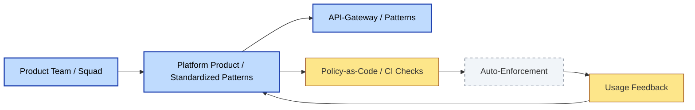

# [C9-04] Architecture-as-a-Service — BRIEF
> **Category:** C9 — Governance, Management & Strategy · **Difficulty:** ●● · **Banking-relevant:** yes
> **One-liner:** Architecture-as-a-Service (AaaS) is the provision of standardized, on-demand architectural guidance, patterns, and reviews delivered like a product to business units and agile squads.
> **Why an EA cares:** In banking, AaaS allows the EA team to scale architecture influence without linear headcount growth, while migrating legacy architects from gatekeepers to enablers—provided governance does not become a distant call center.

## Quick definition
Architecture-as-a-Service treats published architectural standards, pattern libraries, automated governance checks, and lightweight reviews as consumable products. Business units and product owners opt into them, and the EA team continuously improves them based on usage and outcome.

## Key ideas / terms
- **Platform Product Management:** Treating architectural standards as products with stakeholders, roadmaps, docs, and SLAs.
- **Self-Service Governance:** Automated tooling (e.g., SonarQube rules, policy-as-code) that enforces standards without human bottleneck.
- **Squad Enablement:** The goal of AaaS is to make every squad self-sufficient at the architecture-standard level.

## The mental model
AaaS is to traditional enterprise architecture what cloud marketplaces are to on-premise data centers. The shift is from *advising on demand* to *providing standard interfaces that are pre-approved*. If a product team can stand up a compliant payments service from a published pattern, the EA team has succeeded.

## One diagram (mandatory)

## When to use / when NOT to use
- ✅ **Use when:** The bank is running many autonomous squads or product teams that need repeatable, compliant architecture with low EA-queue latency.
- ⚠️ **Avoid when:** The organization is too immature for self-service or lacks the dev-ops maturity to ingest and act on automated governance.

## Banking 💳 example
A neobank building multiple credit-products (personal loans, SME lending, buy-now-pay-later) uses an AaaS catalogue. The catalogue includes a standard KYC data-model pattern, an AML transaction-screening integration pattern, and a PCI-DSS logging pattern. Each product squad consumes the appropriate pattern via Terraform modules and CI checks, ensuring compliance without lining up EA review slots.

## Common confusions (don't mix these up)
- **Architecture-as-a-Service** vs **Architecture Center of Excellence (CoE):** AaaS is productized and opt-in; a CoE is often a centrally staffed advisory body.

## Interview / recall prompt
"Explain Architecture-as-a-Service in 2 minutes without notes." →
- Treat standards as consumable products.
- Use self-service and automation to avoid bottlenecks.
- Shift EA from gatekeeper to enabler.
- Platform products have roadmaps, documentation, and SLAs.
- The squad should be self-sufficient at the standard level.

---
**Status:** ✅ Covered · See detail doc: `[details/C9-04-arch-as-service.md](../details/C9-04-arch-as-service.md)`
