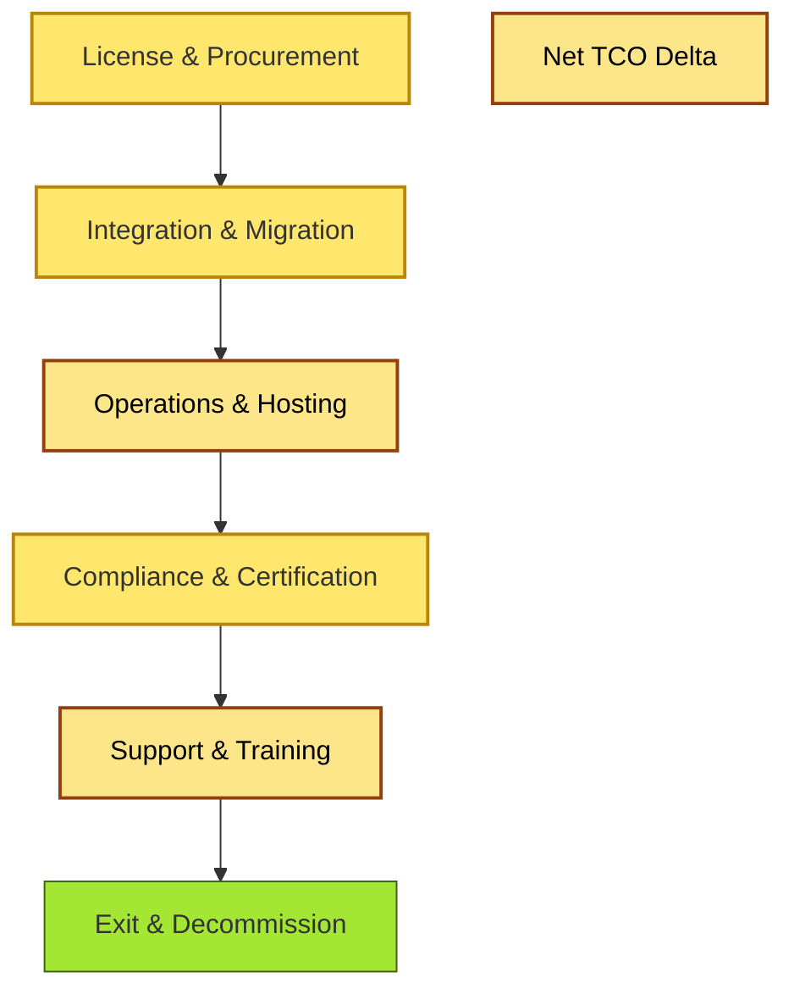

# [C9-05] TCO / Cost Modelling — BRIEF
> **Category:** C9 — Governance, Management & Strategy · **Difficulty:** ●● ●● · **Banking-relevant:** yes
> **One-liner:** Total Cost of Ownership (TCO) in enterprise architecture is the long-run cost prediction model that includes acquisition, integration, operations, compliance, exit, and risk-adjusted costs for any architectural option.
> **Why an EA cares:** In banking, vendors often quote a low license fee but a hidden cost in integration, certification, and exit; a rigorous TCO model lets architects compare options on a common economic axis.

## Quick definition
TCO modelling for architecture is the practice of forecasting the full lifetime cost of a technology choice—including procurement, integration, infrastructure, compliance, support, training, and decommissioning—to inform portfolio-level decisions and vendor negotiations.

## Key ideas / terms
- **Now-case TCO:** The cost of maintaining the current architecture for one more planning horizon.
- **Target-state TCO:** The projected cost of a proposed architectural option.
- **TCO Delta:** The signed difference between target-state and now-case, used to justify investment or retirement.

## The mental model
TCO is not a finance-only spreadsheet; it is an architectural argument. A low upfront cost with high integration and compliance cost is a *bullish* architecture that finance will question. The mental model is "cost-per-transaction-or-per-customer-journey," not license seats, because banking software must be justified by revenue or risk reduction.

## One diagram (mandatory)

## When to use / when NOT to use
- ✅ **Use when:** Selecting between on-premise, cloud, SaaS, or build-vs-buy options, especially when licensing is opaque or switching costs are high.
- ⚠️ **Avoid when:** The evaluation is purely tactical or within a 6-month budget cycle; then a basic TCO may be worse than ignoring cost entirely.

## Banking 💳 example
A bank evaluates three core-banking modernization options: (1) licensing a COTS suite, (2) running an open-source core in a private data center, (3) adopting a managed SaaS core. The TCO model includes licensing, integration with the existing payments hub, DORA compliance certification, disaster-recovery infrastructure, and an exit scenario where the bank re-internalizes. The managed SaaS option wins on on-going cost but loses on exit flexibility; the decision is recorded in an ADR with explicit assumptions.

## Common confusions (don't mix these up)
- **TCO** vs **ROI:** TCO is a cost forecast; ROI is a benefit/cost ratio. Architects must produce a credible TCO before ROI can be calculated.

## Interview / recall prompt
"Explain TCO in architecture in 2 minutes without notes." →
- TCO includes all lifetime costs, not just purchase price.
- Compare on-going cost against now-case to find the delta.
- Include compliance, integration, and exit costs.
- Justify every option on the same axis before discussion shifts to license price.
- TCO is an architectural argument, not a finance-only exercise.

---
**Status:** ✅ Covered · See detail doc: `[details/C9-05-tco-cost.md](../details/C9-05-tco-cost.md)`
