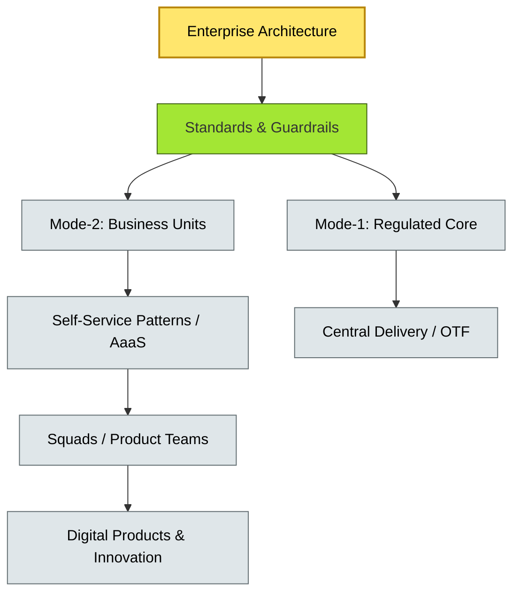

# [C9-06] Delivery Models — BRIEF
> **Category:** C9 — Governance, Management & Strategy · **Difficulty:** ●● ●● · **Banking-relevant:** yes
> **One-liner:** Delivery models in enterprise architecture are the structural arrangements—centralized, federated, Bimodal, or platform-based—that dictate how architectural decisions, funding, and execution are allocated across the organization.
> **Why an EA cares:** In banking, the choice of delivery model determines whether an agile product team is blocked by a central review bottleneck or enabled by self-service standards, and whether technology debt is visible or hidden.

## Quick definition
Delivery models describe how architectural strategy is operationalized through organizational design, budgeting, and workflow. They shape who decides, who pays, who builds, and who enforces standards.

## Key ideas / terms
- **Centralized EA:** All major decisions, standards, and reviews flow through a single enterprise architecture function.
- **Federated EA:** Business units and regions have delegated authority, with enterprise architecture setting guardrails and standards.
- **Bimodal EA:** Rapid-delivery, decentralized Mode-2 squads coexist with controlled, centralized Mode-1 infrastructure—a tension that requires explicit governance.
- **Platform / AaaS Model:** Enterprise architecture provides self-service patterns and automation; business units build applications with product ownership retained locally.

## The mental model
Delivery models are not one-size-fits-all. A bank with a highly regulated core business and a fast-moving digital subsidiary may need a *dual* delivery model: strict Mode-1 governance for payments and settlement; flexible Mode-2 enablement for customer-facing features. The risk is that the two models collide at shared platforms (identity, data, cloud).

## One diagram (mandatory)

## When to use / when NOT to use
- ✅ **Use when:** The bank has diverse business lines with different speed and risk profiles, and leadership needs clarity on where architecture authority sits.
- ⚠️ **Avoid when:** The organization is too small or homogeneous to sustain multiple delivery modes; a single federated or centralized model may be simpler.

## Banking 💳 example
A global money-center bank adopts a federated delivery model: the enterprise architecture team owns the global payments reference architecture and the cloud-security baseline; individual country IT teams implement local variants subject to the baseline. The digital bank subsidiary is a separate legal entity with its own delivery model, but it must still consume the enterprise-owned identity and data-platform services, creating a governance handshake at the shared boundary.

## Common confusions (don't mix these up)
- **Delivery Model** vs **Architecture Practice Model:** Delivery model is organizational; practice model is the body of methods and standards used.

## Interview / recall prompt
"Explain delivery models in 2 minutes without notes." →
- Delivery models define who decides, who pays, who builds.
- Common models: centralized, federated, bimodal, platform/AaaS.
- Banks often need hybrid models for regulated core + digital innovation.
- The risk is collision at shared platforms.
- The model must be explicitly stated, not accidental.

---
**Status:** ✅ Covered · See detail doc: `[details/C9-06-delivery-models.md](../details/C9-06-delivery-models.md)`
