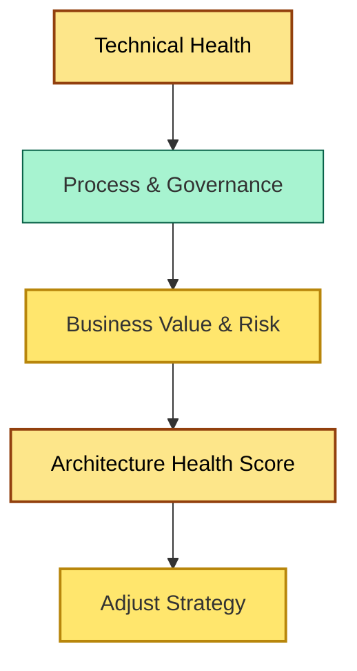

# [C9-08] Metrics & KPIs — BRIEF
> **Category:** C9 — Governance, Management & Strategy · **Difficulty:** ●● ●● ●● · **Banking-relevant:** yes
> **One-liner:** Metrics and KPIs in enterprise architecture are the quantifiable measures—lagging and leading—that assess the health, effectiveness, and business impact of the architecture function and its decisions.
> **Why an EA cares:** In banking, if you cannot measure architecture quality, risk reduction, and value realization, you cannot negotiate budget, defend standards, or prove ROI to the board and the regulators.

## Quick definition
Architecture metrics are quantitative and qualitative indicators that describe the state of architectural decisions, debt, compliance, and value. KPIs are those metrics tied to explicit targets, owners, and review cadences.

## Key ideas / terms
- **Leading vs Lagging KPIs:** Leading indicators predict outcomes (e.g., design-review coverage); lagging indicators confirm results (e.g., cost overruns, incident rate).
- **Architecture Health Index:** An aggregated score from component-quality, documentation-completeness, and compliance-status indicators.
- **Value Realization KPIs:** Metrics that close the loop between delivered architecture and promised business outcomes (e.g., loan-processing time reduction, KYC speed-up).

## The mental model
If you do not measure it, you do not manage it—and in banking, "not managing it" means fining, remediation, or competitive obsolescence. The mental model is a balanced scorecard: technical health (what we built), process governance (how we governed), and business value (what changed for customers or operations).

## One diagram (mandatory)

## When to use / when NOT to use
- ✅ **Use when:** The EA function is funded at a material level, or the bank is under regulatory pressure to demonstrate governance effectiveness.
- ⚠️ **Avoid when:** Metrics are invented for vanity or used punitively; leading indicators must be actionable, not punitive.

## Banking 💳 example
An EA function tracks four KPI categories: (1) leading—percentage of new services that pass automated policy-as-code checks on first build; (2) process—average time from EA proposal submission to Architecture Board decisions; (3) technical—percentage of critical systems with up-to-date component diagrams; (4) value—time-to-market reduction for new retail loans. A quarterly score trades off exception to mean and trends, presented to the CIO and the CRO.

## Common confusions (don't mix these up)
- **Measures vs Metrics:** A measure is a raw number (e.g., lines of code); a metric is a derived, interpreted quantity (e.g., architecture health score).

## Interview / recall prompt
"Explain architecture metrics and KPIs in 2 minutes without notes." →
- KPIs are metrics with targets and owners.
- Use lagging (outcomes) and leading (predictors) indicators.
- Balance technical health, governance process, and business value.
- In banking, prove governance effectiveness to the board and regulators.
- Avoid vanity metrics; tie every KPI to an action.

---
**Status:** ✅ Covered · See detail doc: `[details/C9-08-metrics-kpis.md](../details/C9-08-metrics-kpis.md)`
