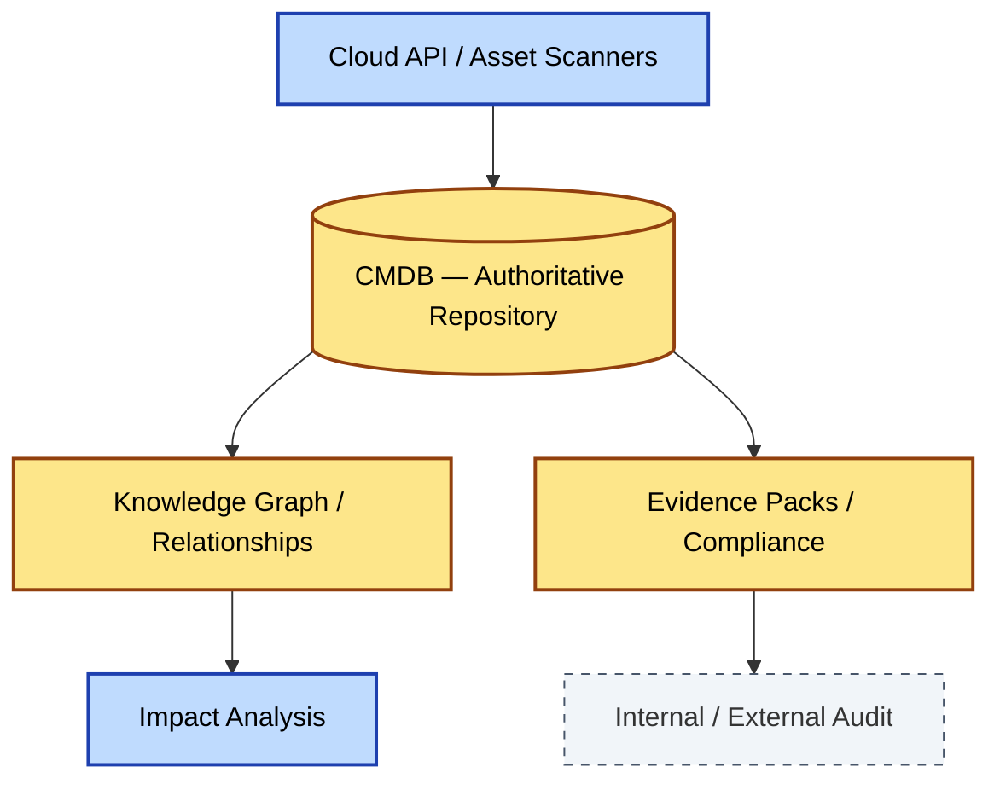

# [C9-09] Knowledge & CMDB — BRIEF
> **Category:** C9 — Governance, Management & Strategy · **Difficulty:** ●● ●● ●● · **Banking-relevant:** yes
> **One-liner:** The Configuration Management Database (CMDB) and knowledge layer in enterprise architecture is the authoritative, curated registry of all configuration items, their relationships, and the evidence that proves compliance with architectural and regulatory standards.
> **Why an EA cares:** In banking, without a CMDB you cannot prove that your production environment matches the approved architecture, that no rogue nodes exist, or that you can recover from a DR test—failures that auditors and regulators punish.

## Quick definition
A CMDB is a centralized repository of configuration items (CIs) and their configuration item relationships (CIRs). In modern EA, it is augmented with knowledge graphs, evidence packs, and compliance mappings that turn static inventory into an auditable, real-time architectural truth.

## Key ideas / terms
- **Configuration Item (CI):** Any component that must be managed to deliver an IT service (hardware, software, network, cloud resource).
- **Configuration Item Relationship (CIR):** The logical or physical dependency between two CIs.
- **Evidence Pack:** A collection of logs, policies, scan results, and test evidence that proves a CI or relationship complies with an architectural standard.
- **Knowledge Graph:** A semantic network of CIs, owners, and business services that enables impact analysis and automated discovery.

## The mental model
The CMDB is the "source of truth" for what exists, not just what *should* exist according to the reference architecture. Modern CMDBs ingest from cloud APIs, asset scanners, and CI/CD pipelines, making the CMDB live data rather than a quarterly manual reconciliation. A living CMDB enables automated compliance evidence and instant impact analysis.

## One diagram (mandatory)

## When to use / when NOT to use
- ✅ **Use when:** The bank has multiple production environments, regulated systems, and audit requirements that demand proof of configuration state.
- ⚠️ **Avoid when:** The organization has no regulated production systems and cannot sustain the data-quality discipline to keep the CMDB accurate.

## Banking 💳 example
After a cyber-security incident, a bank's forensics team discovers an unpatched database server that was never inventoried. The bank mandates an authoritative CMDB that ingests vCenter, Kubernetes, and AWS Config data into a knowledge graph. Within three months, every CI is linked to its CMDB record, every record has an evidence pack proving encryption and access-control, and the CMDB is used daily by SOC and auditors to answer "what is vulnerable?" in seconds.

## Common confusions (don't mix these up)
- **CMDB** vs **Asset Inventory:** A CMDB includes relationships, provenance, and service mappings; an inventory is just a list of assets.

## Interview / recall prompt
"Explain the CMDB in 2 minutes without notes." →
- It is the authoritative repository of configuration items and relationships.
- It includes evidence packs that prove compliance.
- It enables impact analysis, not just inventory.
- In banking, it prevents rogue assets and supports audit/forensics.
- It must be sourced from live data, not manual reconciliation.

---
**Status:** ✅ Covered · See detail doc: `[details/C9-09-knowledge-cmdb.md](../details/C9-09-knowledge-cmdb.md)`
