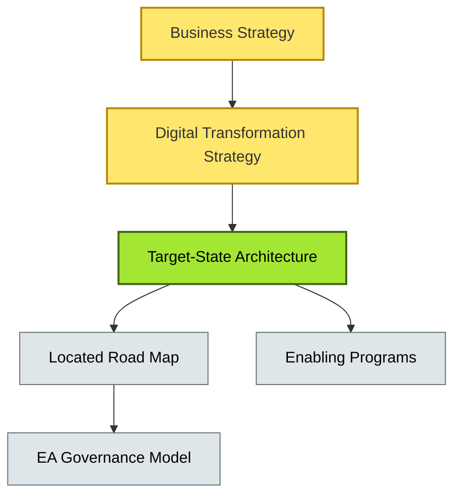

# [C9-10] Digital Transformation Strategy — BRIEF
> **Category:** C9 — Governance, Management & Strategy · **Difficulty:** ●● ●● ●● ●● || **Banking-relevant:** yes
> **One-liner:** Digital transformation strategy is the long-term, enterprise-wide plan that re-imagines customer and operations models through technology, explicitly defining what to preserve, what to disrupt, and what technologies are excluded.
> **Why an EA cares:** In banking, digital transformation is not an IT program; it is the bank's strategy. The EA function translates business strategy into an architectural road map, governs portfolio alignment, and ensures that every transformation program is architectures a *coherent* future state.

## Quick definition
Digital transformation strategy is a multi-year plan—spanning customer experience, operations, risk, and ecosystem—that uses technology to create new value and discontinue obsolete processes. It is distinct from IT-only modernization because it redefines the *business model*, not merely the IT platform.

## Key ideas / terms
- **Customer Journey Redesign:** Re-mapping banking services (onboarding, lending, payments) to digital-first experiences, decoupled from legacy channel assumptions.
- **Ecosystem / Platform Strategy:** Opening the bank's API-gateways and data platforms to fintechs, partners, and embedded finance.
- **Operating Model Design:** New governance, funding, and velocity models (e.g., squads, guilds, guilds) that sustain transformation.
- **Transformation Architecture:** The target state that emerges from the strategy, distinct from incremental modernization.

## The mental model
Transformation strategy sets the *destination*; transformation architecture sets the *path*. Without a strategy, the architecture road map is a collection of local optimizations that look like modernization but fail to change the competitive model. The mental model is "strategic alignment": every technology choice must ladder up to a customer or operations outcome explicitly defined in the strategy.

## One diagram (mandatory)

## When to use / when NOT to use
- ✅ **Use when:** The bank faces existential competitive pressure from neobanks, embedded finance, or platform disintermediation and must re-imagine its model.
- ⚠️ **Avoid when:** The bank is in a regulated, low-growth environment with no customer or channel disruption; modernization may be more appropriate than transformation.

## Banking 💳 example
A global retail bank announces a digital transformation strategy to shift from branch-centric deposits and loans to an API-driven ecosystem where third-party fintechs offer personalized credit products powered by the bank's identity and payments rails. The EA function defines three target-state architectural domains (identity, payments, data) and a four-year road map with explicit *in-scope* and *out-of-scope* boundaries, ensuring that the credit-risk platform modernization does not get rerouted into branch-system upgrades that do not serve the ecosystem vision.

## Common confusions (don't mix these up)
- **Digital Transformation** vs **Digital Modernization:** Modernization improves the existing model; transformation redefines it.

## Interview / recall prompt
"Explain digital transformation strategy in 2 minutes without notes." →
- It redefines the business model, not just IT.
- It sets the destination; architecture sets the path.
- It must define what to preserve, disrupt, and exclude.
- It requires an ecosystem and operating-model view.
- EA translates strategy into an aligned, coherent road map.

---
**Status:** ✅ Covered · See detail doc: `[details/C9-10-digital-transform.md](../details/C9-10-digital-transform.md)`
