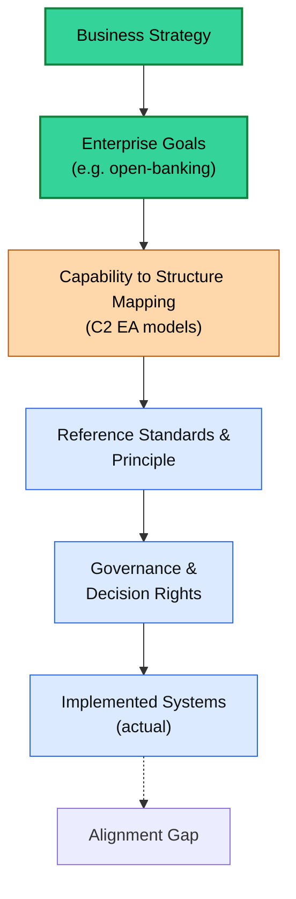
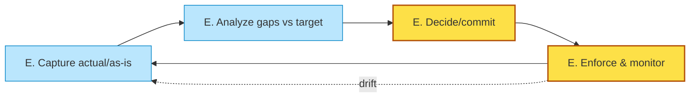
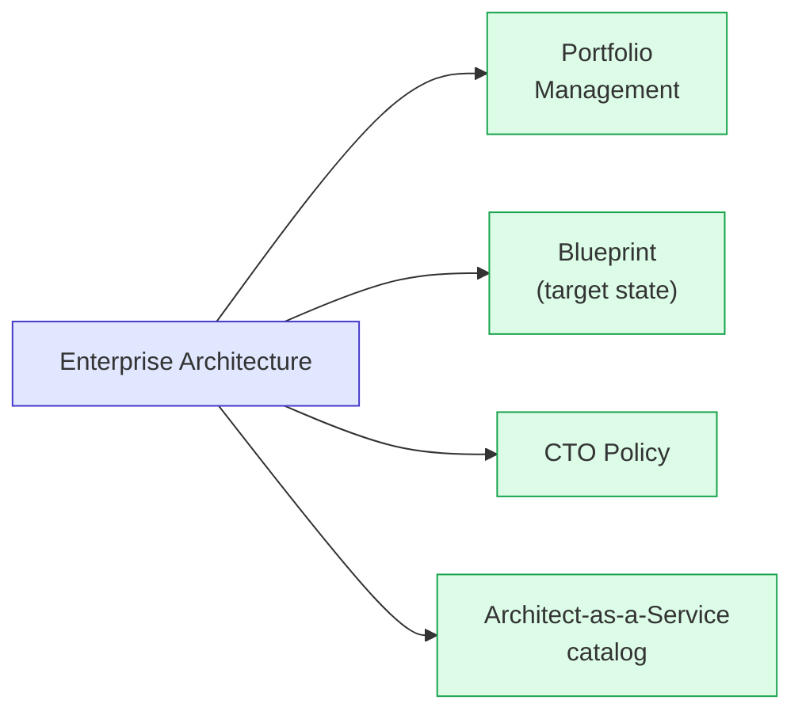
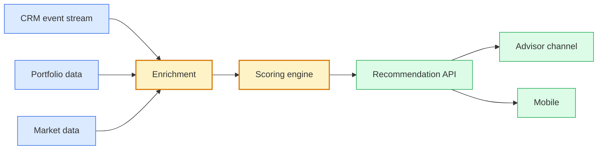

# [C1-01] What is Enterprise Architecture? — DETAIL
> **Category:** C1 Foundations · **Difficulty:** ● foundational · **Banking-relevant:** yes
> **Companion brief:** `briefs/C1-01-what-is-ea.md`
> **Target reader:** enterprise architect who must *explain, justify, and defend* the topic — not just recite it.

---

## 1. Precise definition
Per IEEE 42010 (and the TOGAF term), **Architecture** is a "fundamental concept or proposition that a system is organized and provides the foundation from which the system progress and proceeds as a consequence of the statement." **Enterprise Architecture** extends this to the *whole enterprise*: the business + information + application + technology structures and their relationships, governed to achieve strategic outcomes.

Key distinction from the confusion table: EA is a *domain of architecture practice*; system/software architecture is a *perspective* within it.

## 2. Why it exists (problem it solves)
Before EA, technology spending in large banks followed **local optimization**:
- Business units bought best-of-breed tools rather than interoperable ones.
- Data duplicated across CRM, LOS, and collateral management — with no single truth.
- Compliance required manual reconciliation (SOX-404, PCI, DORA).
- M&A integration took 18–24 months of re-platforming.

This produced **accidental architecture**: a structure that works locally but fails globally. EA exists to replace it with *evidence-based, governed, coherent* structure.

## 3. Core concepts & vocabulary
| Term | Precise meaning |
|------|-----------------|
| **Architecture domain** | One of business, data, application, technology (TOGAF). |
| **Viewpoint / view** | A representation tailored to a stakeholder concern (Gartner). |
| **Governance** | Enforcing policies, standards, and decision rights over architectural artifacts. |
| **Architectural decision** | A binding or guiding choice that constrains system design. |
| **Reference architecture** | A reusable, canonical structure for a class of solutions. |
| **Target / To-Be** | The architecture the enterprise intends to achieve. |
| **Actual / As-Is** | The current, usually emergent, architecture. |
| **Alignment** | The degree of coherence between strategy and technology. |
| **EA maturity** | A staged scale (0 opportunistic to 5 optimal) of how EA is institutionalized. |
| **Decision rights** | Who may commit to which architectural choice (L*e*D* or AD*). |

## 4. How it works (architecture / mechanism)
EA works by **decomposing strategy into traceable structures**, then **governing change** so the structures remain aligned.

### 4.1 Diagram A — The EA decode: strategy → outcome


### 4.2 Diagram B — EQ (enterprise-quality) feedback loop


### 4.3 Diagram C — EA consumption paths (who uses what)


## 5. Variants, options & trade-offs
| Variant | When to pick | When to avoid | Key trade-off axis |
|---------|--------------|---------------|--------------------|
| **None (accidental)** | Very small org, no strategy yet | Any regulated, growing, or multi-platform org | Cost now vs integration/remediation cost later |
| **Lightweight EA (no framework)** | Need alignment but no budget/staff for full methodology | Complex, multi-country, regulated bank | Governance coverage vs implementation cost |
| **Full TOGAF** | Large, regulated, multi-year enterprise program | Small/simple org, fast-moving startup | Rigor/traceability vs time-to-market |
| **Jaeger + domain-driven** | Lean org, high developer autonomy | Heavy compliance / SOX / audit worlds | Speed vs governance documentation |

## 6. Relationships to sibling topics
- **Business Architecture (C3-01):** EA *consumes* business architecture models (capabilities, value streams) and translates them into technology.
- **IT Strategy (not a topic here but a boundary):** EA is the *realization* of strategy; strategy is the *starter* of EA.
- **System Architecture:** EA is the *governance of many* system architectures, ensuring they fit.
- **Architectural Governance (C9-01):** governance is the *enforcement mechanism* of EA.

## 7. Banking / financial-services context 💳
> **Scenario:** A top-10 global bank decided to migrate to a microservices-based payments platform (real-time settlement, ISO-20022, SWIFT gpi).

**Why EA had to lead:**
- **Regulatory:** PSD2 (EU), DORA (EU), SOX (US), PCI-DSS, OCIE audits — each demands traceability from strategy → control → system.
- **Risk:** Payments failure = immediate trust loss + penalty. The "accidental" alternative (each brand's old monoliths) had no global enterprise view.
- **Acquisition:** Buying a neobank (EU) must be peeled and integrated into the *target* architecture, not a patchwork.

**What EA produced:**
1. A *global payments capability map* (C3-01).
2. A *payments reference architecture* (C8-01) with data-residency rules (EU data → EU DAX-3) (C8-06).
3. *Decision rights*: CTO approves settlement capability additions; business architects validate capability fit.
4. *Architecture decisions* (C6-09) recorded in ADM D (C2-01).
5. *Actually*, the team adopted lightweight / domain-driven (see 5): extensive ADRs, no full TOGAF ADM is recorded internally — saving 30% cost with partial loss of external audit traceability (accepted trade-off).

## 8. Reference architecture / worked example
> **Problem:** A retail bank wants a "recommended next-best-action" engine for wealth management, sourcing events from CRM, portfolio, and market data.

**EA-led approach:**
- Define the **business need** (increase cross-sell by 12%).
- Map to **business capabilities** (client insight, decision engine, channel activation).
- Build a **reference architecture** — not a single code repository, not a point product — with clear boundaries: acquisition, enrichment, scoring, recommendation, delivery.
- Enforce via **development-time and runtime governance** (see ADM D vs something else).

### Diagram


## 9. Maturity & adoption signals
- **Adopt when:** (1) a board-level strategy exists, (2) integration pain > 5% of change-delivery time, (3) leadership funds a governance body.
- **Anti-signals (don't start):** strategy is in headlines only, or leadership will not enforce decisions.
- **Common failure modes:**
  1. **Presentation factory:** EA produces glossy decks nobody acts on → starved of real authority.
  2. **Solution factory:** EA becomes project-delivery → loses governance role.
  3. **Evangelism without artifact:** talks about future state with no As-Is → no baseline for change.

## 10. Common confusions — the "don't mix" list
| Often confused | Real distinction |
|----------------|------------------|
| EA vs IT Strategy | Strategy is *the decision goals*; EA is *the structured, governed realization* of them. |
| EA vs System Architecture | EA governs *many* systems; system architecture designs *one* system to its requirements. |
| Business Architecture vs Enterprise Architecture | Business architecture describes organization/process; EA ensures technology *supports* it and is *governed* globally. |
| Reference Architecture vs Blueprint | Reference = canonical *template* for a class; Blueprint = single org's *target* state over top of it. |

## 11. Tools & standards to know
- **Standards/Frameworks:** IEEE 42010 (architecture definition), TOGAF (ADM), ISO 42010, IEEE 1471.
- **Common tooling:** The Open Group/Archi (ArchiMate), Sparx EA, Modelio (UML/SYSMOD), draw.io / Miro (whiteboards), Confluence (ADR), LeanIX / OpenIAM / ServiceNow (catalog), GitHub (ADR as code).
- **Mandatory reading:** TOGAF 10 (C2-01), A Guide to Developing, Communicating, and Using a System Architecture (OGC), Perry's "Software Architecture: Foundations, Theory, and Practice."

## 12. ADR template (ready to fill in)
```markdown
# ADR-001: Why we are adopting an enterprise architecture function
## Status
Accepted
## Context
The bank evaluated (a) no EA, (b) lightweight EA, (c) full TOGAF, (d) domain-driven. The board requires a clear migration path to target-state coherence over 3 years; audit requires traceability from strategy to system.
## Decision
Adopt a hybrid: TOGAF with reduced ADM tailoring + domain-driven ADRs, per decision rights (CTO + Business Architects).
## Consequences
- Positive: board/audit trust; coherent platform roadmap.
- Negative: adoption cost; risk of over-process at startup.
- ...
## Alternatives considered
1. Lightweight EA only — rejected: audit risk, integration cost too high.
2. Full TOGAF — rejected: cost + time + cultural mismatch for first 12 months.
```

## 13. Practice — apply it
1. **Recall:** "What is EA?" in 2 min without notes.
2. **Model:** a one-page ArchiMate context diagram (business-level) for your bank's current/Random state.
3. **ADR:** write ADR-001 using the template above.
4. **Defend:** roleplay explaining to a non-technical CRO: why we need an EA function before building the next payment platform.

## 14. Summary (1 paragraph)
Enterprise Architecture is the disciplined, governance-backed translation of business strategy into coherent, traceable enterprise-wide structures — the organization's *built-in coherence*. In banking, it is the antidote to the billion-dollar cost of accidental architecture: uncoordinated systems, duplicate data, unvalidated compliance, and failed integrations. A successful EA is invisible to the end user but safeguards every transaction, every audit, and every merger.
