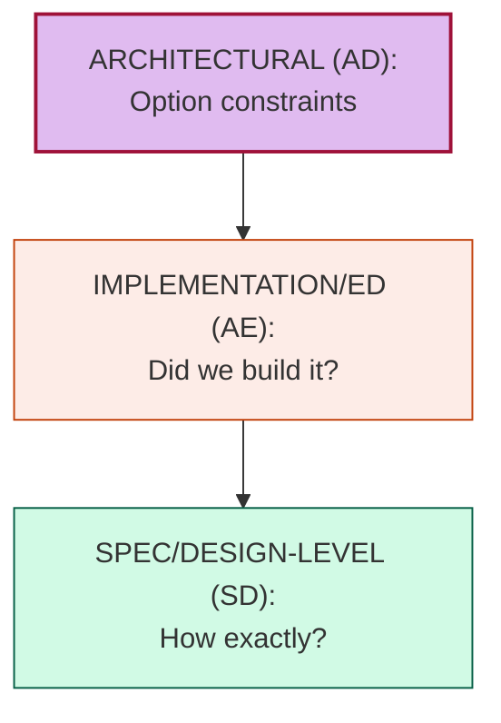
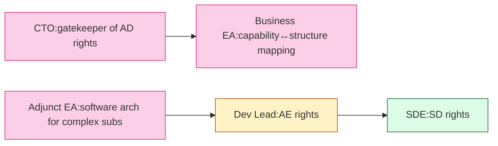

# [C1-02] Architecture vs Engineering vs Design — DETAIL
> **Category:** C1 Foundations · **Difficulty:** ● foundational · **Banking-relevant:** no
> **Companion brief:** `briefs/C1-02-arch-vs-engineering.md`

---
## 1. Precise definition
Michel Martin's canonical definition of *architecture* is a "fundamental concept or proposition that a system is organized and which provides the basis from which the system either progresses as a consequence or derives a concept of itself." The decisive property is **choice among alternatives**.

This distinguishes architecture from **engineering** (realization & quality assurance of a given design) and **design** (spec-level decisions within a structure).

## 2. Why it exists
Early naming conflated these layers, leading to:
- **Frontier drift:** architects delivering code (autonomy cost) → governance weakened.
- **Orchestration cost:** architecture becomes too small (micro-decisions) → governance overload.
- **Accountability loss:** business blames "architecture" for engineering/delivery failures.

## 3. Core concepts & vocabulary
| Term | Precise meaning |
|------|-----------------|
| **Architecture** | A set of fundamental options (structures, standards, patterns) that constrain and enable solutions. |
| **Software architecture** | The architecture of a *single* software system. |
| **System architecture** | Hedging: can mean software system *or* engineered system (hardware+software); distinguish with TOGAF's *physics* (engine) vs *construct* (architecture). |
| **Engineering** | The discipline of building and proving to spec; includes quality, process, integration, testing. |
| **Design** | Spec-level decisions (decomposition, naming, layout, algorithms) inside an architectural envelope. |
| **Architecture decision** | A binding or guiding choice made by an *architecture* (AD) decision right. |
| **Architecture description** | The documented form of an architecture; can be reference, current, or specific. |

## 4. How it works
### 4.1 The decision hierarchy

### 4.2 Decision rights (L*e*D* model)

## 5. Variants, options & trade-offs
- **Single layer OR, multiple layers (Recommended):** Most banks need both *enterprise* (AD by CTO/Architect team) and *software* (EA decision rights) — do not blur.
- **Architect-as-engineers (anti-pattern):** architects self-assign coding — loses AD authority and traceability; document as a *behavior to avoid*.

## 6. Relationships
- **To C1-01 (What is EA):** this is the *differentiation* that prevents EA from collapsing into project delivery.
- **To C6-10 (Evaluation):** evaluation should score architectural and engineering quality separately, not as one proxy.

## 7. Banking example
> **Scenario:** A bank's CTO holds AD rights over settlement-capability choices but authorizes Dev Leads AE rights over implementation details.

> **What happens correctly:** Business wants to migrate ACH → real-time payments. EA defines the *capability boundary* (C3-01) and *reference architecture* (C8-01). Dev Leads negotiate *how* (technology, patterns — C5). CTO/EA review and may veto a pattern that breaches regulatory resilience (C3-05) — a non-negotiable AD boundary.

> **What happens if conflated:** Dev Lead self-selects a "cool" async-but-no-transactional-outbox pattern (C5-04) to hit a sprint goal → settlement inconsistency → regulatory breach. The architect who "just approves PRs" had no AD boundary; accountability diffused.

## 8. Practice
1. **Recall:** define each layer in 30 seconds with one example.
2. **Model:** map your org's decision rights to the L*e*D* model.
3. **Defend:** "Why should architects not write production code?" in a compliance context (audit traceability of decision ≠ code merge).
