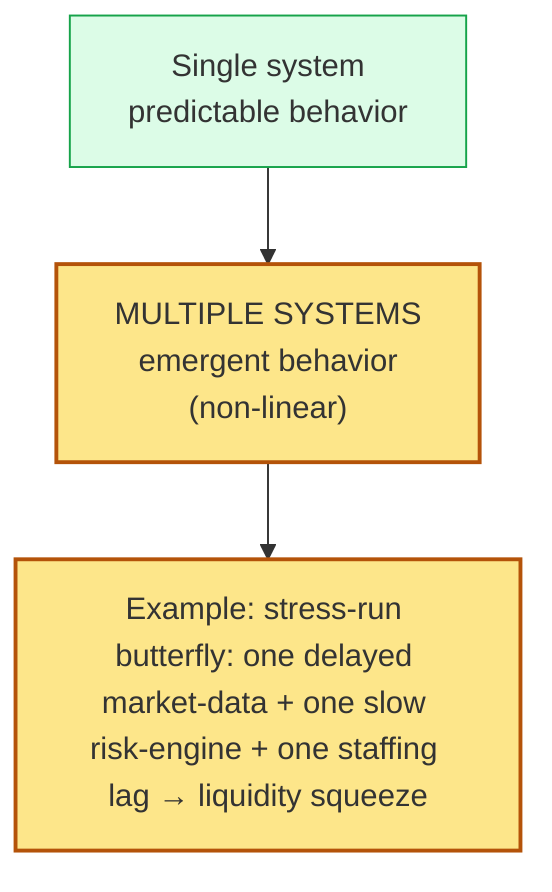
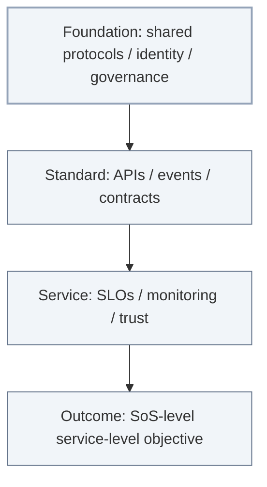

# [C1-03] Systems & System-of-Systems Thinking — DETAIL
> **Category:** C1 Foundations · **Difficulty:** ● foundational · **Banking-relevant:** yes
> **Companion brief:** `briefs/C1-03-systems-thinking.md`

---
## 1. Precise definition
A **system**, per IEEE 1471 / Martin-Ares, is a "set of elements and relationships between elements" that together produce **emergent** properties — meaning properties attributable to the system *as a whole*, not to any single element in isolation.

A **system of systems (SoS)** is a higher-order system in which constituent systems:
1. Retain *independent* operational management (each has its own purpose, lifecycle, owners).
2. Interoperate *functionally* at a defined interface/contract.
3. Together produce *collective* emergent properties no constituent alone can achieve (e.g., end-to-end payment settlement).

Types (after Maier 1996):
- **Directed SoS:** centrally managed (e.g., a bank's own retail+payments+settlement systems under one CTO).
- **Acknowledged SoS:** loosely committed (e.g., a bank + its card issuer + its liquidity pool).
- **Collaborated SoS:** equals operating together (e.g., a real-time gross settlement + real-time payment scheme across multiple independent banks).
- **Virtual enterprise:** Just the collaboration; no central control (e.g., a consortium of neobanks + a core provider).

## 2. Why it exists
SoS are the *default state of enterprise technology*. The alternative — a single planned system for everything — is a **restaurant-induction** that fails above ~3 teams / 2 product lines. Banks live in SoS: legacy cores + cloud apps + SaaS + partner APIs + regulatory feed layers.

## 3. Core concepts & vocabulary
| Term | Precise meaning |
|------|-----------------|
| **System boundary** | The delimiter that separates what is inside (designed/controlled) from outside (externalized). |
| **Emergence** | Behavior produced by the whole that cannot be predicted from individual parts alone (e.g., liquidity shortage under stress). |
| **Heterogeneity** | Architects of SoS contend with different tech stacks, lifecycles, risk appetites. |
| **Interoperability** | The degree to which systems can exchange and use information without requiring changes. |
| **Contracts** | Behavioral agreements (not just APIs): SLOs, schemas, invariants, exception policies, data ownership. |
| **Constituent system** | An independently managed system within an SoS. |
| **Stakeholder** | Any party with an interest in the SoS's outcome. |

## 4. How it works
### 4.1 Why emergence matters

### 4.2 SoS contract hierarchy

## 5. Variants, options & trade-offs
- **Tight integration (planned SoS):** strong contract + central governance + slow evolution — price: capex, autonomy cost; suited to a *directed* SoS.
- **Loosely coupled (acknowledged/collaborated):** weak contract, fast evolution, emergent risk — price: observability, modeling; suited to a federation.
- **Anti-pattern: false monolith for SoS:** pretend an SoS is one system → collapse boundaries → merge responsibilities into one team (see Conway's Law, C7-01) → likely failure.

## 6. Relationships
- **C1-01 (What is EA):** SoS *is* the domain EA models.
- **C3-06 (Integration):** SoS *generates* integration architecture needs.
- **C4-03 (CAP, distributed):** SoS boundaries are where CAP plays out between constituents.

## 7. Banking/financial-services context 💳
> **Scenario:** A mid-size European retail bank's end-to-end euro-denominated retail payment (payment initiation → instant payment scheme → card network → issuer → merchant → account) is a *collaborated SoS*.

> **Constituents (with independent lifecycles):**
> - Retail bank's own PSP ( ACH-like, e-money )
> - TPP (3rd-party fintech, regulated under PSD2)
> - Card scheme (Visa/Mastercard, whose own SoS)
> - Merchant acquirer
> - Liquidity provider for real-time gross settlement
> - One or more core banking engines (legacy, acquired)

> **SoS contracts (not just APIs):**
> - **Schema contracts:** ISO-20022 message semantics, at least three levels (header, payload, business-message).
> - **SLOs:** 99.95% message delivery under 500 ms; >3σ triggers Data Quality escalation.
> - **Invariants:** Every debit has a matching credit across the settlement boundary; no double-spend at the SoS level.
> - **Exception policy:** TPP retry with idempotency keys follows retry *then* fraud-hold on 5x without success; not per-TPP, SoS-level.

> **Emergence in action:** In March 2023 (fictional but realistic pattern), 1) TPP A's data latency spiked 8 s, 2) card auth fell 0.8%, 3) the bank's liquidity buffer had not been re-modeled for real-time bursts → a *cross-constituent stress* only visible at the SoS level. C1-03 thinking + C5-09 (Circuit-Breaker) would have kept it contained instead of becoming a regulator-reportable incident.

## 8. A worked example
> **Problem:** The bank wants to launch a "push-to-card" product (customer initiates debit from their bank account, pays a merchant).

> **SoS composition:** PISP registration → bank consent → ISO-20022 push message → scheme → acquirer → merchant. Each is a constituent.

> **EA's job:** Model the *SoS*, not rebuild the card scheme. Define contracts:
> - *Identity:* eKYC (passport) → bank (strong) → scheme (medium) — deviation is the *funding source* risk.
> - *Behavior:* mandatory memo field + legal basis string on every push.
> - *Fallback:* if scheme unavailable, hold funds in escrow with a partial settlement flag.

## 9. Maturity & adoption signals
- **SoS awareness mature:** architects and dev leads use *contracts* not *integration code* as the primary specification.
- **Anti-signals:** no SoS-level monitoring; system-only metrics; every integration is a one-off; technology mismatch is tolerated without a bridge budget.

## 10. Common confusions
| Often confused | Real distinction |
|----------------|------------------|
| System vs SoS | A system has a *single* owner/batch; an SoS has *many* independent owners whose composition produces new outcomes. |
| Integration vs SoS | Integration is the *mechanics* between constituents; SoS is the *governance of the composed whole* beyond any one integration. |
| Emergence vs unpredictability | Emergence is *designed-for* (models its possibility); unpredictability is *residual risk* requiring observability (C4-12). |
