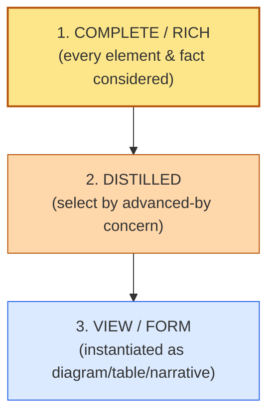
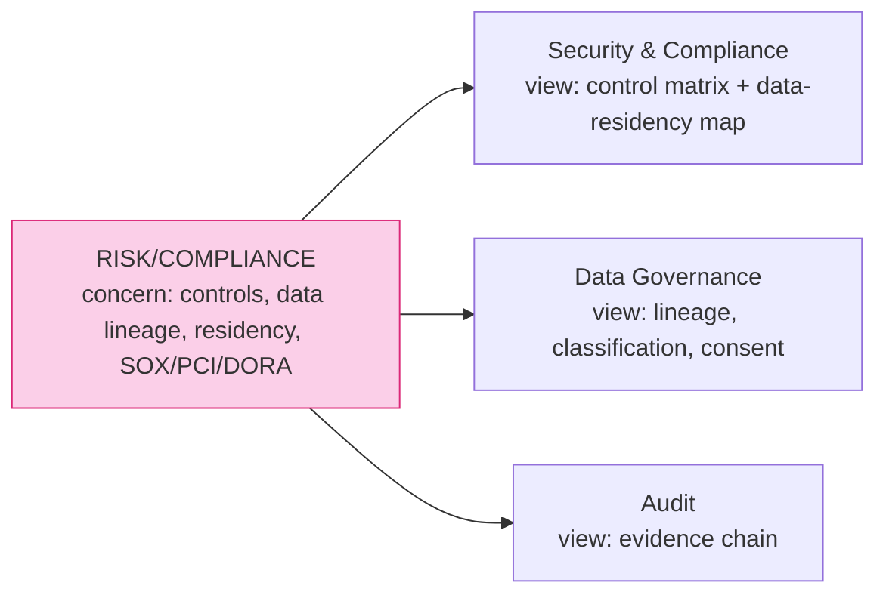
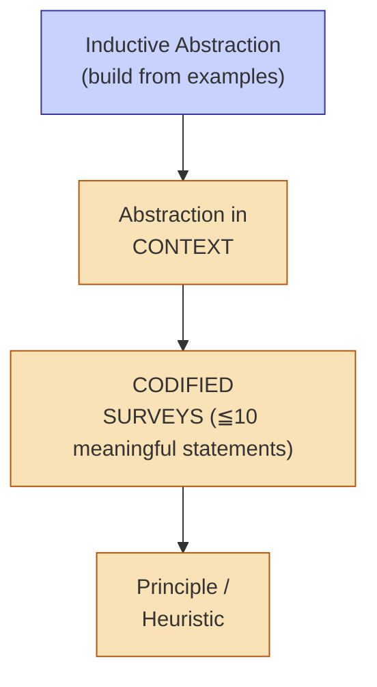

# [C1-04] Abstraction, Views & Representations — DETAIL
> **Category:** C1 Foundations · **Difficulty:** ● foundational · **Banking-relevant:** yes
> **Companion brief:** `briefs/C1-04-abstraction-views.md`

---
## 1. Precise definition
Per IEEE 1471 and Peter Way's *Conceptual Modeling*, an **architecture description** (AD) comprises more than one view. Each **view** addresses a **stakeholder concern** via a **viewpoint** (a template of questions and visual constructs). **Abstraction** is the art of deciding what to exclude without breaking meaningfulness for the concern.

Key: *abstraction is not lying — it's *designing the omission* for a purpose*.

## 2. Why it exists
Stakeholders *already* think about the same system differently. The danger is not multiple views — it's *unacknowledged, conflicting, or missing* views.

Consequences in banks:
- Compliance asks for a "risk-mitigation view" and gets the deployment diagram → failure.
- DevOps builds a "monitoring view" but it omits regulatory data-exposures → audit finding.
- The "architecture diagram" lives in a folder and no one owns which stakeholder it serves → stale, unusable.

## 3. Core concepts & vocabulary
| Term | Precise meaning |
|------|-----------------|
| **Abstraction** | The disciplined omission, distortion, and selection of information relevant to a perspective. |
| **Viewpoint** | A *template* that maps stakeholder concerns to model elements and relationships to be shown. |
| **View** | A concrete artifact produced from a viewpoint. |
| **Model** | The formal/informal language + constructs used; *rich* (complete) vs *distilled* (purpose-tuned). |
| **Survey** | A higher abstraction: *how complete/rich is this description?* (C4's "codified surveys"). |
| **Architectural element** | Any part of a model (component, connection, data object). |
| **Relationship element** | How elements are associated (depends-on, realized-by, allocated-to). |
| **Oblicity** | per Nassim Taleb - "focus on the indirect" (reaching a goal by a circuitous path); not to be confused with abstraction. |

## 4. How it works
### 4.1 The abstraction stack

### 4.2 Viewpoints for banking stakeholders

### 4.3 The "too-many-arrows" diagram

## 5. Variants, options & trade-offs
- **Coded in-line (e.g., C4):** code-like thing that *is* the view AND drives doc (both sides). Trade-off: precision vs tooling cost.
- **Model-only (ArchiMate, UML):** rich, standardized, but can become decorative; requires disciplined maintenance.
- **Integrative (natural language + diagrams):** fastest to produce, hardest to keep consistent; common in aCAD (agile contracts + documents).
- **Bad practice: one "architecture diagram"** that everyone points to — usually misaligned to *any* stakeholder concern.

## 6. Relationships
- **C9-01 (EA practice):** view governance (who owns which view, when refreshed).
- **C1-05 (Artifacts):** the *how* of keeping views trustworthy (CMDB linkage, review cycles).
- **C8-02 (Standards):** ISO 42010 mandates multiple views and a trade-off rationale.

## 7. Banking/financial-services context 💳
> **Scenario:** A bank prepares for a DORA audit + internal risk-operations review.

> **Same architecture; three views produced from one rich model:**
> - **Security & Compliance view (CRO/Audit):** data-residency map (C8-06), encryption-at-rest mandates, PCI-DSS scope, third-party control attestation. *Distillation:* omits module internals; keeps contracts + locations.
> - **Technical Engineering view (Head of Engineering):** deployment topology, CI/CD pipeline, observability stack (C4-12), auto-scaling rules. *Distillation:* collapses cloud/account relationships to cost-center view.
> - **Cost Control view (CFO):** cloud per-service spend, outsourcing fees, build-vs-buy TCO. *Distillation:* not a technical diagram; a cost-allocation + risk-weighted spend model.

> **The abstraction discipline:** each view's *omissions* are *acceptable for its concern* and *not* propagated elsewhere. No single view carries the "whole truth" — but the governed set is the whole truth.

## 8. Practice
1. **Recall:** define abstraction/view/viewpoint in 20 seconds; then distinguish "view" from "model" using your bank's wiki as the example.
2. **Model:** take a real risk/compliance concern and draft *one* view (a 6-box diagram + 3 questions it answers).
3. **ADR:** "Why we produce 3 stakeholder views before every architecture decision" — template.
4. **Defend:** "Why a 'master architecture diagram' is an anti-pattern" — in a board context.
