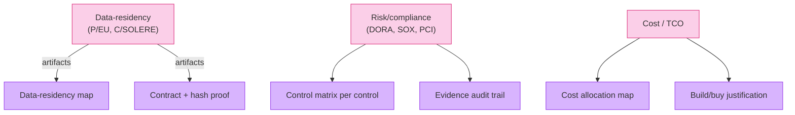

# [C1-05] Architecture Artifacts & Documentation — DETAIL
> **Category:** C1 Foundations · **Difficulty:** ● foundational · **Banking-relevant:** yes
> **Companion brief:** `briefs/C1-05-artifacts.md`

---
## 1. Precise definition
An **architecture artifact** is any expressible, reviewable, and (where required) audited representation of a concern to a stakeholder: a model, diagram, decisions, policy, standard, survey, catalog, interface specification, or MVD.

From TOGAF: *storage, inventory, and distribution of architecture descriptions / decisions / standards / measures / references / suppliers*.

## 2. Why it exists
Regulators now *demand* evidence, not intent:
- DORA: active governance of digital operational resilience *must be demonstrable*.
- SOX-404: ISMS controls *must be traceable* to system-level artifacts.
- PCI-DSS: network diagrams, segmentation validation artifacts.
- Basel/CCAR: models + change/control records.

Also: Decision-making fatigue. Without a persistent artifact, every architect re-explains the same thing at a different meeting, with drift.

## 3. Core concepts & vocabulary
| Term | Precise meaning |
|------|-----------------|
| **Artifact** | A justified, maintained representation of a logical/physical structure or decision for a stakeholder. |
| **Document** | The narrative/form of an artifact; must have *when/ why* and *who approved*. |
| **Survey** | A high-level, codified *few* (~10) meaningful statements about an abstraction. Also "quantitative". |
| **Lineage/traceability** | The *relationship* showing which artifacts flow from / into one another (goal → capability → structure → system). |
| **ID/catalog** | Curated, unfrozen lists (ADR index, architecture decision board, vendor catalog). |
| **MVD (Minimal Viable Document)** | The least set of artifacts that delivers *decision confidence* for a concern; *not* for completeness. |
| **Completeness** | *How much* must be described relative to purpose vs. *perceived* of completeness (never 100% — omit deliberately). |

## 4. How it works
### 4.1 Artifact lifecycle

### 4.2 Artifact-concern matrix (banking)

### 4.3 MVD discipline

## 5. Variants, options & trade-offs
- **Comprehensive documentation:** completeness, audit-ready, slow; rarely warranted for fast-moving products.
- **MVD (Recommended for most):** just enough for the decision; prefer *linked artifacts* (a survey + the critical diagram) over long documents.
- **In-code (C4 / IDEF-on-code):** code-as-life-source; artifacts derived from code; maintain code quality discipline.
- **Navy (anti-pattern):** doc-only logic vs code behavior → agents maintain the gap → drift.

## 6. Relationships
- **C1-08 (Core vocabulary):** lineage/traceability is one of the glossary terms.
- **C8-02 (Standards):** ISO 42010, IEEE 1471 enforce artifact traceability.
- **C9-09 (Knowledge & CMDB):** the *living* catalog of architecture artifacts + their binding to live systems.

## 7. Banking/financial-services context 💳
> **Scenario:** A bank is acquired and must integrate the target's payment platform into its DORA-compliant architecture within 9 months.

> **Essential artifacts (MVD set, not "everything"):**
> 1. *As-Is architecture* (current target + existing bank) — per C3-10.
> 2. *To-Be reference* — per C8-01.
> 3. *Decision record* (ADR) for *each* material integration choice (C6-09) — e.g., build bridge vs. adopt acquirer's DEI, with cost/security/control rationale.
> 4. *Control-to-system* map (SOX-404 + DORA) — C3-05 + C8-01 linked to CMDB (C9-09).
> 5. *Evidence* of review/approval per DORA art. 30 and SOX-404 — signatures + timestamps, not a deck.
> 6. *Integrity/availability/confidentiality/integrity* survey (C6-04) as ≦10 codified statements.

> **What to omit (by MVD):** historical greenfield sketches, obsolete runbooks, every past ADR (keep index; maintain top-N active ones).

## 8. Practice
1. **Recall:** list 6 artifacts + their *who/when/why* in 1 min.
2. **Model:** audit on self-service: which of your past architecture decisions lack a review/approved artifact?
3. **MVD-challenge:** take a "master document" and extract its MVD in ≤6 statements.
4. **Defend:** "Why a 100-page architecture document that no stakeholder reads is *worse* than a 6-statement MVD plus a linked diagram."
