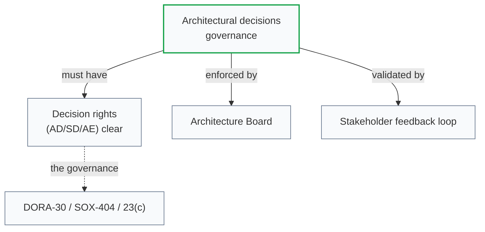
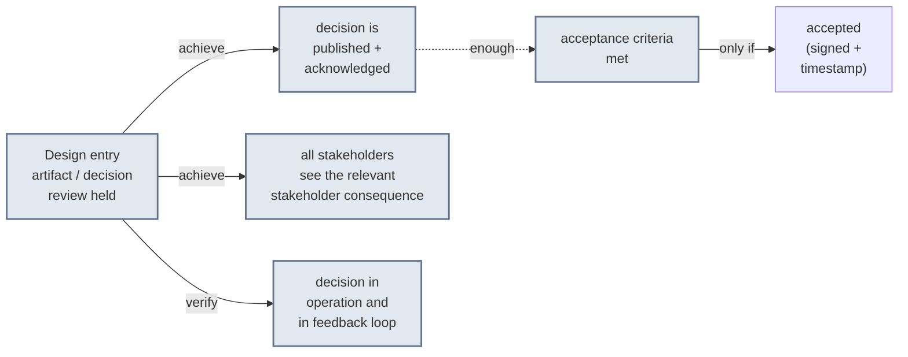

# [C1-06] Stakeholders & Communication (business-IT bridge) — DETAIL
> **Category:** C1 Foundations · **Difficulty:** ● foundational · **Banking-relevant:** yes
> **Companion brief:** `briefs/C1-06-stakeholders.md`

---
## 1. Precise definition
In A/ML: *stakeholder = any organization/individual serving a function able to care about architecture outcomes (C1-01)*. **Communication = the enforcement of shared understanding** of architecture decisions. The *actually* correct diagrams *have* no value unless a stakeholder share aligned.

This is the *enforceable* part: if the ADR exists but nobody read it or didn't understand the trade-off, the architecture decision is *legally* in place and *operationally* invisible — which is the root cause of "accidental" architecture.

## 2. Why it exists
Architecture decisions are implemented across *business leadership, IT leadership, dev teams, security, risk, compliance, legal, data, and platform*. These roles have *different concerns, vocabularies, and authority*.

Without structured communication:
- Business says "we need feature X" → dev implements *naively*, violating resilience (C4-05).
- Security issues a mandate → implemented *narrowly*, breaking observability (C4-12).
- Risk flags a data-residency issue → architect *acknowledges* but doesn't **communicate closure** to the program, so the risk stays open (DORA, SOX).

## 3. Core concepts & vocabulary
| Term | Precise meaning |
|------|-----------------|
| **Stakeholder** | Any org/individual with a function able to care about architecture outcomes. |
| **Role** | *Type* of stakeholder member (Board, Business Architect, CFO, Data Officer, Dev Lead, Vendor). |
| **Accountable** | ultimate authority + decision *right* over an architecture decision (AD/SD/AE). |
| **Communication** | the enforcement of shared understanding — list + *what* (what needed to be shared), *with whom*, *when*, *validated*. |
| **Business architecture** | the discipline where *business leaders* — not IT — bridge strategy & operations; distinct from EA. |
| **EA process** | the end-to-end practice by which EA decisions *live*; the visible form that stakeholders interact with. |
| **Intelligence** | per Open Group, the *ability to learn/adapt*; stakeholder intelligence = the feedback loops. |
| **Outline / line-item** (against) architecture = visible line-pieces; "outline" = *result* of identification, line-by-line decision monitoring. |

## 4. How it works
### 4.1 Stakeholder-communication map
```mermaid
graph TD
    classDef acd fill:#dbeafe,stroke:#2563eb,stroke-width:2px
    classDef intent fill:#fde68a,stroke:#b45309
    Accountable[CTO / Head of EA<br/>(decides AD rights)]:::acd --> Intent["intent / decision<br/>published (within 2-48h)"]:::intent
    Tintent["type:"):::intent -->|"once-through sign-off"| T1[Board / Risk Committee]
    Tintent --> T2[Business Architects]
    Tintent --> T3[Data Officer(s)]
    Tintent --> T4[Dev (Lead); Security / Risk / Legal]
    Tintent --> T5[Vendor / Ecosystem firms]
    T1 --> Tsurface["surface (share)"]:::intent
    T2 --> Tsurface
    T3 --> Tsurface
    T4 --> Tsurface
    T5 --> Tsurface
    class Accountable critical
```
**Key rule:** *intent/decision → published within* 2-48h; *presence* = *acknowledged by stakeholder*; then publish *surface* = *share where each can see the consequence of each decision*.

### 4.2 Authority-communication-compliance triangle


### 4.3 The "shared understanding" checklist


## 5. Variants, options & trade-offs
- **One-channel (e.g., only Board):** fast, but misses operational nuance; common anti-pattern (decision correct in theory, stale in practice).
- **Multiple channels by stakeholder type (recommended):** Board on outcomes + risk; BA on capability; Dev on implementation + ADR; Security on control; vendors on contract/technical contracts.
- **Anti-pattern: "announce-and-run":** publishes decision, then people produce adjustments *around* it — the decision is *not* enforced, not enforceable.

## 6. Relationships
- **C1-01 (What is EA):** stakeholder management is the *enforcement* mechanism.
- **C3-06 (Integration):** stakeholder communication must propagate integration contract changes.
- **C9-01 (EA practice):** the *process* that runs stakeholder-by-stakeholder communication.

## 7. Banking/financial-services context 💳
> **Scenario:** A bank's CTO publishes an ADR: "no on-premise payment core, all-in on a multi-region persistent message bus (going pragmatic, C1-01)."

> **Stakeholder communication executed:**
> - **Board / Risk:** *decision published* within 48h; *acknowledgment* that resilience SLAs include DR (C4-10) + data-residency to EU/India; *signed* by CRO with an acceptance comment.
> - **Business Architects:** *capability map* updated (C7-02) showing the old payment app is sunset, not migrated; *sunk cost* accepted deliberately per C6-05 (trade-off: legacy debt vs. cloud-migration cost/time).
> - **Data Officer / Privacy:** *data-residency map* (C1-05 + C8-06) shared; *acceptance* that bus data-at-rest is encrypted, logs retained for 7 years (PCI).
> - **Dev (Lead) + Security / Risk / Legal:** *ADR linked* to C4-05 (resilience) and C8-06 (residency); *pull-based acceptance* — Dev Lead confirms build plan will enforce bus-level idempotency (C4-09) and encryption; Security validates PCI-DSS v4.0 mapping.
> - **Vendor:** contract renewed with *technical contract* showing EU-region deployment, right-to-audit, and data-rest clause; *accepted* by vendor + Legal within 2 weeks.

> **What would fail the communication test:** only (*1*) the technical ADR exists in Confluence with no 'accepted' signature from CRO/Legal/Data/Dev Lead. Then, in month 6, a recurring auditor asks "where is the evidence the decision was communicated and accepted by every stakeholder with compliance authority?" — and there is none.

## 8. Practice
1. **Recall:** list the 5 stakeholder types referenced in the A/ML talk + *what* for each, in 1 min.
2. **Project audit:** for your last architecture decision, check: was it *published within* 48h? Did *every* accountable stakeholder *acknowledge*? Do you have a *timestamped sign-off*?
3. **Defend:** "Why the same architecture decision is *correct* in engineering and *illegal* in compliance if the communication/evidence trail is missing."
