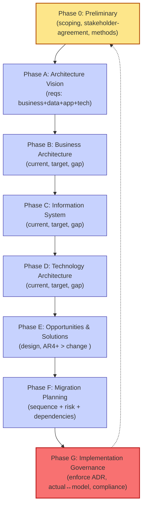
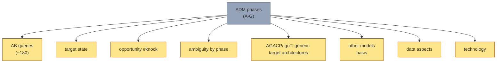

# [C1-07] The Architecture Lifecycle (Plan → Build → Operate) — DETAIL
> **Category:** C1 Foundations · **Difficulty:** ● foundational · **Banking-relevant:** yes
> **Companion brief:** `briefs/C1-07-lifecycle.md`

---
## 1. Precise definition
The architecture lifecycle is the **standardized, traceable sequence** by which an enterprise governs the *evolution* of its structure: it models the desired current/target state, derives gap, selects solution components, plans phased transition, and then governs implementation / operation / maintenance against the target — with continuous feedback of the *actual* state back to recap for the next cycle.

In most organizations the canonical reference is **TOGAF's Architecture Development Method (ADM)**; the structure below is *practically* TOGAF-derived but generalized for portability.

## 2. Why it exists
Without a lifecycle, architecture is *episodic* or *event-driven* ("architecture review before go-live" or "audit finds a hole"). This creates:
- **As-Is/To-Be drift:** the target is abandoned, never governed, and the actual architecture is a *massive* accidental construct.
- **Regulatory gaps:** audit asks "where is the target operating model?" Answer: "It's the PowerPoint from 2020."
- **Budget waste:** migration plans are created but not governed; then abandoned, leaving half-built shares.
- **Re-architecture pressure:** every change is a revolution because there is no agreed transition sequence.

## 3. Core concepts & vocabulary
| Term | Precise meaning |
|------|-----------------|
| **Preliminary (Phase 0)** | Scoping, stakeholder alignment, architecture work method, stakeholder agreement. |
| **Phase A — Architecture Vision** | Build the statement of business requirements (business, data, application, technology) → high-level scope. |
| **Phase B — Business Architecture** | Model current and target business; identify gaps. |
| **Phase C — Information System Architecture** | Model current/target information system & applications → identify gaps. |
/  **Phase D — Technology Architecture** | Model current/target technology / infrastructure → identify gaps. |
| **Phase E — Opportunities & Solutions** | Identify solution components (architecture design + external solutions); *the* design phase. |
| **Phase F — Migration Planning** | Sequence the transition, identify risk/dependencies; *phased* migration not big-bang. |
| **Phase G — Implementation Governance & Change** | Establish architecture governing body; enforce via AD4 + AMF test; per "actual" on model ↔ live architecture; when architecture is out of compliance; when refactor mandates. |
| **AD (architecture decision):** binding or guiding choice restricting the system design / change (e.g., "all new payment services use REST + JSON, gRPC for intra-service"). |
| **As-Is / To-Be:** C1-07. |
| **Actual running architecture:** the *implemented* "actual" (distinguish from *intended*). |
| **Gap:** deviation between current and target. |
| **Capability / plan:** per TOD (c1-03). |

## 4. How it works
### 4.1 The lifecycle mapped


### 4.2 ADM phase artifact types

[Correction: keep this where-relevant; in practice phase specifics define *internal* artifacts — see TOGAF standard.]

### 4.3 "Actual/Intended" diagram
```mermaid
graph LR
    classDef ppl fill:#dbeafe,stroke:#2563eb,stroke-width:2px
    classDef live fill:#f87171,stroke:#b91c1c
    classDef diff fill:#fed7aa,stroke:#b45309
    TargetIntended["Intended / Target<br/>Architecture (To-Be)"]:::ppl -->|"target model"| Actual["Actual Running<br/>Architecture"]:::live
    Actual --> Evidence["Evidence<br/>(traces, CMDB, surveys)"]:::diff
    Actual -.->"Diff drift"| Drift["drift /<br/>gap turns<br/>investment"]:::diff
    Actual --> Modeled["Modeled quiet"|].. _Model actual"|_
    class Target critical
```

### 4.4 Governance against drift
```mermaid
graph TD
    classDef eqtlter fill:#fff7ed,stroke:#cc7a00
    classDef diff fill:#fecaca,stroke:#991b1b,stroke-width:1px
    Target["Target To-Be"]:::ppl --> Comm["Communicate<br/>(see C1-06)"]:::comm --> Audit["Audit & compliance<br/>deviation"]:::audit
    Target -->|model| Actual["Actual Live"]:::live
    Comm -->|reference| Criteria["monitoring /<br/>compliance criteria"]:::criteria
    Audit -->|found| Found["Architectural deviation /<br/>gap resolved by decision"]:::critical
    Actually Live["immunity"]:::eqtlter -->|gap found| Criteria
    class Target critical
```

## 5. Variants / options / trade-offs
- **Full TOGAF ADM cycles:** maximum rigor, highest turnaround; only justified for *major platform, M&A integration, or regulatory program*.
- **Lightweight ADM (recommended for most changes):** cap to Phase 0 + A + B + brief E; implement rejection rules rather than full artifact; *if* phase is not executed properly, pause development until it is (DoD).
- **Parallel streams:** Business + Data + App+Tech arc groups can be *parallel* but *converge* at Phase F (migration planning).
- **"As-is/To-be" hysteresis:** the *actual* state drifts; governance must *catch* it (see Phase G monitoring & trap).

## 6. Relationships
- **C1-01:** the lifecycle *implements* the EA practice.
- **C1-06:** communication runs in every phase (stakeholder >> what determined by phase).
- **C2-01:** TOGAF ADM = the canonical reference lifecycle instance.
- **C9-01:** Phase G = the governance phase.

## 7. Banking/financial-services context 💳
> **Scenario:** A global bank chooses to move from a 10-year old COBOL-based clearing engine to a cloud-native real-time platform (repo-settle flow per real-time gross settlement in an EU clearing house, per C1-03).

> **Lifecycle in action:**
> - **Phase 0 (Prep):** sponsor + steering board + budget; artifact: Statement of Architecture Work Method. Accountability: CTO + STO.
> - **Phase A (Vision):** reqs: 99.999% settlement availability (C4-10), 300 ms end-to-end (C4-04), PCI/DORA/SOX traceability (C8-04/C8-05), EU data-residency (C8-06), support for ISO-20022 (C3-05).
> - **Phase B (Business):** Business Architecture model (C2-04/C3-01). Gap: current COBOL clearing + manual exception handling does not meet 300 ms+resilience; *business* or *financial harms* identified.
> - **Phase C (Info-system):** Current/Application + Data Architecture per C3-03 + C3-02. Gap: no event-driven clearing; manual ledger reconciliation; no shared settlement data model.
> - **Phase D (Tech):** Current/target infra: on-prem r3.04 dedicated CPU (C8-01 + C6-08) vs. Azure-EU region with hardened edge/microservices / event streaming (C10-02/C5-04). Gap: res/no.
> - **Phase E (Opportunities & Solutions):** *Solution components*: (1) event sourcing clearing (C5-07), (2) microservices (C5-03), (3) cloud-native patterns (C10-04), (4) proven AWS/Azure clearing service (Vendor strategy C8-08). *ADR* documents each choice.
> - **Phase F (Migration):** Phased: (1) NIST-compliant *ihd* (insulated hybrid emulation → migrate COBOL batch to EU container), (2) full replacement with new microservices, (3) parallel in test (simulate 10M txns), (4) cut-over. Dependent on vendor (C3-06).
> - **Phase G (Governance):** Establish Architecture Board (C9-02); enforce ADR against live; *actual/intended* drift detection; *refactor mandated* when (compliance violation or cost >40% of budget) — *refactor mandated* by decision trigger per C1-06 disclosed.

> **Anti-pattern avoided:** Big-bang rewrite in 18 months; staff siloed; Phase F missing → no rollback plan; Phase G missing → "we thought it was done" but live drift caused a 4-hour outage.

## 8. Practice
1. **Map one program:** take 2–3 of your past programs and identify which lifecycle phase they *actually* went through.
2. **Phase-checklist:** write a one-line checklist for *your* org per phase (what must exist to call a phase done).
3. **ADR + Lifecycle:** align ADR-001 (C8-03/C1-01) to the lifecycle phase that generated it.
4. **Defend:** "Why a 10-year migration plan that never entered Phase G governance is *worse* than no plan at all."
