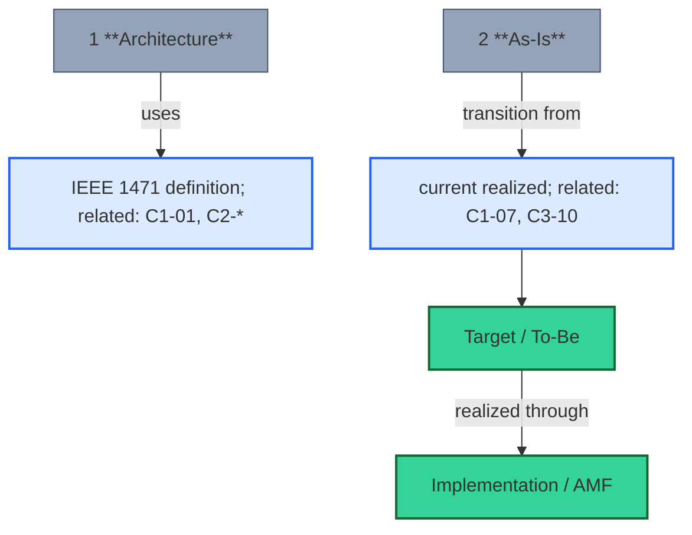
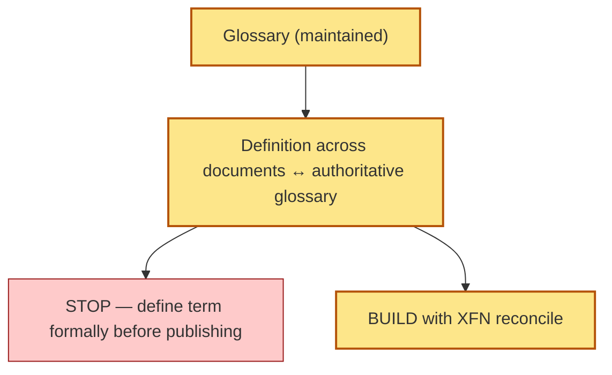

# [C1-08] Core EA Vocabulary & Glossary — DETAIL
> **Category:** C1 Foundations · **Difficulty:** ● foundational · **Banking-relevant:** yes
> **Companion brief:** `briefs/C1-08-glossary.md`
> **Target reader:** the enterprise architect who must *enforce* definitional consistency across audit, compliance, board, and dev communication.

---
## 1. Precise definition
A glossary, per IEEE 1471 and the Open Group, is the **definitive, maintained reference list** of terms with precise definitions, scope, and cross-references. It is *self-referential*: each term points to the IDs of topics that use and develop it.

## 2. Why it exists
Regulators probe consistency:
- DORA supervisor asks "where is the *actual* payment-risk architecture?" If the *as-is* definition differs across audit docs → inconsistency → *supervisory finding*.
- Data Governance asks "data *residency* = data-at-rest in EU vs in-flight over EU?": different assumptions in two documents → *incorrect control scope* → *PCI non-conformance*.

## 3. Core concepts & vocabulary
| Term | Precise definition | Example in banking |
|------|-------------------|-------------------|
| **Architecture** (IEEE 1471) | "A fundamental concept or proposition that a system is organized and provides the foundation from which the system either progresses or derives its concept." | Not "our systems" but "the controlled choice of structures that govern our systems." |
| **As-Is (Actual)** | The *current, implemented* structure of the enterprise, including all accidental / organic / unplanned elements; the *target* of Phase G governance. | The COBOL-based clearing engine that passed last year's payment audit. |
| **Capability** | The ability to deliver a specific outcome or manage a specific risk, expressed in *business language*; *not* a system nor an application. | "Customer Onboarding & Credit Decision" — a capability served by CRM + credit engine + AML. |
| **Decision rights** | *Who* may commit/bind to each class of architectural decision — AD (architecture), SD (software), AE (engineering), L (lead). | CTO holds AD on settlement-capability architecture; Dev Lead AE on team-level tech; Architecture Board approves. |
| **Gap** | The deviation between *actual/current/realized* and *target/intented* per the architecture lifecycle. | The compliance-audit gap: actual encryption key management not mapped to target (AES-256-at-rest). |
| **Continuity** | The enduring value and consistency of the *It* (architecture knowledge) across time. | A change report that is *not* matched to the unique change identified in *all* changes in the *actual* or *target* structure. For a single target structure, the *actual* & *target* Define: Implementation gap knowledge evaluated by enterprise architects. |
| **Individual system** | One software/electrical/ system structure within the enterprise; often used interchangeably with *system* in practice. | The Payments Core Banking System, the Mobile App, the Credit Risk Engine. |
| **Target / To-Be** | The architecture the enterprise *intends* to have, *per decisions*. | The target state: microservices-based, EU-region-only, API-gateway-sourced, PCI-compliant. |
| **To-Be (Intended / Target)** | A model of the *intended* architecture; *not* a static blueprint but a *governed, evolving* state. | The target model maintained in Architecture Mu; subject to versioning and change control. |
| **Build-by-zonal** | Repeated capability-level + statement-structure + structure-level + *artifacts + rules + tests* (ABZ). | A set of build-by-zonal that claims to be *cross-organizationally* applicable, *context-independent*, *shared* within a *sector* (banking/retail). |

## 4. How it works
### 4.1 The definition-provenance graph

### 4.2 Implementation-review fork

## 5. Variants, options & trade-offs
- **Heavily cross-document:** maximum consistency cost; suited to *regulated, compliance-bound, multi-document* enterprises (banks).
- **Lightweight:** glossary as a *landing page*; less central, easier to adopt fast; suited to *small/fast-moving* teams.
- **Anti-pattern:** *different* definitions in different documents for the same term (e.g., "as-is" in architecture vs GRC).

## 6. Relationships
- **C1-01 to C1-07:** the glossary *enforces* consistent use of every term across the lifecycle.
- **C8-03 / C8-04:** compliance and regulatory terms must be in-glossary.
- **C1-08 itself:** the glossary is a living artifact, updated per ADR outcomes (C1-09).

## 7. Banking/financial-services context 💳
> **Scenario:** During a DORA self-assessment, the bank's architecture glossary *defines* "critical third-party" differently in the Architecture section vs. the GRC section:
> - Architecture says: any third-party *providing* a critical *function* → vendor must be *contracted*.
> - GRC says: any third-party *processing* critical *data* → vendor processing = covered.
> The gap: a *payment* vendor that provides a critical function *and* processes critical data is under *two* different rules — one allows a lightweight contract, the other requires full due-diligence. During the audit, the discrepancy is a *supervisory finding* because the "actual" control is not consistently defined.
>
> **Fix:** the glossary reconciles "critical third-party" as *both* (provides a critical function AND processes critical data) = the *union* of the two, and the Architecture body must adopt it per ADR =(1)*.

## 8. Practice
1. **Audit your last 5 documents** for *terminological drift* (same term, different definitions).
2. **Draft one glossary entry per top stakeholder** (CRO, CTO, BA, Security, Audit) — see whence terms differ.
3. **Update C1-08** with the *top 5* definitions; make it the *single source demanded to be used* on each key topic.
4. **Defend:** "Why a 5-word definition divergence is *not* a pedantic concern but a *regulator-evidenced* control weakness."
