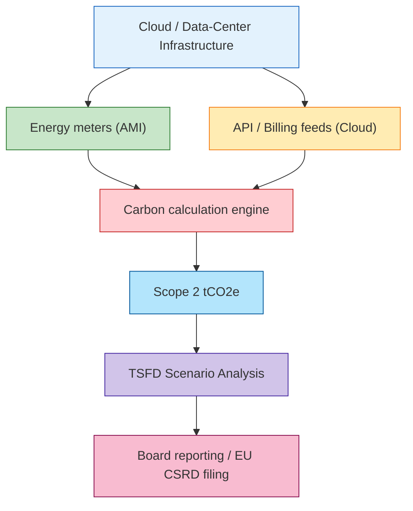
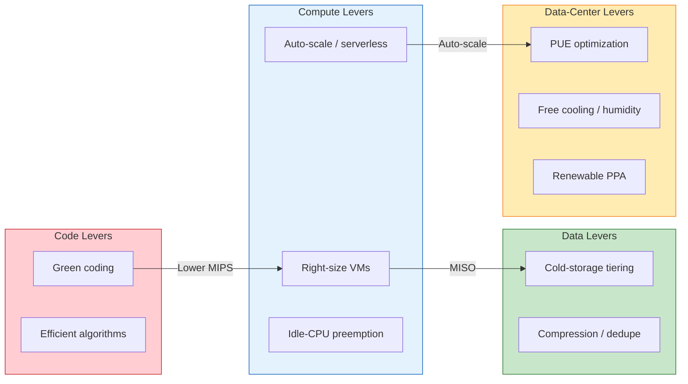

# C10-12-Green-IT.md — Detail: Sustainable / Green IT Architecture

## Precise Definition
Sustainable IT Architecture is the design, operation, and governance of information-technology assets and services to **minimize environmental impact** while preserving— or enhancing—business value. It spans the full lifecycle: procurement, design, deployment, operations, and disposal. The field is driven by regulatory frameworks (CSRD, TCFD, SFDR, GDPR-adjacent hardware-right-to-repair), cost economics (energy as OpEx), and brand risk (public carbon accounting).

## Why It Exists
- **Regulatory pressure**: EU CSRD, TCFD / ISSB disclosure rules, and national taxonomy regulations now require banks to report IT-related emissions.
- **Cost pressure**: Energy and compute are OpEx line items; idle capacity directly erodes margin.
- **Reputational pressure**: Investors and depositors increasingly evaluate green credentials; greenwashing fines are rising.
- **Resilience**: Green IT overlaps with IT resilience—redundancy for energy continuity, not just data continuity.

## Core Concepts Table

| Concept | Meaning | Formula / Metric |
|---|---|---|
| **Carbon footprint (Scope 2)** | Emissions from purchased electricity, heat, steam, cooling. | `tCO₂e = kWh × grid emission factor (gCO₂e/kWh) + PPA offset factor` |
| **PUE** | Data-center energy efficiency ratio. | `Total Facility Power / IT Equipment Power` |
| **WUIRE** (Water Usage Effectiveness) | Water consumed by cooling / IT equipment. | `Total Facility Water / IT Equipment Power` |
| **Idle-CPU throttling** | Reducing CPU frequency or stopping workloads when utilization is low. | % of cores powered down / sleep cycles |
| **Renewable PPA** | Power Purchase Agreement for off-site renewable generation; often virtual (REC-based). | % of consumption matched |
| **Green coding** | Writing so-called *"): applications that minimize runtime, memory, and network calls. | MIPS / runtime / bytes-out per transaction |
| **Resource efficiency** | Storage and compute utilization ratios. | `Utilized / Provisioned` |

## Mechanism: How Banks Measure and Reduce Carbon

1. **Meter everything**
   - Install power meters (AMI) per rack; key-power-cap every PDU.
   - Cloud billing APIs → cost/kWh mapping via provider sustainability dashboards (AWS CloudCarbonFootprint, Azure Emissions Impact, GCP Carbon Sense).
2. **Baseline**
   - Compute *carbon intensity* per transaction: `tCO₂e per 1,000 card payments`.
   - Establish PUE and WUIRE baselines for each data-center region.
3. **Target-setting**
   - Board-level target: *absolute Scope 2 reduction* (e.g., 42% by 2030, net-zero 2045).
   - Operational KPI: *€/MWh* or *tCO₂e/€m revenue*.
4. **Intervention levers**
   - **Right-sizing**: Right-size VMs using workload telemetry (Prometheus + Grafana + kube-state-metrics); de-provision over-provisioned databases.
   - **Idle-CPU throttling**: Use Kubernetes Cluster Autoscaler + KEDA; set pod eviction for nodes < 5% CPU for > 10 minutes.
   - **Renewable matching**: Virtual PPAs with green-energy certificates; real-time matching via ERP / sustainability platforms (Sustainalytics, Watershed).
   - **Humidity / temperature optimization**: Raise free-air inlet temps from 18°C to 27°C; use hot-aisle containment.
   - **Server lifecycle**: Decommission > 5-year-old servers; refurbish and redeploy; recycle e-waste via R2v3 / WEEE-certified partners.
5. **Disclose**
   - TCFD Scenario Analysis: 1.5°C / 2°C aligned pathways for IT-related emissions.
   - GRI 302 (Energy) / GRI 305 (Emissions).
   - DORA operational resilience: link carbon-outage risk to business-continuity plans.

## Diagram: Measurement & Reporting Flow



## Diagram: Intervention Levers



## Variants / Options

| Variant | Description |
|---|---|
| **On-premises / colocation** | Full control over PUE and cooling; high CapEx, direct GHG measurement. |
| **Hybrid cloud** | Burstable workloads to hyperscaler; requires cross-cloud energy-attribution. |
| **Green cloud** | Cloud-provider pledge (e.g., 100% renewable by 2030); rely on provider disclosures. |
| **Edge computing** | Distributed small nodes; may reduce WAN traffic but increase sprawl—trade-off required. |
| **FinOps** | Cost-optimization as proxy; often drives energy reduction indirectly. |
| **Circular IT** | Hardware refurbishment, leasing, and end-of-life recycling programs. |

## Relationships

- **Green IT ↔ Resilience**: Power outages equal carbon-outage risk; designs for green efficiency often improve resilience (e.g., free-air cooling reduces chiller failure modes).
- **Green IT ↔ Cloud Governance**: Cloud sustainability dashboards (AWS, Azure, GCP) provide data; governance decides allocation and tagging.
- **Green IT ↔ ESG / CSRG**: CSRG sets policy; Green IT is the execution domain covering procurement, operations, and disposal.
- **Green IT ↔ DORA / TCFD**: DORA demands operational resilience; TCFD demands carbon disclosure—both require reliable IT metrics.

## Banking Context (💳)

### Regulatory Drivers
| Regulation / Standard | Green IT Implication |
|---|---|
| **TCFD** | Disclose governance, strategy, risk management, metrics related to climate-relevant IT assets. |
| **DORA** | Operational resilience includes energy-supply continuity; mandate carbon-outage stress tests. |
| **EU Taxonomy / CSRD** | Report Scope 2 and Scope 3 emissions; IT is a material contributor. |
| **GRI 302 / 305** | Energy and emissions reporting; IT metrics must be audited. |
| **SFDR** | Asset managers must report green/dark/transition IT holdings. |

### Cross-Border Data-Center Emissions
- EU cloud regions (e.g., eu-central-1 Frankfurt) source grid mix varies; **PPA + REC** coverage must be region-specific.
- **Supplier leverage**: Hyperscaler sustainability clauses must be embedded in IT procurement contracts.
- **Transfer-pricing implication**: Carbon accounting must align with tax residency of data-center locations.

## Worked Example

**Scenario**: A European retail bank needs to reduce data-center Scope 2 by 30% in 18 months while maintaining 99.999% SLA.

| Phase | Action | Metric |
|---|---|---|
| 1. Measure | Install smart PDUs; export to sustainability platform (Watershed). | `kW per rack`, `PUE`, `RECs matched` |
| 2. Baseline | Compute `tCO₂e per transaction` (card payments). | 0.12 gCO₂e / transaction |
| 3. Target | Board approves: PUE < 1.35, renewable PPA 80%, idle-CPU > 70% at night. | `€/MWh` < baseline |
| 4. Actuate | Raise inlet temp to 27°C; shut dev/test after 22:00; right-size prod VMs. | `tCO₂e / 1,000 tx` drop 0.12 → 0.084 |
| 5. Audit | Third-party assurance of TCFD and GRI disclosures. | Assurance report |

## ADR Snippet

```yaml
title: "Data-Center Carbon-Reduction Programme"
date: 2026-06-01
status: accepted
scope: "eu-central-1 data-center + 30% hybrid cloud"
regulatory:
  - TCFD Core & Recommended disclosures
  - DORA ICT risk-management
  - CSRD / EU Taxonomy
decisions:
  - "Target PUE < 1.35 by Q4 2026."
  - "Match 80% of annual compute consumption to renewable PPAs / RECs."
  - "Implement idle-CPU throttling and overnight node shutdown."
  - "Adopt free-air cooling with inlet temp 27 degC ± 2 degC."
consequences:
  positive:
    - "Estimated 22% Scope 2 reduction; €/MWh savings."
    - "Improved resilience via reduced chiller complexity."
  negative:
    - "requires chilled-water redundancy audits."
    - "vm-migration downtime risk during right-sizing."
```

## Maturity / Adoption Signals

| Level | Signal |
|---|---|
| **1 — Ad-hoc** | No carbon metrics; energy bills reviewed only for cost. |
| **2 — Reactive** | PDCU reports energy cost; occasional virtualization drives (PUE awareness emerging). |
| **3 — Repeatable** | Carbon-accounting pilot; PUE target set; some right-sizing and idle-CPU policies in dev. |
| **4 — Defined** | TCFD metrics published; renewable PPA in place; automation detects and acts on idle capacity. |
| **5 — Quantitative** | Carbon budgets per application; FinOps + GreenOps merged; real-time carbon-intensity dashboards; cross-border scope accounted. |

## Confusions Table
| Confusion | Clarification |
|---|---|
| Green IT = carbon neutrality | Green IT is *one lever*; true net-zero also requires supply-chain, business-model, and offset strategies. |
| Renewable PPA = 100% green | PPAs are often *virtual* (RECs); real-time matching depends on grid parity and data-center location. |
| Green IT hurts performance | Right-sizing and idle-CPU throttling can *improve* density and response if capacity is managed. |
| Green IT vs. ESG/CSRG | Green IT is operational; ESG/CSRG is policy + disclosure + strategy. |
| Cloud is always greener | Cloud can reduce total footprint, but multi-cloud sprawl and data-transfer emissions may offset gains. |

## Tools / Standards
| Category | Tool / Standard |
|---|---|
| Carbon calculation | CloudCarbonFootprint, Watershed, Persefoni, oEo |
| Energy monitoring | Dry-Contact Smart PDU, OpenBez, liblab |
| Data-center optimization | Huawei iManager, Schneider EcoStruxure, Vertiv |
| Green coding | SonarQube (maintainability), CodeClimate (efficiency), OpenSSF scorecard |
| Procurement / reporting | EU Taxonomy Technical Screening Criteria, TCFD, GRI, ISO 14064, GHG Protocol |

## Fillable ADR Template

```yaml
title: "[[GREEN IT ADR TITLE]]"
date: "[[YYYY-MM-DD]]"
status: [[accepted|proposed|deprecated]]
scope:
  - "[[Scope line 1]]"
  - "[[Scope line 2]]"
regulatory:
  - "[[Regulation or standard]]"
targets:
  pue: "[[Target, e.g., < 1.35]]"
  renewable_ppa: "[[XX%]]"
  carbon_intensity: "[[XX gCO2e per unit]]"
decisions:
  - "[[Decision: ...]]"
  - "[[Decision: ...]]"
consequences:
  positive:
    - "[[Positive: ...]]"
    - "[[Positive: ...]]"
  negative:
    - "[[Negative: ...]]"
    - "[[Negative: ...]]"
```

## Practice Prompts

1. **Operational**: Map your bank’s VM fleet against green metrics. Which application family has the worst carbon intensity per transaction, and why?
2. **Strategic**: You must choose between migrating a core-banking workload to AWS eu-central-1 (higher PUE, better renewable PPA) vs. keeping it on-prem (lower PUE, grid mix). Build a TCFD-aligned decision framework.
3. **Governance**: Draft a board-level disclosure section for TCFD Item B that covers IT materiality, carbon-accounting methodology, and risk-management steps.
4. **Technical**: Implement a chaos-engineering-style "carbon tripwire" in Kubernetes that shuts down idle nodes and alerts when baseline PUE deviates > 0.05 for 30 minutes.
