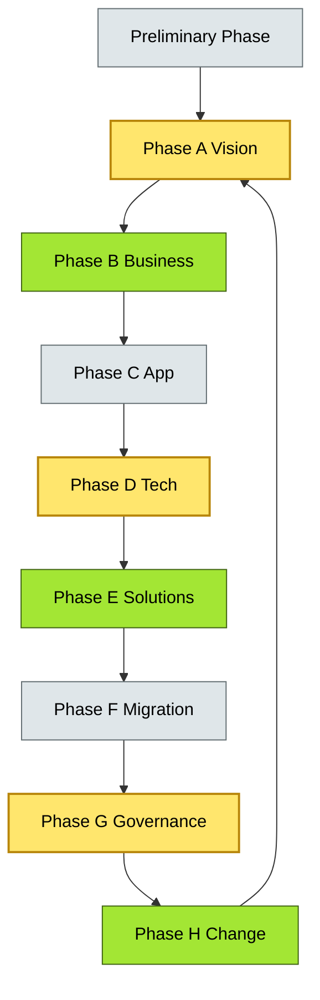
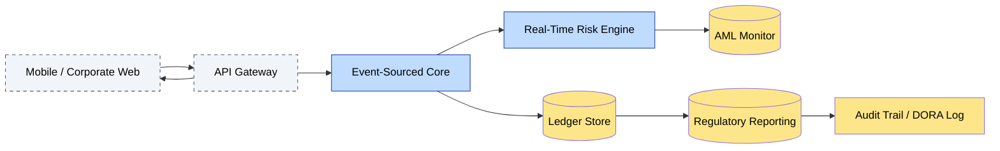

# [C2-01] TOGAF ADM — DETAIL

> **Category:** C2 — Reference Frameworks & Methods · **Difficulty:** ●/◑/○ · **Banking-relevant:** yes
> **Companion brief:** `[briefs/C2-01-togaf.md](../briefs/C2-01-togaf.md)`
>
> > **Target reader:** enterprise architect who must *explain, justify, and defend* the topic — not just recite it.

---

## 1. Precise definition

TOGAF ADM (Architecture Development Method, version 10.2 as of 2024) is the Open Group standardized, iterative, phase-gated methodology for developing enterprise architecture. It defines eight core phases (A–H), a Preliminary Phase, and enabling streams (Business, Information Security, Interoperability, Application). Unlike a body of knowledge (e.g., TOGAF’s certification syllabus), ADM is *prescriptive about process*: it mandates deliverables, checks (gating criteria), and review boards at each transition. ISO/IEC 42010 (Systems and software engineering — Architecture description) provides the meta-model; TOGAF ADM provides the life-cycle.

## 2. Why it exists (problem it solves)

Before ADM (pre-1995, post-CCTA-to-CCTA), banks ran architecture programs ad hoc: IT strategies drifted from business strategy, audit trails for transformation were nonexistent, and multi-country programs produced incompatible platform layers. ADM was imported from the UK government’s CCTA (now The Open Group) to solve:

- **Traceability:** business driver → architecture artifact → implementation project.
- **Governance:** gate reviews, architecture boards, and compliance checks are built into the method.
- **Repeatability:** every national banking program can claim the same disciplined method.

Without ADM, a bank risks regulatory findings (e.g., EBA concerns over process risk), cost overruns during core modernization, and orphaned data assets post-retirement.

## 3. Core concepts & vocabulary

| Term | Precise meaning |
|------|-----------------|
| **Architecture Vision (Phase A)** | Statement of Architecture Work with stakeholder diagram, scope, and principles; output: Vision Requirements Specification |
| **Business Architecture (Phase B)** | Functional decomposition, process/value-stream mapping, capability inventory aligned to strategic goals |
| **Information System Architecture (Phase C)** | Application portfolio map, information flow model, integration patterns, data architecture |
| **Technology Architecture (Phase D)** | Baseline and target infrastructure, cloud/vendor decisions, standards, non-functional requirements |
| **Opportunities & Solutions (Phase E)** | Transition architecture, project sequencing, gap-closure plan, solution portfolio |
| **Migration Planning (Phase F)** | Detailed implementation plan, risk register, readiness criteria, resource allocation |
| **Implementation Governance (Phase G)** | Built-to-spec verification, compliance validation, architecture specification back-updates |
| **Architecture Change Management (Phase H)** | PMO feedback, lessons learned, requirements refinement, re-baseline triggers |
| **Enablement** | Deep-dive methodological guidance (Business, InfoSec, Interoperability, Application) that feeds into specific phases |
| **ADM+** | Competency-based, continuous-evolution approach; less versioned, more modular |
| **Principles** | Architectural principles statements that govern design decisions in Phase A and C onward |
| **Requirements Management** | The technique to ensure each phase’s outputs satisfy stakeholders’ requirements |

## 4. How it works (architecture / mechanism)

### 4.1 Diagrams

**Diagram A — Core structure (highlight the load-bearing parts = amber, supporting = grey, decision = green):**


**Diagram B — Banking banking program lifecycle (highlight decision points = green, risks = red):**

```mermaid
flowchart LR
    classDef ok fill:#a7f3d0,stroke:#065f46,color:#000
    classDef risk fill:#fecaca,stroke:#991b1b,color:#000
    Prelim[Prelim]:::ok --> A[Vision: SOW]:::risk
    A --> B[Business: Scope]:::ok
    B --> C[Apps: Portfolio]:::risk
    C --> D[Tech: Platform]:::ok
    D --> E[Solutions: Sequence]:::risk
    E --> F[Migration: Plan]:::ok
    F --> G[Governance: Audit]:::risk
    G --> H[Change: Feedback]:::ok
```


## 5. Variants, options & trade-offs

| Variant | When to pick | When to avoid | Key trade-off axis |
|---------|--------------|---------------|--------------------|
| **Full ADM (8 phases + Enablement)** | Regulated environment needing audit trails, multi-year large transformation | Small greenfield startup or single-squad feature team | High completeness vs time-to-market |
| **ADM arc (A–D only)** | Early-stage program defining scope before funding commitment | Any program that must produce a migration plan | Speed vs downstream readiness |
| **Light ADM (A–E + F as lightweight plan)** | Agile-characterized transformations where governance lives in sprint reviews | Projects requiring formal Change Advisory Board (CAB) sign-offs | Iteration flexibility vs contractual/regulatory rigor |
| **ADM+ modular enablement** | Organizations already practicing SAFe / custom Agile with existing governance | Teams unfamiliar with EA competencies | Adaptability vs learning curve |

## 6. Relationships to sibling topics

- **Zachman Framework:** ADM is the *process*; Zachman is the *taxonomy*. In banking, you use ADM to drive a Zachman matrix, ensuring each phase (Column) produces the correct cell (Row) deliverables.
- **TOGAF Content Metamodel (BCM):** ADM prescribes *when* you produce architecture descriptions; BCM defines *what* the descriptions look like (viewpoints, catalogs, matrices).
- **ArchiMate:** Phase D (Technology) and Phase I (Interchange) outputs in TOGAF 10.2.1 use ArchiMate 3.1; ADM does not mandate ArchiMate but recommends it.
- **IEEE 1471 / ISO 42010:** ADM phases map to ISO requirements elicitation and architecture description life cycles; 1471’s stakeholder focus is Phase A’s domain.

## 7. Banking / financial-services context 💳

Regulations drive ADM adoption in banking more than technology novelty:

- **DORA (EU):** Requires banks to document ICT risk-management processes; ADM’s Phase F (Migration Planning) and Phase G (Implementation Governance) provide that documentation.
- **PSD2 (EU):** Open-banking roadmaps must demonstrate measurable improvement in provider-to-provider data interchange; ADM Phase B and C deliver the process and application baseline to prove before/after.
- **PCI-DSS / SOX:** Phase G’s compliance validation and Phase H’s change control map directly to audit evidence requirements.
- **FX / Trade-finance:** Cross-border correspondent banking requires Phase A stakeholder alignment across jurisdictions; ADM’s upfront scoping catches jurisdictional divergence early.

## 8. Reference architecture / worked example

**Problem:** A North American retail bank with $300B AUM needs to replace its mainframe core banking by 2029, comply with DORA ICT-risk rules, and launch real-time payment rails.

**Decision:** Use full ADM with a DORA-aligned governance layer.

**Architecture:**


**ADR:**
```markdown
# ADR-001: Event-Sourced Core + ADM-governed Replacement
## Status
Proposed
## Context
The bank retail core is a 30-year-old mainframe with ~60% annual run-cost inflation. DORA requires documented ICT risk processes by January 2027.
## Decision
Adopt TOGAF ADM with Enablement streams, drive a BIZBOK-aligned Zachman matrix, and build the new core as an event-sourced platform on hardened VPCs.
## Consequences
- **Positive:** Audit-ready architecture artifacts; clear migration sequencing; risk-gated releases.
- **Negative:** 18-month overhead before code; requires strong EA-PMO coordination.
- **Risks:** Platform team velocity pressure; regulatory interpretation of DORA “testing” may add iterations.
## Alternatives considered
1. **Big-bang rewrite (ADAM only, no full ADM):** Faster to build but no governance trail for DORA audit; rejected.
2. **Strangler fig + light ADM:** Lower overhead but insufficient documentation for OCC/FISM scrutiny; deferred to phase-E revision.
```

## 9. Maturity & adoption signals

- **Adopt when:** You have >1,000 FTEs, multi-year transformation with >€50M budget, or multi-country presence with divergent regulatory regimes.
- **Anti-signals (don’t adopt yet):** Sub-100 FTE start-ups, single-sprint delivery teams, or organizations already using lightweight SAFe PI planning with proven EA alignment.
- **Common failure modes:**
  1. **Phase-gate theater:** Teams fill in templates without stakeholder alignment; artifacts become doorstops.
  2. **Waterfall misconception:** Treating ADM as strictly one-pass 8→1; real programmes iterate 2–4 cycles from Phase A to H.
  3. **Enablement neglect:** Skipping Business or InfoSec Enablement causes re-work in later phases.

## 10. Common confusions — the "don’t mix" list

| Often confused | Real distinction |
|----------------|-----------------|
| **ADM** vs **TOGAF** | TOGAF = certification + body of knowledge + content metamodel; ADM = the development method only |
| **Phase D** vs **Information System Architecture (ISA)** | Phase D is TOGAF-specific (Technology); ISA is Zachman Row 3 (Application / Data); they overlap but are not synonyms |
| **ADAM** vs **ADM** | ADM = Architecture Development Method; ADAM = Architecture Development and Maintenance (a subset/variant, not the full method) |
| **Preliminary Phase** vs **Initiation** | Initiation = generic; Preliminary Phase has specific outputs (gap analysis, method choice, stakeholder register) |

## 11. Tools & standards to know

- **Standards/Frameworks:** TOGAF 10.2.1, ISO/IEC 42010, ISO/IEC 15288, DORA (EU), PSD2, PCI-DSS
- **Common tooling:** The Open Group TOGAF Workbench (if licensed), Sparx Enterprise Architect, Archi, draw.io, Miro, Jira Align, Confluence
- **Mandatory reading:** TOGAF 10.2.1 Specification (for phase detail), Zachman Institute, Jurinov articles on DORA-Enterprise-Architecture mapping

## 12. ADR template (ready to fill in)

```markdown
# ADR-XXX: <decision>
## Status
Accepted | Proposed | Deprecated
## Context
...
## Decision
...
## Consequences
- Positive ...
- Negative ...
- ...
## Alternatives considered
1. ...
2. ...
```

## 13. Practice — apply it

1. **Recall:** define ADM in 2 min without notes.
2. **Model:** produce a Zachman matrix (6 rows × 6 columns) for a banking core-modernization program.
3. **ADR:** write a decision doc applying ADM to the event-sourced core example in §8; include a DORA mapping table.
4. **Defend:** roleplay explaining ADM to a non-technical CRO / CIO in 90 seconds.

## 14. Summary (1 paragraph)

TOGAF ADM is the most widely adopted enterprise-architecture methodology in banking because it converts strategic business drivers into auditable, phase-gated architecture artifacts that satisfy regulators, auditors, and internal PMOs. Its eight-phase cycle, combined with Enablement streams and an explicit feedback loop back to business requirements, makes it the natural governance backbone for large-scale core-banking, payments, and risk-platform transformations—provided organizations treat it as an iterative, competency-based method rather than a heavy watermark exercise.

---
**Status:** ☐ Not started · **Last updated:** 2026-09-14
