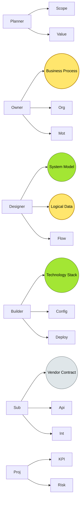
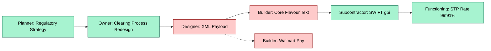
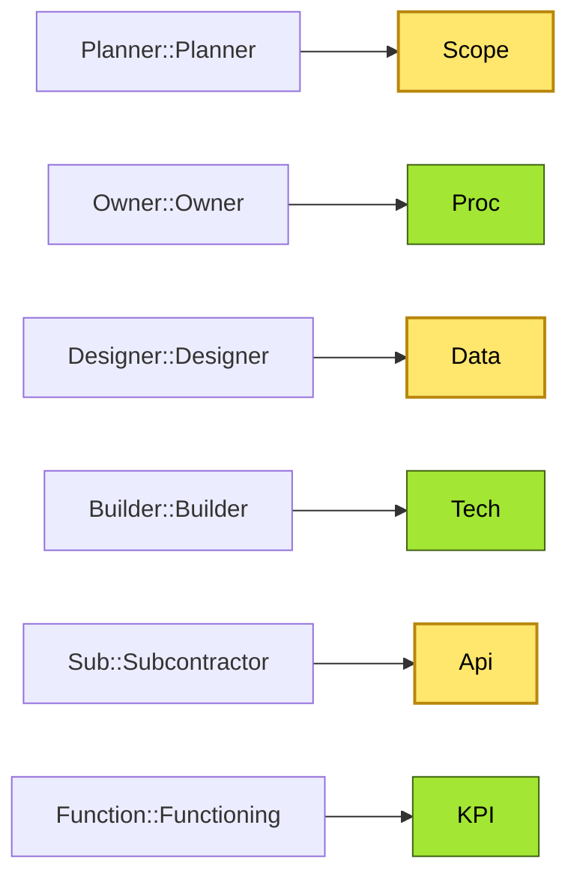

# [C2-02] Zachman Framework — DETAIL

> **Category:** C2 — Reference Frameworks & Methods · **Difficulty:** ●/◑/◐ · **Banking-relevant:** yes
> **Companion brief:** `[briefs/C2-02-zachman.md](../briefs/C2-02-zachman.md)`
>
> > **Target reader:** enterprise architect who must *explain, justify, and defend* the topic — not just recite it.

---

## 1. Precise definition

The Zachman Framework (Zachman 1987, 2000, 2017) is a 2D classification schema for enterprise architecture artifacts. It organizes architectural descriptions along two orthogonal dimensions:

- **Rows = description types (What, How, Where, Who, When, Why):** the structural nature of what is being described.
- **Columns = stakeholder perspectives (Planner, Owner, Designer, Builder, Subcontractor, Functioning Enterprise):** the abstraction level and intent of the audience.

Each cell (Row × Column) represents a specific artifact type. The framework is *complete* (every cell has a defined content type) but *not* a methodology; it does not prescribe *how* to produce or evolve these artifacts, nor does it define *when* they should be produced.

Differentiation:
- **Vs. ArchiMate:** ArchiMate is a *language* (syntax) for drawing architecture; Zachman is a *taxonomy* (classification) for cataloging what those drawings *mean*.
- **Vs. TOGAF ADM:** ADM is a *process* with phases; Zachman is a *structure* with cells. TOGAF ADM can be mapped onto Zachman by assigning which cells are the deliverables of each phase.
- **Vs. DoDAF:** DoDAF is domain-specific (DoD); Zachman is domain-agnostic. DoDAF 2.0 *did* incorporate Zachman’s 2D grid via the OV-1/OV-2 rows, confirming the taxonomy’s generality.

## 2. Why it exists (problem it solves)

In the late 1980s, Zachman observed that organizations were producing an inconsistent mix of architecture artifacts: business analysts wrote process models, systems analysts wrote data models, and IT architects wrote technology star schemas—with no shared classification. The result was *architectural fragmentation*: you could not tell whether you had adequately described the enterprise because there was no standard way to inventory what "adequately" meant.

Banking specifically suffers from this because:
- **Line-of-business units** (e.g., Global Markets) create *Why*/*What* models;
- **Data-governance teams** create *Where*/*How* models (master-data, data-lineage);
- **Infrastructure teams** create *Where*/*Who* models (server, network);
- **Regulators** expect *Why*/*When* explanations (why a process exists, when a control fires);
- **Integration vendors** (e.g., SWIFT, cloud hyperscalers) require *Where*/*How* literals.

Without Zachman, the bank cannot answer: "Do we have all 36 cells for this transformation?"

## 3. Core concepts & vocabulary

| Term | Precise meaning |
|------|-----------------|
| **Row 1 — What (Scope)** | Enterprise boundary, context diagrams, scope definitions; answers "What is in scope and what is out?" |
| **Row 2 — How (Business Process)** | Business process model, activity decomposition, value-stream map; answers "How does the business do its work?" |
| **Row 3 — Where (System & Logical Data)** | System model, logical data model, application decomposition; answers "What systems and data concepts exist?" |
| **Row 4 — Who (People & Org)** | People model, organizational model, role/responsibility model; answers "Who does what, where, and when?" |
| **Row 5 — When (Timing)** | Timing model, trigger model, schedule, event model; answers "When does something happen, and what triggers it?" |
| **Row 6 — Why (Motivation)** | Motivation model, value model, acquisition model; answers "Why does this exist, and what value does it produce?" |
| **Planner** | Strategic, abstract; concerned with goals, scope, assumptions. |
| **Owner** | Business-owner view; concerned with business rules, responsibilities, value. |
| **Designer** | Conceptual/logical design; rules, relationships, constraints. |
| **Builder** | Physical implementation; actual code, config, contracts. |
| **Subcontractor** | Vendor/service integration; interface specifications, SLA logic. |
| **Functioning Enterprise** | Operational metrics, KPIs, live states, measured performance. |

## 4. How it works (architecture / mechanism)

### 4.1 Diagrams

**Diagram A — Complete Zachman 6×6 matrix with banking-specific cell labels:**


**Diagram B — Banking workflow: ISO 20022 migration viewed across perspectives (highlight gaps = red, healthy = green):**


**Diagram C — Zachman maturity heat-map pattern (conceptual, for assessment):**


## 5. Variants, options & trade-offs

| Variant | When to pick | When to avoid | Key trade-off axis |
|---------|--------------|---------------|--------------------|
| **Full 6×6 completion** | Regulated, multi-year transformations (core replacement, MD2025) | Small projects, MVP launches | Completeness vs execution speed |
| **Row-limited (Rows 1–4 only: What, How, Where, Who)** | Process/data-centric programs where timing/motivation are implicit | Projects requiring regulatory justification, ESMA stress-testing | Coverage vs depth |
| **Column-limited (Design/Builder/Sub only)** | Technical migration (e.g., cloud lift-and-shift) | Business-driven transformations lacking executive sponsorship | Technical fidelity vs business alignment |
| **Zachman + Lighthouse / SABSA** | Financial-services with strong security/privacy requirements | Organizations without compliance mandates | Analytical depth vs complexity |

## 6. Relationships to sibling topics

- **TOGAF ADM:** ADM *drives* the creation of Zachman cells; Phase A produces Row 1–2 (Planner/Owner columns); Phase C–D produce Row 3 (Designer/Builder); Phase G produces Row 6 (Functioning).
- **ArchiMate:** ArchiMate diagrams are the *medium* that populates Zachman cells; e.g., an ArchiMate Business Process diagram typically belongs in Row 2, Owner/Designer columns.
- **DoDAF:** DoDAF 2.0 absorbed Zachman’s 2D taxonomy; every DoDAF product (OV-1, SV-1, etc.) maps to specific rows/columns.
- **IDEF0 / BPMN:** These languages provide the *vocabulary* for Row 2 (How) and Row 5 (When) cells.
- **Enterprise Ontology / metamodelling:** Zachman’s orthogonality (what × perspective) is an early inspiration for modern enterprise architecture domain ontologies.

## 7. Banking / financial-services context 💳

Zachman’s greatest banking value is *integration coverage analysis*:

- **ISO 20022 migration:** Row 1 (What) = scope of message types; Row 2 (How) = new clearing business process; Row 3 (Where) = XML payload structure (logical data); Row 4 (Who) = roles in payment initiation; Row 5 (When) = settlement timing; Row 6 (Why) = regulatory justification. A gap in Row 3–Builder (Core flavour text) caused the Walmart Pay interoperability failure.
- **DORA ICT-risk:** Row 6 (Functioning) gives the metrics (availability, recoverability); Row 4 (People) models third-party dependency orgs; Row 3 (Where) data model maps data-residency rules.
- **Basel III / internal-model validation:** Row 2 (How) models FRTB workflows; Row 5 (When) triggers limit-breach alerts; Row 6 (Why) provides the business-justification narrative for model overrides.
- **Open Banking (PSD2):** Row 1 (Scope) defines regulated entities; Row 3 (Where) data model maps account-information API; Row 5 (When) TPP access windows.

## 8. Reference architecture / worked example

**Problem:** A European retail bank with 12 million SMEs needs to launch an instant-payment account-information service (PIAS) under PSD2 and PSD3.

**Decision:** Zachman-complete documentation paired with ADM-governed delivery.

**Architecture / cell mapping:**
```mermaid
graph LR
    classDef service fill:#bfdbfe,stroke:#1e40af,color:#000
    classDef data fill:#fde68a,stroke:#92400e,color:#000
    classDef boundary fill:#f1f5f9,stroke:#475569,stroke-dasharray: 5
    Client[SME / TPP Client:::service] --> API[API Gateway (PIAS)]:::service
    API --> Auth[OAuth 2.0 / KYC]:::service
    API --> Data[(Consent Ledger)]:::data
    API --> Event[Event Bus]:::service
    Event --> Core[Core Banking Svc]:::service
    Core --> Reporting[(PSD Reporting)]:::data
    Reporting --> Audit[Audit Trail / DORA Log]:::data
    API:::boundary --> Client:::boundary
```

**ADR:**
```markdown
# ADR-002: PSD2/PSD3 PIAS with Zachman-complete Documentation
## Status
Proposed
## Context
The bank must expose account-information APIs under PSD2 and PSD3; regulators require documented process, data, and security architecture for TPP access.
## Decision
Adopt Zachman 6×6 compliance as a coverage gate: no build proceeds until all 36 cells have at least a placeholder. ADM Phase A-B drive Rows 1–2; Phase C drives Row 3; Phase D-E drive Row 4–5; Phase G validates Row 6.
## Consequences
- **Positive:** Regulators can verify coverage; integration failures (e.g., TPP timeout) trace to missing cells.
- **Negative:** 6-month overhead before first API release; requires disciplined EA PMO.
- **Risks:** TPP vendors may request early APIs before Zachman cells are complete; phased enablement for Row 6 (Functioning).
## Alternatives considered
1. **API-first (APIDaemon) + post-hoc Zachman:** Faster delivery but integration debt and audit gaps.
2. **Zachman-only, no ADM:** Schema coverage without migration sequencing; rejected because transition architecture is undefined.
```

## 9. Maturity & adoption signals

- **Adopt when:** You have multi-domain programs (business, data, tech, security) with >10 FTEs and regulatory scrutiny.
- **Anti-signals (don’t adopt yet):** Single-squad feature development with no audit requirement; or teams already using a domain-specific classification (e.g., COBIT-5 business goals) that replaces Zachman’s generality.
- **Common failure modes:**
  1. **Cell-count theater:** Claiming 36/36 complete while half the cells are photocopied from a prior program.
  2. **Perspective confusion:** Delivering Row 3 data model as if the Builder perspective were the Owner perspective.
  3. **Row 6 neglect:** Functioning metrics never updated; the "living" architecture becomes a dead document.

## 10. Common confusions — the "don’t mix" list

| Often confused | Real distinction |
|----------------|-----------------|
| **Zachman rows vs. TOGAF phases** | Rows = *what* is described (scope, process); phases = *when* it is produced (A=vision, B=business, C=application). |
| **Row 1 (Scope) vs. Row 6 (Why)** | Scope defines *boundary and context* (in/out, boundaries); Why defines *motivation and value* (goals, objectives, acquisition rationale). |
| **Column 3 (Designer) vs. Column 4 (Builder)** | Designer = *conceptual/logical rules* (what *should* work); Builder = *physical instantiation* (what *will* be built/contracted). |
| **Zachman vs. SABSA vs. SABSA** *(same)* | Zachman ≠ SABSA (Security Architecture and Assessment Framework). Zachman is generic; SABSA is security-specific. Zachman contains security-relevant cells (Row 3, Row 5, Row 6) but is not a security framework. |

## 11. Tools & standards to know

- **Standards/Frameworks:** Zachman (1987, 2000, 2017), TOGAF 10.2.1, DoDAF 2.0, ISO/IEC 19706 (meta-data modeling), IDEF0, BPMN, ArchiMate 3.1
- **Common tooling:** Archi (free, Zachman-first), Sparx / Enterprise Architect, draw.io, Miro, Lucidchart, Confluence, Excel/Google Sheets for cell matrices
- **Mandatory reading:** Zachman, J. (2017) *Information Systems Architecture: An Ontological Approach*; Zachman Institute whitepapers; Harvard Business Review article on architecture taxonomy (classical)

## 12. ADR template (ready to fill in)

```markdown
# ADR-XXX: <decision>
## Status
Accepted | Proposed | Deprecated
## Context
...
## Decision
...
## Consequences
- Positive ...
- Negative ...
- ...
## Alternatives considered
1. ...
2. ...
```

## 13. Practice — apply it

1. **Recall:** define Zachman in 2 min without notes.
2. **Model:** produce a 6×6 matrix for the PSD2 PIAS initiative, placing one concrete artifact per cell (e.g., Row 2/Owner = "SME PIAS process map v1.1"; Row 3/Builder = "Open Banking API JSON schema").
3. **ADR:** write a decision doc applying Zachman to a banking example (e.g., ISO 20022 migration or AML data lake).
4. **Defend:** roleplay explaining Zachman to the board's risk committee in 90 seconds—emphasize *why* we need all 36 cells.

## 14. Summary (1 paragraph)

The Zachman Framework is not a method but a *complete classification schema* that ensures enterprise-architecture programs — especially in banking, where business process, data semantics, security, and regulatory justification must all coexist — do not leave critical perspectives or description types undocumented. Its six rows (What through Why) and six columns (Planner through Functioning Enterprise) provide a universal inventory that, when paired with a method such as TOGAF ADM, transforms architecture from an art into an auditable, gap-controlled discipline.

---
**Status:** ☐ Not started · **Last updated:** 2026-09-14
