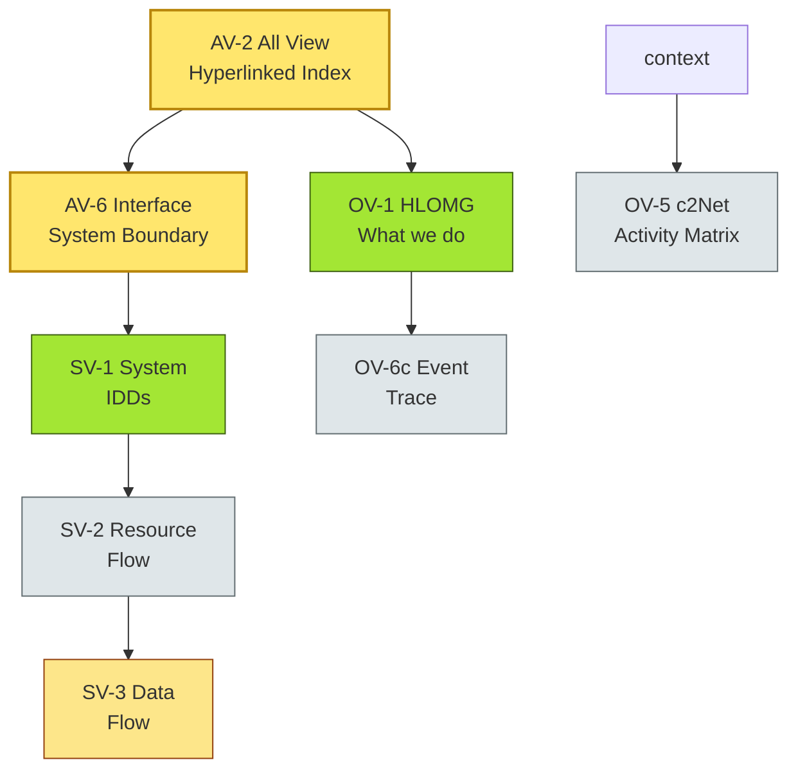
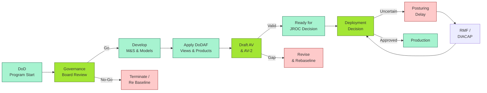

# [C2-03] DO-DAF (Government) — DETAIL
> **Category:** C2 — Frameworks & Methods · **Difficulty:** ● · **Banking-relevant:** no
> **Companion brief:** `[briefs/C2-03-dodaf-govt.md](./briefs/C2-03-dodaf-govt.md)`
>
> **Target reader:** enterprise architect who must *explain, justify, and defend* the topic — not just recite it.

---

## 1. Precise definition
DO-DAF (Department of Defense Architecture Framework) is a standardized set of view-and-models-based architecture descriptions for United States Department of Defense (DoD) programs, governed by the DoD Chief Information Officer (CIO) and the Architecture Framework Working Group (AFWG). Per DoDAF v1.5 / 2.02:

> Every architecture description in use in a DoD program domain uses a standard set of views and products.

DO-DAF is not a *method* (like TOGAF ADM) but a *reference architecture* and the associated *viewpoint specification*. It provides templates (e.g., DoDAF Specification v2.02, the UML profile and Iconography) so that architecture data are modeled with consistent glossaries, symbols, and relationships.

The family now includes:
- **DoDAF** (superseded by v2.02; still referenced in defense contracts).
- **DoDAF 2.02** (current; includes formal UML profiles).
- **AF (Architecture Framework)** — extended operational concepts and mission profiles.
- **TEW (Test & Evaluation Work Practices)** — aligned subsets for C5ISR testing.

Closest standards parallels:
- **ISO/IEC/IEEE 42010** — standard for architecture description; DoDAF implements this at a high level.
- **IEEE 1471** — which ISO 42010 largely superseded; DoDAF was originally mapped to IEEE 1471.
- **TOGAF ADM** — process layer; DoDAF is the *content* structure (what to produce); TOGAF is the *method* (when and how).

## 2. Why it exists (problem it solves)
Before DoDAF (circa 1997), DoD acquisition programs produced impenetrable 3,000-page technical manuals with no common structure. Stakeholders whooped about "architecture documents that nobody reads." DoDAF's promise was:

1. **Learn once:** One viewpoint schema for Navy, Army, Air Force.
2. **Find information fast:** AV-2 (All Viewpoint Product) is a hyperlinked center; search for "F-35 funding" and jump directly to the relevant model.
3. **Interoperate across programs:** Same viewpoint names, same glossary, same UML profile → paste a model into a new program and it is instantly *mostly* useful.

What happens without it? Unstructured architecture "clarity"; compliance audits fail; major programs (F-35, Army Future Combat Systems) stall because contractors produce incompatible models that cannot be reconciled for the Joint Requirements Oversight Council (JROC) brief.

## 3. Core concepts & vocabulary
| Term | Precise meaning |
|------|-----------------|
| **Viewpoint (VP)** | A viewpoint is a *template + stakeholder profile + decision questions*; it defines what to include, what to leave out, and how to render it. |
| **Model (DoDAF)** | A collection of one or more views consistent with a *specific* phase / decision state, not the whole "architecture." |
| **AV-2 (All Viewpoint)** | A hyperlinked index of *all* other views; the DoDAF equivalent of an architecture repository home page. |
| **OGD (Operational Graphics / Diagrams)** | Human-readable images (e.g., OV-1 High-Level Operational Concept Graphic, OV-2 Logical Data Model). |
| **AV-6 Interface Description** | The *only* view that shows system boundaries and interfaces; critical for integration and compliance. |
| **DoDAF Iconography** | A controlled set of 36 reusable symbols; enforced in DoDAF XT (DoD Architecture Framework eXchange Tool). |
| **DoDAF Profile** | A UML profile (DoDAF OMT 2.02) that constrains Profiles, Flows, and Nodes to valid relationships; enables model-based verification. |
| **Defense (DoD) Information Assurance** | The assurance regime; DoDAF models must satisfy DIACAP / RMF controls in classified environments. |

## 4. How it works (architecture / mechanism)

### 4.1 The seven (plus) viewpoints

DoDAF v2.02 defines 18 products across **8 viewpoints** (AV is the "all" or meta viewpoint).

| Viewpoint | Purpose | Core Product |
|-----------|---------|--------------|
| **AV** (All) | Index and cross-reference | AV-1 → AV-19 (metadata, glossary, concept descriptions) |
| **AV** | | AV-2 All View (hyperlinked model index) |
| **AV** | | AV-3 Description of All ICDs |
| **AV** | | AV-6 Interface Description |
| **AV** | | AV-7 Activity Description |
| **AV** | | AV-11 AV-2 Viewer |
| **OV** (Operational) | What the system *does* in mission space | OV-1 High-Level Operational Concept Graphic (HLOMG) |
| **OV** | | OV-2 Logical Data Model |
| **OV** | | OV-5 c2Net (Activity / Timing Matrix) |
| **OV** | | OV-6c Operational Event-Trace |
| **OV** | | OV-7 Operational Node Connectivity Description |
| **OV** | | OV-8 Operational Resource Flow Description |
| **SV** (Systems) | How the hardware / software is built | SV-1 System Interface Description |
| **SV** | | SV-2 Systems Resource Flow Description |
| **SV** | | SV-3 Systems Resource Flow Description (Data) |
| **SV** | | SV-4 Systems Functionality Description |
| **SV** | | SV-5 Systems/Services Evolution Description |
| **SV** | | SV-6 System ports and logical interfaces |
| **TV** (Technical / Technology) | What technologies are selected | TV-1 Technical Standards Profile |
| **TV** | | TV-2 Systems Technology Forecast Profile |
| **DV** (Deployment) | How systems are staged | DV-1 Deployment Style Description |
| **DV** | | DV-2 Communication Description |
| **PV** (Project) | *Note: deprecated* | |
| **AF** (Architecture Framework) | Extended mission profiles | AF models replace some OV/SV products for operational architectures |

Key insight: **AV-6** is the *scaffold* of integration planning; every SV diagram that touches a boundary references back to AV-6.

### 4.2 Diagram A — Core structure (highlight the load-bearing parts = amber, supporting = grey)



### 4.3 Diagram B — Lifecycle / flow (highlight decision points = green, failures = red)



## 5. Variants, options & trade-offs

| Variant | When to pick | When to avoid | Key trade-off axis |
|---------|--------------|---------------|--------------------|
| **DoDAF v2.02 + DoDAF XT** (DO-DAF) | USAF / DoD prime contracts; need UML profile consistency | Lean-agile startup; 10k-line-of-code fintech MVP | Compliance vs velocity |
| **DoDAF v2.02 without XT** | Contract requires DoDAF products but no tool mandate | Large program with 500+ artifacts | Standardization vs tooling cost |
| **MODAF / NAF (UK/NL)** | Multinational defense consortium; NATO interoperability | U.S.-only program | Alignment cost vs alliance narrative |
| **MDAP (Minimal Data Architecture Package)** | Rapid prototyping for provisional contracts | Full capability development | Completeness vs speed |
| **AF-based mission profiles** | Operational architectures (not just acquisition) | Traditional hardware-acquisition programs | Scope expansion vs clarity dilution |
| **Custom DoDAF subset** (e.g., AV + OV + SV only) | Midsized contract; small team | JROC / Milestone C reviews with full AV suite | Coverage vs survivability |

## 6. Relationships to sibling topics
- **TOGAF:** DoDAF = *content* structure; TOGAF = *process* structure. TOGAF Phase B/C/D ingest DoDAF views; TOGAF Phase A/B/D produce them.
- **TOGAF / ISO 42010:** DoDAF is, in spirit, an *implementation* of ISO 42010's "architecture description" concept; TOGAF's Architecture Repository can store both.
- **ArchiMate:** ArchiMate is DoDAF's functional-domain cousin; Archi does not prescribe Viewpoints. A bank will eventually have DoDAF-compliant UML/SysML models (DoDAF Profile) *and* ArchiMate decision models (C4/TOGAF) side by side.
- **IEEE 1471:** DoDAF alternates with IEEE 1471; if a bank cites IEEE 1471 in its own governance, it must map DoDAF's viewpoints to its own viewpoint-taxonomy.

## 7. Banking / financial-services context 💳
DO-DAF itself is *not* a banking standard, but it governs suppliers and partners that *are* heavily regulated:

- **FedRAMP / CMMC / DoD RMF alignment:** If a bank's fintech subsidiary seeks DoD contracts (e.g., Pentagon Federal Credit Union, veterans' lending platforms), the same DoDAF viewpoint discipline is required to prove FedRAMP high / DoD IL5 compliance.
- **CCAR / stress-testing:** The Federal Reserve's CCAR does not require DoDAF, but the *information-assurance* rigor (down to interface descriptions) mirrors DoDAF AV-6: a bank must know *exactly* which system touches PII or capital-ratio data.
- **BCBS 239 (Principles for Effective Risk Data Aggregation and Risk Reporting):** Principle 2 demands a *single, complete, timely, and accurate* view of risk data. DoDAF's "All View" (AV-2) is a literal model-of-models that satisfies this for data-aggregation architecture.
- **FP Document / FedNow / RTP participation:** Interoperability standards (ISO 20022, NACHA, The Fed's specs) require *interface descriptions* that are formally versioned. DoDAF AV-6 is the template for exactly this level of rigor.
- **Cross-border M&A / BRRD-2:** When underwriting a European bank acquisition, due diligence teams use a DoDAF-like *viewpoint stack* (operational, data, systems) to compare target architecture to acquirer baseline.

## 8. Reference architecture / worked example
**Problem:** A regional bank (RegionalTrust) is selected to operate the newly created ** Veterans Direct Lending Platform (VDLP)** under the Department of Veterans Affairs (VA). The VA contract requires AV-2, AV-6, and all OV products by Milestone C (Preliminary Design Review).

**Decision:** Use DoDAF v2.02 + DoDAF XT (Tilley / IBM Rational DOORS Next Generation) for model-based architecture, with automated UML profile validation.

**Resulting diagram:**

```mermaid
graph LR
    classDef service fill:#bfdbfe,stroke:#1e40af
    classDef data fill:#fde68a,stroke:#92400e
    classDef boundary fill:#f1f5f9,stroke:#475569,stroke-dasharray: 5
    classDef critical fill:#ffe66d,stroke:#b8860b
    VLP[Veterans Contact<br/>Center]:::service --> API[VA API<br/>Gateway]:::service
    VLP --> Bank[RegionalTrust<br/>Core Banking]:::service
    VLP --> Credit[VA-VA-Cred<br/>Scoring Engine]:::service
    API --> LUDA[VA Loan<br/>Underwriting]:::service
    Bank --> DB[(Loan DB)]:::data
    Credit --> DB
    API -.-> LUDH[VA Legacy<br/>System]:::boundary
    classDef context fill:#dfe6e9,stroke:#636e72
    LUDA:::context --> Identity[ID.me<br/>KYC]:::context
    LUDA:::context --> AIOPS[Anti-Fraud AIO]:::context
    classBoundary fill:#f1f5f9,stroke:#94a3b8,stroke-dasharray: 3
    class CardBorder boundary
    LUDA:::boundary --> LUDH:::boundary
```

**ADR applied:**

```markdown
# ADR-014: Model DoDAF v2.02 for VDLP VA Contract
## Status
Accepted
## Context
The VA contract mandates deliverable AV-2 (All View) and OV series models for Milestone C DRev. RegionalTrust historically lacked model-based discipline; risk of non-conformance is high.
## Decision
Adopt DoDAF v2.02 with DoDAF XT for UML profile-constrained architecture models. Deliver AV-2 via Enterprise Architect, with automated round-trip to requirements in DOORS NG.
## Consequences
- Positive: VA compliance; single model serves both architecture and interface documentation.
- Negative: Up-front tooling cost ($240K license + 6-month training); velocity impact on parallel sprint work.
- Negative: Linguistic barrier — DoDAF view naming (e.g., "c2Net") is alien to Agile product teams.
## Alternatives considered
1. **Custom ISO 42010 viewpoint set** — Cheaper to create, but VA auditor will reject it.
2. **UAF / UPDM** — Good for systems-engineering, and closer to SysML; more renderer plugins; less government-native.
```

## 9. Maturity & adoption signals
- **Adopt when:**
  - A government contract, FedRAMP / CMMC / DoD RMF assessment, or DCMA audit is on the roadmap (>12 months).
  - The architecture team already uses UMLE / SysML / Modelio.
- **Anti-signals (don't adopt yet):**
  - The organization's "architecture" is a Word document.
  - No compliance stakeholder can articulate what a *viewpoint* is.
  - The team is below 15 people building a greenfield product with no external interface requirements.
- **Common failure modes:**
  1. **Model paralysis:** Treating DoDAF v2.02 as a waterfall requirement — architects spend 6 months building AV-6 diagrams before any value is delivered.
  2. **Viewpoint theater:** Producing seven products that differ by one font change (military-compliance theater, not decision support).
  3. **Profile drift:** Using non-UML tools that model circles and boxes but do not enforce the DoDAF Stereotypes; models become untranslatable to the buyer's toolset.

## 10. Common confusions — the "don't mix" list
| Often confused | Real distinction |
|----------------|----------------|
| DoDAF vs TOGAF | DoDAF = *what* to model (viewpoints); TOGAF = *how* to run the architecture process (ADM). |
| DoDAF v2.02 vs AF (Architecture Framework) | AF is DoDAF extended with mission-profile semantics for *operational* architectures; DoDAF v2.02 is the baseline. |
| AV-6 vs SV-1 | AV-6 shows *interfaces* (boundary crossings); SV-1 shows *system interfaces* from a technical data perspective. AV-6 is operational; SV-1 is technical. |
| DoDAF vs ISO 15288 | ISO 15288 is system-engineering life-cycle process; DoDAF is architecture *content* (what to describe at each phase). |
| DoDAF vs MODAF / NAF | National variants of the same *style* (viewpoint-based); DoDAF is one lineage; UK MODAF is another. |

## 11. Tools & standards to know
- **Standards/Frameworks:** IEEE 1471 / ISO/IEC/IEEE 42010:2011, IEEE 1471 (2000), DoDAF v2.02 Standard, UAF v1.2.2, MODAF v2.0.1, NAF v3.2, NIST SP 800-53 Rev 5, FedRAMP 3.0.
- **Common tooling:** Telelogic / IBM Engineering DOORS Next Generation, Sparx Systems Enterprise Architect v19, MagicDraw / Cameo Systems Modeler, Modelio v4, Rational DOORS (legacy), Archi (open-source), Visio (for hand-drawn AV-1 / AV-2 quickly), draw.io for ad-hoc.
- **Mandatory reading (if any):**
  - "DoDAF v2.02, Volume I: Architecture Framework Description" — U.S. Department of Defense.
  - "Enterprise Architecture body of knowledge for UK Defence" — MODAF by-product guidance.

## 12. ADR template (ready to fill in)
```markdown
# ADR-XXX: <decision>
## Status
Accepted | Proposed | Deprecated

## Context
...

## Decision
...

## Consequences
- Positive ...
- Negative ...
- ...

## Alternatives considered
1. ...
2. ...
```

## 13. Practice — apply it
1. **Recall:** Define DoDAF's seven viewpoints in 90 seconds without notes.
2. **Model:** Produce an ArchiMate diagram of your *own* personal architecture; then translate it into DoDAF's OV-1, SV-1, AV-2 template format (just a pencil).
3. **ADR:** Write a decision doc: "Will we use DoDAF for our next vendor-selection audit?"
4. **Defend:** Roleplay explaining to a non-technical CRO / CIO why a VA contract requires 18 DoDAF products instead of "an architecture diagram."

## 14. Summary (1 paragraph)
DoDAF is the Department of Defense's viewpoint-based architecture framework. It gives programs a rigorous, repeatable recipe for producing seven-to-many architecture products so that warfighters, auditors, and program offices see the same truth. Banks do not build tanks, but when a bank's lending platform touches DoD, VA, or FedRAMP, DoDAF's discipline — especially the interface-and-dependency rigor of AV-6 and the All-View AV-2 — is exactly what auditors and procurement officers demand. DoDAF is not a replacement for TOGAF or ArchiMate; it is the heavyweight compliance layer that sits *on top* of them, and it is the reason government-integration architecture in fintech costs more to prove than to build.

---
**Status:** ✅ Covered · **Last updated:** 2026-06-23
