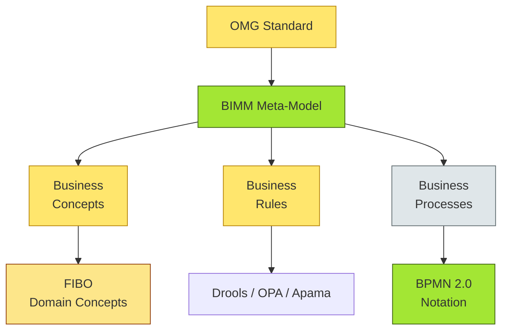
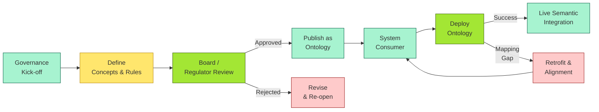
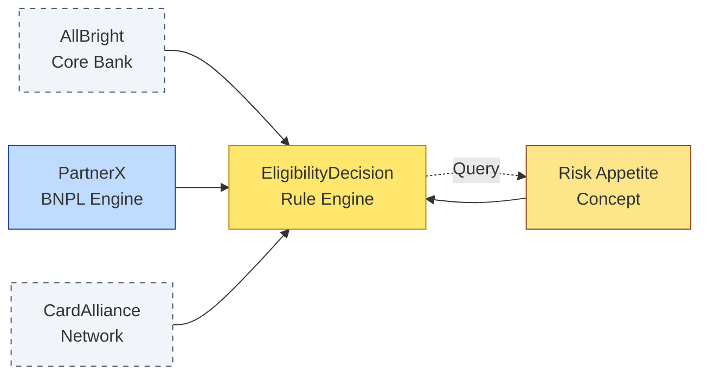

# [C2-04] Business Book of Knowledge (BizBoK) — DETAIL
> **Category:** C2 — Frameworks & Methods · **Difficulty:** ● · **Banking-relevant:** yes
> **Companion brief:** `[briefs/C2-04-bizbok.md](./briefs/C2-04-bizbok.md)`
>
> **Target reader:** enterprise architect who must *explain, justify, and defend* the topic — not just recite it.

---

## 1. Precise definition
The **Business Book of Knowledge (BizBoK)** is an Object Management Group (OMG) standard that provides a formal methodology for describing, managing, and exchanging business concepts, business rules, and business processes. It is the semantic counterpart to the more famous **Business Process Model and Notation (BPMN)**: BPMN says *how* work is done; BizBoK says *what* the work is *about*.

Formally, BizBoK defines:
- A **meta-model (BIMM)** — the core meta-model for business concepts, business rules, and business processes.
- **Business Concept (BC)** — a class/instance that represents a meaningful business entity with definition, attributes, relationships, and lifecycle.
- **Business Rule (BR)** — a governance construct that constrains BCs and processes; expressed in natural language or formal notation.
- **Business Process (BP)** — an instantiation of a modeled workflow at the business-concept level, linking actors, resources, and concepts.

BIMM is the OMG-sanctioned meta-model (equivalent to BPMN's meta-model) but scoped to *concepts* and *rules* rather than tasks and gates.

Reference sources:
- **OMG Specification: Business Integrated Meta-Model (BIMM)**
- **OMG Specification: Business Metadata Standard**
- **OMG Specification: Business Process** (related drafts)

## 2. Why it exists (problem it solves)
Before BizBoF, banks and vendors maintained *ad-hoc* glossaries:
- The core-bank "bank account" ≠ the file-repository "bank" document ≠ the regulator's "bank entity."
- When multiple vendors pitch a LOS, they each bring their own taxonomy; integration costs are driven by *semantic alignment*, not *technical integration*.
- Regulators (especially in the post-crisis era) require *machine-readable* taxonomies for reporting (e.g., EBA / DNB / FRB data dictionaries).

BizBoK solves *semantic interoperability*: if two systems consume the same ontology, they can communicate *without custom translation layers*. It also solves *governance traceability*: if an auditor asks "which business rule governs overdraft fees?" the answer is a direct link from the overdraft-fee concept to the board-approved business rule.

Without it, banks spend millions on *harmonization projects* that are essentially engineering one giant thesaurus.

## 3. Core concepts & vocabulary
| Term | Precise meaning |
|------|-----------------|
| **Business concept** | A named, definable entity (e.g., `BankAccount`, `CreditLimit`, `LoanProduct`) with attributes, relationships, and lifecycle state. |
| **Business rule** | An explicit, consequential statement that constrains or enables business concepts and processes (e.g., "No overdraft facility may exceed 2x the customer's net-worth"). |
| **Business process** | A BPMN-style workflow *instantiated over* BizBoK concepts and rules — the "orchestration of meaning" rather than the dry orchestration of tasks. |
| **Ontology** | A formal, explicit specification of a shared conceptualization; BizBoK is an *industry-standard ontology* backed by OMG. |
| **BIMM (Business Integrated Meta-Model)** | The OMG meta-model that defines BCs, BRs, and BPs and their relationships (e.g., BC is governed by BR; BP instantiates BCs). |
| **FIBO (Financial Industry Business Ontology)** | An OMG-sponsored ontology specifically for the financial domain; intended to be the *instantiation content* consumed by a BizBoK method. |
| **Rule engine** | A system that evaluates business rules against runtime facts; examples: Drools, OPA, Apama, fICO Blaze. |
| **Linked Data / RDF** | A way to represent ontology as triples (subject-predicate-object); BizBoK-compatible; enables SPARQL queries across bank systems. |
| **Ontology alignment** | The process of mapping concepts from one ontology (e.g., core-bank vendor "loan") to another (e.g., FIBO "Offer"). |
| **Semantic query** | A query (SPARQL, Cypher) against an ontology graph; contrast with SQL against tables. |

## 4. How it works (architecture / mechanism)

### 4.1 The OMG / BIMM layers
The OMG specifications for BizBoK are in a stack:

1. **Meta-model:** UML / MOF meta-model — what a Business Concept *is* (attributes, relations, lifecycle events).
2. **Notation / language:** XML / RDF schema representations — how to serialize the ontology.
3. **Application profile:** FIBO, ISO 27434 (insurance), etc. — the *domain-specific* concepts.
4. **Methodology:** Governance process for adding, retiring, and versioning concepts (the "Book of Knowledge" itself).

### 4.2 Diagram A — Core structure (highlight the load-bearing parts = amber, supporting = grey)



### 4.3 Diagram B — Lifecycle / flow (highlight decision points = green, failures = red)



## 5. Variants, options & trade-offs

| Variant | When to pick | When to avoid | Key trade-off axis |
|---------|--------------|---------------|--------------------|
| **FIBO-only (no BizBoK)** | Small vendor-only stack; single product line | Multi-vendor enterprise with regulators / M&A | Conceptual clarity vs vendor lock-in |
| **Full OMG BizBoK + FIBO + Drools** | Large international bank with strict data-governance; multi-jurisdiction reporting | Lean-agile fintech; third-party API-only product | Explicitness & traceability vs velocity |
| **FHIR / HL7 FHIR + FIBO** | Healthcare + finance convergence (e.g., health savings accounts, insurance-linked products) | Pure retail banking without health touchpoints | Standardization vs scope creep |
| **DIY ontology in Neo4j / Triple Store** | Small IT team; need custom graph queries | Large enterprise with governance / audit requirements | Flexibility vs standardization |
| **WS-MetadataExchange + OWL 2** | Legacy ESB / SOA with OWL 2-capable tooling | Modern cloud-native / microservices stack | Tooling maturity vs language richness |

## 6. Relationships to sibling topics
- **TOGAF:** TOGAF Phase B / C / D outcomes (capabilities, building blocks) can instantiate BizBoK concepts; TOGAF tells you *when* to do it, BizBoK tells you *how* to represent the result.
- **BPMN:** BPMN describes *task* flow; BizBoK describes the *business concept* flow *over* tasks. A BPMN lane labeled "Risk Review" can be semantically grounded by BizBoK: the lane enforces BR `OverdraftLimit ≤ 2 * NetWorth`.
- **ArchiMate:** ArchiMate is a third-system (not BizBoK) for architecture visualization; can import definitions from FIBO/BizBoK, but does not provide its own governance for concepts.
- **FIBO:** FIBO is the *content*; BizBoK is the *method*. Use both.
- **ISO 20022 / ISO 20022-AM:** ISO 20022 is the *message syntax*; BizBoK provides the *semantic layer* above the data element definitions.

## 7. Banking / financial-services context 💳
**Concrete applications:**

1. **Multi-vendor core banking integration:** A European universal bank operates ACI (core), SAP (ERP), and a boutique LOS (origination). Each vendor has its own concept for "account." BizBoK + FIBO provides a registry (`OpenBankAccount`) with attributes: `accountType`, `currency`, `customerAssignedID`, `regulatoryIdentifier`. All three systems import the ontology via RDF triples. When a new PSD2-compliant payment instruction arrives, the bank resolves which of 3,000 data elements maps to which `OpenBankAccount` attribute — without a custom mapping layer.

2. **Regulatory reporting (EBA / Basel / DORA):** The DIA (Data and Risk Analytics) team must produce CRR / CRD / DORA submissions. By defining `CreditExposure`, `RiskWeightedAssets`, and `CapitalAdequacy` as BizBoK concepts with Mermaid/BIMM-backed attributes, the reporting system can auto-generate XBRL taxonomies from the same source.

3. **Anti-fraud / AML:** Fraud models often rely on a "risk event" concept with dynamic attributes. A BizBoK-defined `SuspiciousTransactionEvent` (with relationships `triggers`, `investigatedBy`, `resolvedBy`) can be consumed by a rules engine (Drools) and a knowledge graph (Neo4j) simultaneously.

4. **Open banking / API standardization:** A bank licensed under PSD2 wants to expose *product definitions* to fintech partners. Instead of hand-crafting JSON-LD for each product, the bank publishes a FIBO-derived ontology as Linked Data. A fintech simply dereferences the ontology URL and understands "auto-loan" as a `FinancialProduct` with `interestRate`, `term`, and `originationFee` — no custom API spec needed.

5. **M&A due diligence:** When acquiring a regional bank, the acquirer can compare the target's concept registry against the acquirer's own ontology. Misalignments such as "checking account" vs "current account" pop out as ontology-distance metrics, not just manual document review.

**Regulatory tie-ins:**
- **DORA (Regulation (EU) 2022/2554):** Requires "risk management processes" that are documented and auditable. A BizBoK-governed concept registry supports this directly.
- **EBA Guidelines on DORA ICT risk management:** Emphasizes *data quality* and *ownership*; BizBoK provides explicit ownership (`DataOwner`, `Steward`).
- **Basel III / Pillar 3 / CRR / CRD IV:** "Credit risk" and "market risk" are not the same; BizBoK models their difference formally.

## 8. Reference architecture / worked example
**Problem:** A retail-plus-wealth bank (AllBright) runs a "one-click buy now / pay later" product via embedded-finance partnerships. The bank, a BNPL fintech partner (PartnerX), and a card network (CardAlliance) must agree on what "eligibility" means before any technology is chosen.

**Decision:** Deploy a FIBO-backed BizBoK ontology in a shared triple store (Stardog/Oracle Graph), with rules in Drools for runtime eligibility checks.

**Resulting diagram:**



**ADR applied:**

```markdown
# ADR-027: Adopt FIBO/BizBoK for BNPL Eligibility
## Status
Accepted
## Context
A single-equation-of-meaning is needed across AllBright, PartnerX, and CardAlliance. Current state: 17 different implementations of "eligibility score" across three tech stacks. Compliance risk is high because DORA requires documented, auditable decision logic.
## Decision
Adopt OMG FIBO + BizBoK methodology. Maintain an RDF ontology in Stardog with a versioned graph. Encode 12 business rules in Drools for runtime evaluation. Expose concept registry via a SPARQL endpoint for partner query.
## Consequences
- Positive: Single source of truth for all three parties; automated audit trail for DORA / CRO.
- Negative: Stardog / Drools license cost; 8-week governance board-approval cycle for new concepts.
- Negative: Partner adoption friction — smaller fintechs lack RDF tooling.
## Alternatives considered
1. **ISO 20022 + data-element catalog:** Cheaper; but 20022 is message format, not concept semantics.
2. **Plain JSON schema in API gateway:** Fastest; but no graph querying or rule reuse for downstream systems.
```

## 9. Maturity & adoption signals
- **Adopt when:**
  - You have ≥3 systems / vendors / regulators that need to agree on business terms.
  - Your compliance / audit backlog includes "document the data dictionary / business glossary" (Basel, DORA, SOX).
  - You are already using a rules engine or graph database and want to share logic.
- **Anti-signals (don't adopt yet):**
  - Team <10 people with a single QA/testing system.
  - "We have a Confluence page with definitions" is considered sufficient.
  - No regulatory requirement for semantic interoperability.
- **Common failure modes:**
  1. **Tectonic content drift:** The ontology grows to 10,000 concepts; governance collapses because adding a concept requires a 4-person committee.
  2. **Text-only rule documents:** Business rules are documented in a Word doc and never loaded into a rules engine; the "BizBoK" is just a prettier glossary.
  3. **Isolation from execution:** The ontology exists in a triple store but the TIBCO / Mule / Kafka event producers never reference it; each system builds its own shadow model.

## 10. Common confusions — the "don't mix" list
| Often confused | Real distinction |
|----------------|----------------|
| BizBoK vs FIBO | BizBoK = *method* (how to build an ontology); FIBO = *content* (the financial-domain concepts themselves). |
| BizBoK vs BPMN | BPMN = *how* process steps correlate; BizBoK = *what* the process is *about*. |
| BizBoK vs TOGAF | TOGAF = *process* (ADM); BizBoK = *semantic model* (business concepts and rules). TOGAF Phase B outcomes can instantiate BizBoK concepts. |
| BizBoK vs ISO 20022 | ISO 20022 = *message format*; BizBoK = *concept semantics above the message*. |
| BizBoK vs OWL | OWL is a W3C language; BizBoK is an OMG *method* that can be *represented* in OWL/RDF. |

## 11. Tools & standards to know
- **Standards/Frameworks:** OMG BIMM / Business Metadata / Business Process standards; FIBO; ISO 25010 (quality model); ISO 20022; W3C RDF / OWL 2; DORA; EBA Guidelines.
- **Common tooling:** Stardog, Ontotext GraphDB, Oracle Spatial & Graph, Neo4j, Apache Jena, Apache Jena Fuseki, Drools, Open Policy Agent (OPA), Apama, Solr / Elasticsearch (for text indexing of rules), Archi (open-source diagramming), Sparx EA.
- **Mandatory reading (if any):**
  - "OMG Business Metadata Standard" — for concept lifecycle definitions.
  - "FIBO: Financial Industry Business Ontology" (EDM Council).
  - "Enterprise Architecture: A Practical Approach" — for mapping TOGAF to BPMN/BizBoK.

## 12. ADR template (ready to fill in)
```markdown
# ADR-XXX: <decision>
## Status
Accepted | Proposed | Deprecated

## Context
...

## Decision
...

## Consequences
- Positive ...
- Negative ...
- ...

## Alternatives considered
1. ...
2. ...
```

## 13. Practice — apply it
1. **Recall:** In 60 seconds, list the five NIST elements of a performing business process (process, input, output, purpose, role) and articulate how BizBoK maps to each.
2. **Model:** Take one of your bank's core processes (e.g., "opening a savings account"); write 10 BizBoK concepts and 3 business rules.
3. **ADR:** Write a decision doc: "Shall we move our product ontology to Third_Brain / Stardog from a home-grown JSON registry?"
4. **Defend:** Roleplay explaining to a CRO / Head of Product why a "word-of-definition" meeting is not the same as an ontology.

## 14. Summary (1 paragraph)
BizBoK is the OMG-standardized method for turning *ambiguous business language* into *precise, interoperable, machine-readable concepts and rules*. In a bank, it is the difference between a 3-page credit policy and a governed, queryable ontology that feeds core banking, LOS, risk engines, and regulatory reporting from a single source of truth. It does not replace BPMN, TOGAF, or ArchiMate — it sits *below* them, as the semantic foundation that makes their content stable, versioned, and auditable. The investment is real (governance body, triple-store tooling, rules-engine integration), but the cost of *semantic drift* in multi-vendor, multi-jurisdiction banking is far higher.

---
**Status:** ✅ Covered · **Last updated:** 2026-06-23
