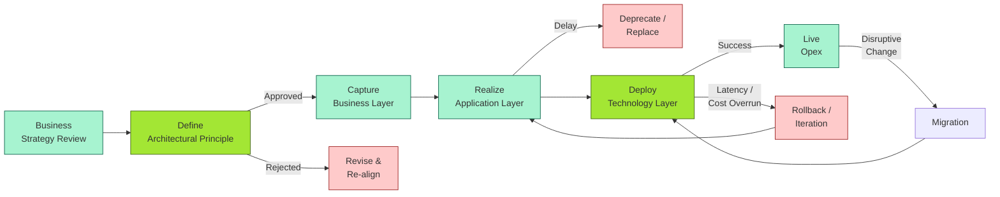
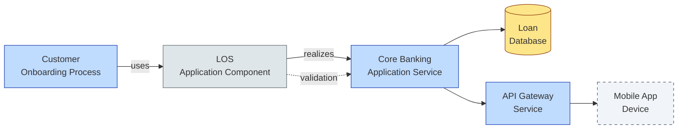
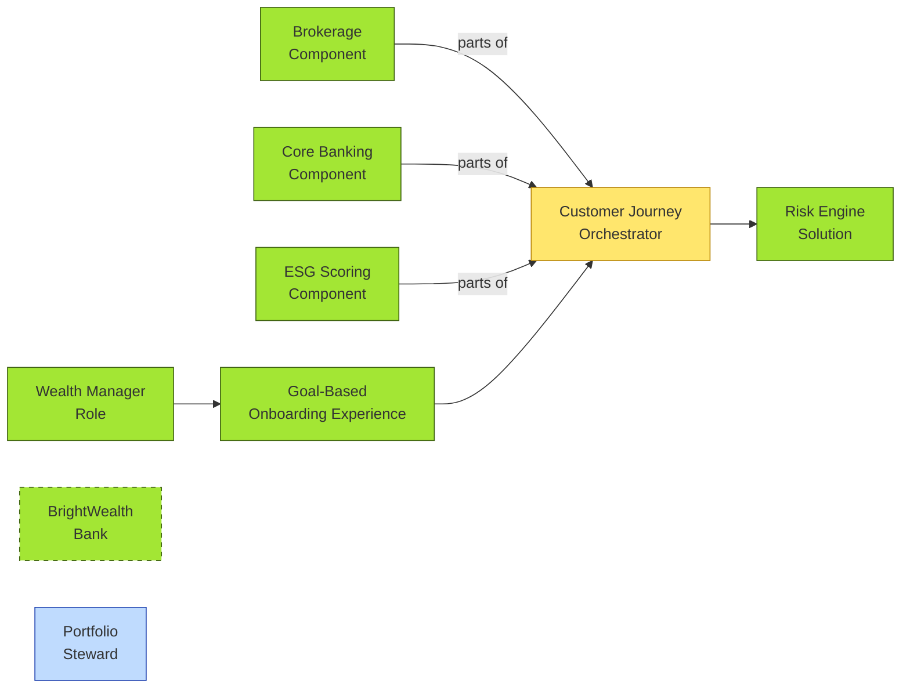

# [C2-05] ArchiMate — DETAIL
> **Category:** C2 — Frameworks & Methods · **Difficulty:** ●★★ · **Banking-relevant:** yes
> **Companion brief:** `[briefs/C2-05-archimate.md](./briefs/C2-05-archimate.md)`
>
> **Target reader:** enterprise architect who must *explain, justify, and defend* the topic — not just recite it.

---

## 1. Precise definition
**ArchiMate (4.1 / 4.1.1)** is The Open Group's standard for architecture description and visualization. It is a *technology-neutral*, *layer-based* modeling language and notation for describing the architecture of enterprise environments.

Key formal properties:
- **Meta-model:** Element, ActiveStructure, PassiveStructure, Grouping & Path, Component, Service, Device, etc.
- **Layers:** Business Layer (conceptual), Application Layer, Technology Layer.
- **Color coding:**
  - *Business Layer*: subscription orange (`#F97316`) / items in that color.
  - *Application Layer*: blue (`#2563EB`).
  - *Technology Layer*: grey (`#6B7280`) / items in that color.
- **Wired-through:** Contexts, Paths, Layout Things do not render nodes themselves in most Archi tools; they optimize readability (e.g., "this is a context boundary").
- **Specialization:** Solid diamond means *composed of (%% Composition / %% Aggregation / %% Association)*; hollow triangle means *realizes (%% Realization)*; dotted line means *direct access (%% Direct Access / %% Assignment)*.

Contrary to common misconception:
- **ArchiMate is NOT a modeling language on its own:** it requires a *meta-model* (the specification defines the elements, but a concrete model (like an ArchiMate diagram) needs a tool + a domain catalog).
- **ArchiMate is NOT a process:** creating ArchiMate models is done in *any* situation; the standard does not define *when* or *how often*.

The current stable 4.1.1 release (2023) introduced `Knowledge` and `Value Stream` enhancements, better `Assignment` semantics, and updated icons for cloud concepts.

## 2. Why it exists (problem it solves)
Before ArchiMate (circa 2009), banks built architecture models in Visio / PowerPoint:
- The CIO saw a network diagram in blue.
- The business VP saw a process flow in green.
- The vendor's solutions architect saw a deployment diagram in yellow.
- No shared vocabulary; misaligned spend decisions; architecture reviews were "three different presentations."

ArchiMate solved this by:
1. **Providing a single visual grammar** that everyone could read, different stakeholders focusing on different layers.
2. **Standardizing colors and stereotypes** (e.g., all Application Components are blue; all Devices are grey) so a diagram is "scannable."
3. **Defining composition and realization** so that business stakeholders can see "this app *is* (simplicial mapping to) our strategy" and IT can see "this device *composes* the runtime."
4. Providing *levels of abstraction*: a business stakeholder sees `Business Service` in orange; a technologist expands it into `Application Component` in blue and `Technology Service` in grey.

The standard was born from a government / Telstra / Philips / SABMiller consortium and is now maintained by The Open Group and ArchiMate Board.

## 3. Core concepts & vocabulary
| Term | Precise meaning |
|------|-----------------|
| **Business Layer** | Conceptual layer: Business Process, Event, Business Service, Business Object, Value Stream, Business Role, Business Interaction, Business Function, Course of Action, Business Principle. |
| **Application Layer** | Application components, Application Interface, Application Service, Application Process, Technology Process, System Software, Service Interface. |
| **Technology Layer** | Technology Service, Device, Network Path, System Software. |
| **ActiveStructure** | An element that has behavior / lifecycle (Process, Service, Device, Function, Business Process, Application Service, Technology Service). |
| **PassiveStructure** | An element that has state / meaning but no behavior (Node, System Software, Business Object, Artifact, Meaning, Value Store, Stakeholder). |
| **%% Business Service** | A service offered by the business to its customers / partners. |
| **%% Application Service** | An application-level service that performs business functions by exposing interfaces to other applications. |
| **%% Realization** | A relationship where one element *is a kind of* another (solid hollow triangle). |
| **%% Composition** | A relationship where one element *is a physical part of* another (solid diamond). |
| **%% Assignment** | A relationship where a resource *is assigned to* an element. |
| **%% Access** | A relationship where one element *has access to* another (direct or indirect). |
| **%% Trigger** | A relationship where one event *triggers* another. |
| **Open / Closed / Connecting / Incomplete / Abstract:** | Diagram elements' *openness*: `[ ... ]` means Open, `[ ... ]` with a gear means Incomplete, solid-bordered box means Closed, dashed-open means Connecting, etc. |
| **Stereotype:** | Optional adornment (e.g., `«directAccess»`, `«assignedTo»`) for relationships not explicitly defined. |
| **Path / Context / Layout Thing:** | Notational: Context (dashed boundary), Path (dotted connector for clarity), Layout (X/Y coordinates to reduce line crossing). |
| **Sub-architecture** | A grouping mechanism using `Composition` or `Grouping` relationships; ArchiMate 4.x uses `Composition` for grouping, not `Grouping & Path`. |
| **Composite Artifact** | An artifact *made of* other artifacts (relevant for document / model composition). |

## 4. How it works (architecture / mechanism)

### 4.1 The three layers in detail
1. **Business Layer (conceptual domain):**
   - Describes *what the organization does* and *how it runs*.
   - Business Principles → Business Functions / Processes → Business Services / Events → Business Objects / Roles.
   - Value Streams bridge high-level value creation.
   - Example: `Incoming Payment Process` → `Payment Gateway Service` → `Payment Event` → `Payment Record`.

2. **Application Layer:**
   - Describes *what software* is used to perform business functions.
   - Application Components (coarse, e.g., `Core Banking Platform`) → Application Services (fine, e.g., `AccountBalance Inquiry`) → Application Interfaces (APIs).
   - A business service is typically *realized* by one or more application services.

3. **Technology Layer:**
   - Describes *the physical / virtual hardware and network*.
   - Devices → Technology Services → Network Paths → System Software.
   - Example: `Customer-Facing App` (Application Component) → `K8s Cluster` (Technology Service) → `Postgres Rack` (Device).

### 4.2 Diagram A — Core structure (highlight the load-bearing parts = amber, supporting = grey)

```mermaid
graph TD
    classDef critical fill:#ffe66d,stroke:#b8860b,stroke-width:2px
    classDef decision fill:#a3e634,stroke:#3f6212,stroke-width:1px
    classDef context fill:#dfe6e9,stroke:#636e72
    classDef data fill:#fde68a,stroke:#92400e

    BL[Business<br/>Layer — Conceptual]:::context
    AL[Application<br/>Layer — Software]:::context
    TL[Technology<br/>Layer — Infrastructure]:::context
    BS[BusinessService<br/>e.g., Lending]:::critical
    ASP[ApplicationService<br/>Core Banking]:::critical
    DS[Device<br/>API Gateway]:::decision
    BL --> BS
    AL --> ASP
    TL --> DS
    BS -.%% Realization .->|is a| ASP:::decision
    ASP -.%% Composition .->|part of| DS:::critical
    classDef service fill:#bfdbfe,stroke:#1e40af,stroke-width:1px
    BL:::service --> BS:::service
    AL:::service --> ASP:::service
    TL:::service --> DS:::service
```

### 4.3 Diagram B — Lifecycle / flow (highlight decision points = green, failures = red)



### 4.4 Diagram C — Accounting example (highlight boundary = dashed-grey, data = yellow)



## 5. Variants, options & trade-offs

| Variant / Approach | When to pick | When to avoid | Key trade-off axis |
|--------------------|--------------|---------------|--------------------|
| **ArchiMate + Archi (open-source)** | Budget-constrained; need a free modeler; willing to maintain custom browser build | Large enterprise with advanced reporting / multi-model federation | Cost vs ecosystem |
| **ArchiMate + Sparx Enterprise Architect** | Large EA team; need model federation, CMM, ARIS-like features, have budget | Small team; hit the cost wall early | Power vs cost |
| **ArchiMate + IBM OpenPages** | If already in IBM CLM/GRC stack; want to link architecture to risk & compliance | Non-IBM environment; want vendor-agnostic toolchain | Integration vs lock-in |
| **ArchiMate 4.x as *view* of TOGAF ADM output** | Want a visual "cover" over your TOGAF repository | Trying to use ArchiMate as a *process* to replace ADM | Visualization vs process |
| **ArchiMate "canvas" (3-6 canvases)** | Seen per-domain dashboards (Strategy -> Capabilities -> Applications -> Technology -> Migration -> Transformation) | When you need *mechanics of governance* (not just visuals) | Readability vs governance |
| **Double-loop vs single-loop diagrams** | Single-loop for audit readiness; double-loop (What-If / scenario) for investment decision | Regulatory/compliance: zero tolerance for ambiguity | Expressiveness vs precision |

## 6. Relationships to sibling topics
- **TOGAF:** TOGAF describes *how* to do architecture; ArchiMate describes *what the architecture looks like*. TOGAF Phase B / C / D produces ArchiMate Building Blocks; TOGAF Phase A / D produces the architecture context that ArchiMate visualizes.
- **BPMN:** BPMN is task-oriented and swim-laned; ArchiMate is layer-oriented and zoomable. A bank may have an ArchiMate *capability* diagram that references BPMN *process* diagrams via composition or observation relationships.
- **Zachman:** Zachman's 6 rows × 6 columns are "kinds of questions"; ArchiMate's 3 layers are "kinds of elements." They are compatible: you can align a Zachman cell (e.g., Row 2 / Col 4 = System Model) and represent it in ArchiMate.
- **UML:** UML is implementation-level (code, containers, components, classes). ArchiMate is *business-system* level (components, services, concepts). A bank's architecture should use ArchiMate for the "why" and "what," UML for the "how."
- **DoDAF / NAF / MODAF:** These also use layer-based notation; ArchiMate is more widely adopted in banking/ETeas; DoDAF + ArchiMate (via UML Profile) can be mapped but are not native.

## 7. Banking / financial-services context 💳
**Concrete applications:**

1. **Digital transformation / agile-at-scale:** National retail bank (AllBright) is moving from a 5-year waterfall roadmap to a 6-month "capability sprint" model. The EA produces a portfolio of ArchiMate diagrams:
   - `Strategy` canvas (Business Layer): "Digital-first mortgage" as a *Business Object* and *Business Service*.
   - `Capability` canvas: maps 4 capabilities (Digital Sales, Onboarding, Risk Decision, Servicing) to Application Services.
   - `Application` canvas: maps each capability to components (BPM, LOS, CRM, Open Banking API).
   - `Technology` canvas: maps to K8s clusters, Postgres, Redis, API Gateway (AWS / Azure / vs On-Prem).
   The C-suite views only the first two; the CTO drills into the last two.

2. **Vendor / outsourcing governance:** A bank engages three payment processors (PSPs). The EA models the `Payment Origination Service` as a *Business Service* (orange), realizes it via three *Application Services* (blue), each *composed* of devices (grey) in the IT operator's environment. When the regulator or auditor asks "which system touches customer PII?" the answer is a single ArchiMate traversal: `Business Object` → `Application Service` → `Device`.

3. **Mergers & acquisitions:** Bank acquires a fintech. The EA overlays the target's ArchiMate capability map onto the acquirer's. Misaligned colors immediately show where the fintech's `Business Service` maps to the acquirer's `Application Service` — often revealing a *single missing component* that would have been a 3-year build if not identified upfront.

4. **Regulatory change (PSD2, DORA, BCBS 239):** When PSD2 mandates Open Banking APIs, the EA identifies:
   - `Account Information Service` (Business Service in orange).
   - Realized by `Open Banking API Framework` (Application Service in blue).
   - Composed of `API Security Gateway` + `Pseudonymization Engine` (Devices in grey).
   - The same diagram is submitted to the regulator and to the vendor's implementation team; one source, zero translation errors.

5. **CCAR / stress-testing:** The FRB expects "a map from business activity to data source." ArchiMate's `% Access` and `% Assignment` relationships allow the bank to trace `Liquidity Stress Test` → `Application Service` → `Data Artifact` → `Technology System` — directly into the resolution plan.

## 8. Reference architecture / worked example
**Problem:** A wealth-management bank (BrightWealth) wants to offer a "goal-based wealth product" that integrates brokerage, insurance, and ESG scoring. Three technology vendors argue:
- Vendor A (core banking): "We only implement account onboarding."
- Vendor B (brokerage): "We only implement trade execution."
- Vendor C (ESG): "We only implement scoring."

Each sees their own component in isolation; the customer experiences *one* journey.

**Decision:** Model the *whole* capability in ArchiMate before writing any contract. Identify one orchestrating *Application Service* (the Customer Journey Orchestrator) that realizes the *Business Service* (`Goal-Based Wealth Experience`) and is composed of three *Application Components* (A, B, C).

**Resulting diagram:**



**ADR applied:**

```markdown
# ADR-033: Adopt ArchiMate as the Canonical EA Deliverable
## Status
Accepted
## Context
The bank's C-suite, vendor negotiation team, and FRB auditors each produce different architecture artifacts: PowerPoint, Visio, and Excel. Misaligned contracts and delayed regulatory submissions have cost 8 person-weeks. We need a *single* visual standard.
## Decision
Adopt ArchiMate 4.1 as the canonical enterprise architecture notation. Mandate ArchiMate in the Architecture Review Board (ARB) gate-check for all RFP / M&A decisions.
## Consequences
- Positive: One source of truth; faster vendor alignment; improved audit narrative.
- Negative: Tooling cost (Sparx EA); 4-week learning curve for architects new to ArchiMate; risk of "pretty diagrams" without traceability.
- Negative: Cannot model code / algorithms natively; must pair with UML for IT-side detail.
## Alternatives considered
1. **UML + SysML:** More powerful for implementation; but too low-level for the board and for business-executives.
2. **BPMN + ArchiMate hybrid:** BPMN for process detail; ArchiMate for layer alignment; but adds complexity of two notations.
```

## 9. Maturity & adoption signals
- **Adopt when:**
  - The architecture team needs to communicate *to non-technical stakeholders* (board, CRO, regulators).
  - The bank has multiple vendors / M&A / outsourcing that need a common "map."
  /3. The RA team is already using TOGAF ADM and wants a *visual* for the Architecture Vision / Building Blocks.
- **Anti-signals (don't adopt yet):**
  - "We have a Visio template; that's enough" and the template is 15 years old.
  - No budget for a tool; architects will continue in PowerPoint / whiteboard photos.
  - The only customer for the diagrams is the architects themselves.
- **Common failure modes:**
  1. **Beautification without coherence:** ArchiMate diagrams with 200+ elements; no hierarchy; no ArchiPack / Archi / Excalidraw to organize.
  2. **ArchiMate-as-documentation:** Producing diagrams but never connecting them to requirements, tests, or configuration.
  3. **Ignoring semantics:** Treating all elements as the same color or ignoring %% Realization vs %% Composition; diagrams become "boxes and arrows" again.

## 10. Common confusions — the "don't mix" list
| Often confused | Real distinction |
|----------------|----------------|
| ArchiMate vs TOGAF | ArchiMate = *visual / layer standard*; TOGAF = *process / methodology*. TOGAF produces the architecture; ArchiMate *is the architecture*. |
| ArchiMate vs BPMN | BPMN = task-oriented, single-process depth; ArchiMate = multi-layer, high-level. |
| Realization vs Composition | *Realization* = logical "is-a" relationship (e.g., `Application Service realizes Business Service`); *Composition* = physical "part-of" relationship (e.g., `Device composes Application Service`). |
| Open / closed abstraction | Closed = fully specified; Open = incomplete / not yet defined; not a "draft" version, but a status in the meta-model. |
| Business vs Application components | Business components are *what the organization does* (e.g., `Customer Onboarding Process`); Application components are *software* (e.g., `Onboarding Application Component`). |

## 11. Tools & standards to know
- **Standards/Frameworks:** The Open Group ArchiMate 4.1.1 Specification; TOGAF 10.2; UML 2.5; Zachman; DoDAF (can map via UML Profile).
- **Common tooling:** Archi (open-source), Sparx Systems Enterprise Architect, IBM OpenPages (ArchiMate view), BiZZdesign Architect, Metamodeler / Idera / Broadcom (Archi), draw.io (ArchiMate icons), Excalidraw, Mermaid.
- **Mandatory reading (if any):**
  - "The ArchiMate 4.1 Specification" (The Open Group).
  - "TOGAF and the TOGAF Architecture Body of Knowledge" for ADM alignment.
  - "Enterprise Architecture: A Practical Approach" for practical banking-domain examples.
  - ArchiPack bundle (Community) for starter icon sets.

## 12. ADR template (ready to fill in)
```markdown
# ADR-XXX: <decision>
## Status
Accepted | Proposed | Deprecated

## Context
...

## Decision
...

## Consequences
- Positive ...
- Negative ...
- ...

## Alternatives considered
1. ...
2. ...
```

## 13. Practice — apply it
1. **Recall:** In 60 seconds, list 6 Element types (1 ActiveStructure, 1 PassiveStructure from each layer) and their default colors.
2. **Model:** Pick one of your bank's end-to-end processes; draw an ArchiMate diagram with no more than 15 elements (one per canvas).
3. **ADR:** Write a decision doc: "Shall we evaluate ArchiMate 4.x for our vendor-integration common layer?"
4. **Defend:** Roleplay explaining to a P&L Head why "your brokerage system *realizes* our wealth-management process" is *not* "your brokerage system *is* the wealth-management process."

## 14. Summary (1 paragraph)
ArchiMate is The Open Group's standard for visual, multi-layer enterprise architecture. In a bank, it is the *lingua franca* that lets the CRO, the CTO, the vendor negotiator, and the regulator look at the same diagram and each see their own layer: the CRO sees business outcomes in orange; the CTO sees software components in blue; the infrastructure team sees devices in grey. It does not prescribe *how* to design; it provides the *visual grammar* for describing what is designed. Used wisely, it replaces PowerPoint architecture decks with governed, queryable, versioned models that tie business strategy to IT execution; used lazily, it produces pretty but untraceable "diagrams."

---
**Status:** ✅ Covered · **Last updated:** 2026-06-23
