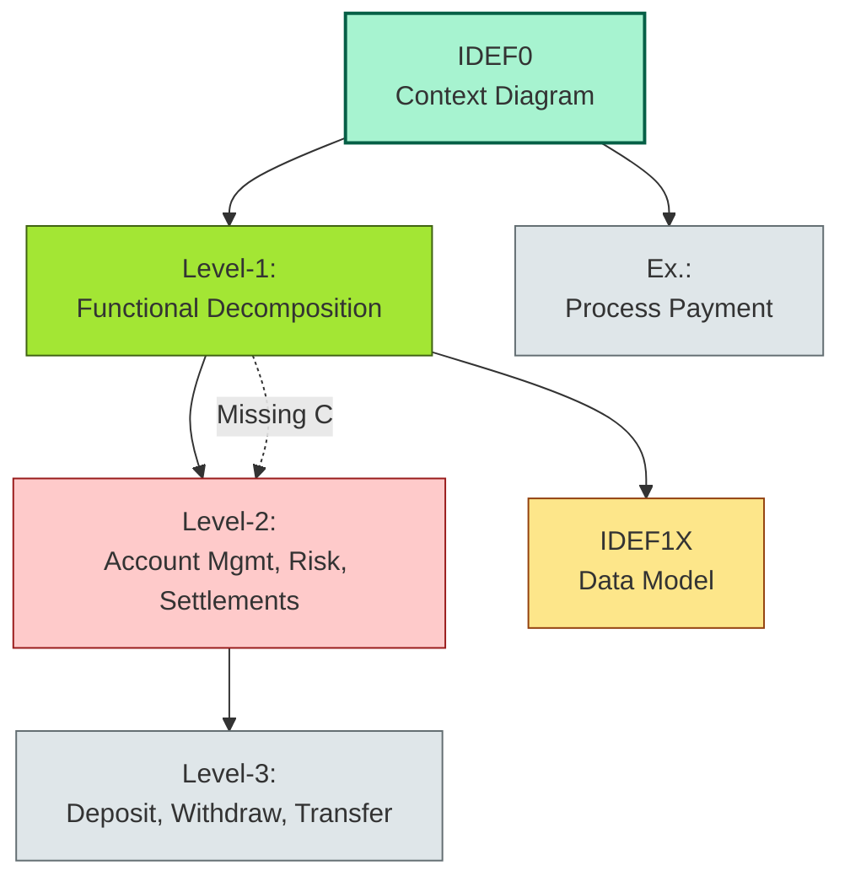
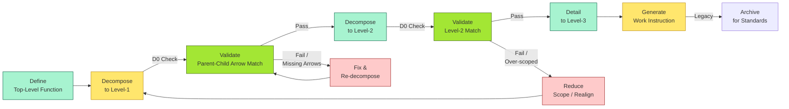
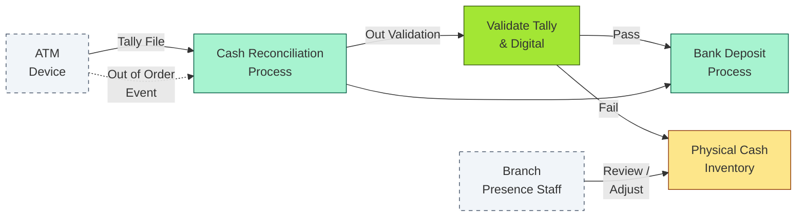

# [C2-06] IDEF — DETAIL
> **Category:** C2 — Frameworks & Methods · **Difficulty:** ●★★★ · **Banking-relevant:** yes
> **Companion brief:** `[briefs/C2-06-idef.md](./briefs/C2-06-idef.md)`
>
> **Target reader:** enterprise architect who must *explain, justify, and defend* the topic — not just recite it.

---

## 1. Precise definition
**IDEF (Integration Definition)** is a family of modeling methods for the *analysis and description* of systems, originally developed under the U.S. Air Force ICAM program (Integrated Computer Aided Manufacturing) in the late 1970s. The term "IDEF" is now a trademarked family name encompassing twelve methods:

| Method | Purpose |
|--------|---------|
| **IDEF0** | Functional modeling: *what* the system does (functional decomposition). |
| **IDEF1** | Conceptual data modeling: *what* the system knows at a high level. |
| **IDEF1X** | Logical and physical data modeling: *what* the system knows (entity-relationship with cardinality). |
| **IDEF2** | Simulation of integrated manufacturing systems (less used in banking). |
| **IDEF3** | Process / workflow modeling: *how* events and objects relate over time. |
| **IDEF4** | Evaluation of object-oriented systems and designs. |
| **IDEF5** | Ontology description: capturing knowledge for reuse. |
| **IDEF6** | Evaluation of design methods (methodology meta-modeling). |
| **IDEF7** | Organizational and process modeling (checklists, used in ATM / teller analysis). |
| **IDEF8** | Operator / human procedural modeling: *how* humans interact with systems. |
| **IDEF12** | Causal analysis (less common). |

**Homepage / official sources:**
- **ANSI / ANS X3.162-1998:** The official standard for the IDEF methods.
- **FIPS (Federal Information Processing Standard):** Historically hosted the ICAM documentation and examples.
- **NIST SP 8070-1:** Interoperability standards body guidance mapping IDEF to formal methods.

**Positioning:**
- IDEF is *not* an EA framework in the sense of TOGAF; it is a *set of diagramming languages* with rigid syntax.
- IDEF0 maps to UML Activity / Use Case decomposition; IDEF1X maps to Class / Entity diagrams; IDEF3 to Activity / State Machine; IDEF8 to Human Activity / Activity diagrams.
- Modern practice: use IDEF where *regulatory proof* or *contractual precision* is required; otherwise, UML / ArchiMate.

## 2. Why it exists (problem it solves)
Before IDEF (pre-1978), ICAM engineers had inconsistent diagrams: some boxes had unnamed inputs, some had "man" in a control box without a policy reference, and the Air Force could not *reconcile* a budget-line "computer" vs "software" vs "procedures" down to first-order principles.

IDEF solved this by:
1. **Arrow taxonomy:** Every incoming or outgoing arrow *must* be labeled (I, O, C, M, Ex, St). This means "no hidden inputs."
2. **Decomposition rule:** A level-N diagram must represent *all* the functionality of its parent (a "D0" rule). You cannot leave a function unexplained.
3. **Decision/action clarity:** IDEF3's "snake" (activity box) can carry a condition (diamond) — the first standard for "if-then-else" in a process view.
4. **Regulatory auditability:** Because every box and arrow is *named*, an auditor can *trace* a requirement from a business goal (Level 0) to a mechanism (lowest level) without guesswork.

Without IDEF, large-program scope creep is "we forgot to model the control input." With IDEF, scope creep is caught by the D0 rule: every child-box input must sum to the parent's input.

## 3. Core concepts & vocabulary
| Term | Precise meaning |
|------|-----------------|
| **IDEF0 (Top-Down Decomposition):** | decomposition of a system into functions until a discrete deliverable is reached. Has context diagrams (Level 0) + up to 3 levels of detail. |
| **IDEF0 Box:** | a rectangular node representing a function; may be decomposed into child diagrams. |
| **IDEF0 Arrow:** | a labeled line; one of {I, O, C, M, Ex, St} (Input, Output, Control, Mechanism, Exertion, Straining). |
| **D0 Rule:** | the rule that the union of all I/O/C/M arrows in child boxes must equal the arrows of the parent box. |
| **IDEF1 (Conceptual ER):** | early entity-relationship model; entities drawn as boxes; attributes as columns; relationships as labeled lines. |
| **IDEF1X (Logical / Physical ER):** | evolution of IDEF1 for production; supports cardinalities (1, 0..1, 0..*, 1..*), participation (total/partial), and foreign keys. |
| **Primary Key / Foreign Key:** | in IDEF1X, the key that uniquely identifies an entity (PK) and the key that references it (FK). |
| **IDEF3 (Workflow/Process Modeling):** | activities as "snakes" with arrows for sequence, object flow, condition, iteration, and procedural links. |
| **IDEF3 Snake:** | a thick vertical bar (activity node) with text inside; connected by links among {sequential, object-flow, condition, iteration, procedural}. |
| **IDEF8 (Operator / Human Procedure):** | models human users, tasks, procedures, and interaction with systems (e.g., teller serving a customer, ATM user). |
| **IDEF8 Operator:** | a human entity performing tasks; may have explicit interaction sequences with the system. |
| **IDEF5 (Ontology):** | a descriptive language for defining a domain of discourse; used in AI / semantic modeling. |

## 4. How it works (architecture / mechanism)

### 4.1 Diagram A — Core structure (highlight the load-bearing parts = amber, supporting = grey)



### 4.2 Diagram B — Lifecycle / flow (highlight decision points = green, failures = red)



## 5. Variants, options & trade-offs

| Variant / Approach | When to pick | When to avoid | Key trade-off axis |
|--------------------|--------------|---------------|--------------------|
| **IDEF0 + manual V&V** | Regulated / audited programs; need traceability without tool cost | Agile / continuous delivery environments | Rigor vs velocity |
| **IDEF1X + ER/DBA tools** | Data-governance; need to auto-generate schema | Cloud-native schemaless / polyglot persistence | Schema stability vs flexibility |
| **IDEF3 + BPMN hybrid** | Process-heavy workflows (e.g., payment-clearing exception) | Fast-changing processes (every sprint) | Traceable condition vs agility |
| **IDEF8 + UX / HCI evaluation** | High-consequence human-in-the-loop (ATM, trading floor) | Pure back-office automation | Human factors vs automation |
| **IDEF1X → UML Class / SysML Profile** | Teams already using UML; need legacy bridge | EDA / regulatory filings that accept IDEF1X natively | Consistency vs native acceptance |
| **Full IDEF suite (all 12 methods)** | Large, defense-grade / government-regulated banks | Small fintech; most IDEF methods are rarely used | Completeness vs overkill |

## 6. Relationships to sibling topics
- **TOGAF:** TOGAF provides *what* to build; IDEF0 provides *how to decompose* what is built. TOGAF Phase B's "Architecture Vision" and "Capability Baseline" can be decomposed with IDEF0.
- **BPMN:** BPMN is the easier-to-use successor to IDEF3; IDEF3's "snake" ↔ BPMN "task box." Choose BPMN when stakeholders already know it; choose IDEF3 when you need *condition / iteration* semantics that map directly to code logic.
- **ArchiMate / SLE:** ArchiMate is the modern visual layer; IDEF0 is the older syntax-constrained specification. A bank may model the same decomposition in both — ArchiMate for the board, IDEF0 for the audit / contract attachment.
- **UML:** IDEF1X → UML Class (with careful mapping of cardinalities); IDEF0 → Activity / Use Case; IDEF3 → State Machine / Activity.
- **Zachman:** IDEF methods provide the "what" and "how" rows/columns; Zachman's "who" and "why" align with ArchiMate's Business Role and Principle elements.

## 7. Banking / financial-services context 💳
**Concrete applications:**

1. **Payment-switch debugging (IDEF0):**
   A regional payment platform experiences *chronic* ACH file-processing failures. The EA applies IDEF0 to `Process ACH File`:
   - **L0:** `Process Incoming Payments` — inputs: `ACH File`, `ISO20022 File`; controls: `Basel Liquidity Rule`, `OFAC Sanctions List`; mechanisms: `Payment Switch`, `Core Banking`.
   - **L1:** `Validate File`, `Post to GL`, `Release Funds`, `Generate Exception Report`.
   - **L2 (Release Funds):** `Risk Re-Rule`, `Execute Settlement`, `Update Ledger`.
   - **L3 (Risk Re-Rule):** `Check LTV`, `Verify Collateral`, `Approve / Reject`.
   - **Catch:** The `Basel Liquidity Rule` control arrow did *not* reach `Risk Re-Rule`. The manual exception queue was an *unmodeled missing control*. Closure: link the control explicitly; 4-hour SLA → 30 minutes.

2. **AML / OFAC screening (IDEF1X):**
   A bank models `CustomerWatchList` (entity: `ThreeCollar`, `RecordCreatedDate`, `Status`) ⟶ `SanctionedEntity` (entity: `SanctionProgram`, `ofacId`) via a one-to-many relationship (a watchlist record *refers to* a sanction program). The IDEF1X cardinality notation (1 to 0..* or *..*) is directly translatable to an SQL `FK` and checked in a nightly `dblink` + `bms_schematxttable` reconciliation.

3. **Teller / ATM teller interface (IDEF8):**
   A national retail bank redesigns its ATM concierge experience. IDEF8 models the human operator (teller / supervisor) and the customer interface:
   - **Operator strikes 115:** teller interacts with `TellerWorkstation`;
   - **Customer:** interacts with `ATMDrive`;
   - **Procedure:** `115 Strike` → `116 Insert Card` → `117 Select Language` → `118 Choose Service` → ...
   This is used for *ergonomic evaluation* (ISO 9241) and for *security analysis* (does the operator have a "back-office override" step that is physically observable by the customer?).

4. **ISO 20022 / payment-clearing (IDEF3):**
   A BRRD-2 credit institution (`CreditEuro`) must produce a "compensation mechanism" documentation for the European Central Bank's T2S (Target Instant Gross Settlement) system. The EA models `ISO 20022 Payment Instruction` as an IDEF3 activity (snake) with `sequential` links to `Validation`, `Message Transformation`, `Bridge Routing`, `Clearing`, `Settlement`, and `Reconciliation` — with `condition` diamonds for `Validation Passed?` → Yes / No.

5. **CCAR / stress-test lineage (IDEF0):**
   In stress-testing, the FRB requires that every "model assumption" map to a *mechanism* (the actual system that produces it). An executive summary (Level 0) uses `Process Stress Test` with controls: `FRB Stress Scenarios`, `Model Governance`. Decomposed to `Loan Model Execution` (mechanism: `Basel III PD-LGD-EAD Module`) — cross-checked via D0 rule: every arrow in the child diagram must be explicitly labeled and must manifest in an actual production system.

## 8. Reference architecture / worked example
**Problem:** A multi-national retail bank (BrightWealth) wants to model its ATM cash-reconciliation process for both internal audit and a PRA / OCC regulatory submission.

**Decision:** Use IDEF0 for functional decomposition (audit-grade) and IDEF1X for the data model (schema-grade); link via a common entity (`ATM Transaction Record`).

**Resulting diagram (simplified):**



**ADR applied:**

```markdown
# ADR-038: Adopt IDEF0/1X for ATM Reconciliation Modeling
## Status
Accepted
## Context
The PRA and OCC both require a *traceable, decomposition-grade* model of the ATM cash-reconciliation process. Current Visio diagrams are insufficient because they are not checkable: inputs and outputs are unlabeled, and the D0 decomposition rule is not applied.
## Decision
Adopt IDEF0 (functional) and IDEF1X (data) for all locked-down process models submitted to regulators; produce UML 2.5 as the working edit-form.
## Consequences
- Positive: Regulators can review the model as a *first-order specification*; D0 completeness is automatable via script.
- Negative: 6-week up-front model build for a process that changes quarterly; unsuited for iterative improvement.
- Negative: IDEF1X is identity-centric; modern polyglot persistence (Cassandra, S3, data lake) does not align cleanly to IDEF1X 1:1.
## Alternatives considered
1. **ArchiMate + Archi:** Faster, board-friendly; but PRA / OCC may not accept ArchiMate as a *specification*.
2. **BPMN 2.0 + Data Object:** More agile; but lacks the D0 decomposition rigor for high-consequence reconciliation (fraud, loss, regulatory).
```

## 9. Maturity & adoption signals
- **Adopt when:**
  - A process is under *regulatory audit* or *compliance review* (CCAR, Basel, DORA, OCC / PRA).
  - The model must be *checked for completeness* (all inputs/outputs accounted for) — not merely *illustrated*.
  - The IT program is large (synod: 6-month waterfall) and the architecture review board requires a "first-order" specification.
- **Anti-signals (don't adopt yet):**
  - The process is *exploratory* or *greenfield*; expectations are unclear and will shift weekly.
  - The team has only 5 people and the process spans 1 or 2 jurisdictions.
  - You need to *code-autonomously*; IDEF notation is not executable (unless converted to a rules engine, which is a heavy lift).
- **Common failure modes:**
  1. **Over-decomposition:** Going to Level 5 when Level 2 already explains the review to the board; stakeholders get lost.
  2. **D0 rule violation:** Drawing a child box with an input that does not appear on the parent — caught late in the design, causing rework.
  3. **Strategy creep:** Using IDEF0 as a *process* (Agile reviews probing mid-sprint) instead of a *specification* (up-front, locked down).

## 10. Common confusions — the "don't mix" list
| Often confused | Real distinction |
|----------------|----------------|
| IDEF0 vs BPMN | IDEF0 = functional decomposition (what does the box *do*); BPMN = event-driven / task-driven process flow (how does the process *run*). |
| IDEF1X vs UML Class | IDEF1X = logical ER with cardinalities; UML Class = richer (associations, stereotypes, constraints); but both describe "what is known." |
| IDEF3 vs BPMN | IDEF3 = workflow with condition / iteration; BPMN is more familiar; IDEF3's "snake" is closest to BPMN's "task box." |
| IDEF8 vs UML Human Activity | Both model human behavior; IDEF8 is the *standard* (ANSI / FIPS); UML Human Activity is a UML profile (less widely adopted in regulated banking). |
| Arrow types (I/O/C/M) in B2B / APIs | In BPMN / ArchiMate, the same thing is "data flow" or "control." IDEF0's strict labeling (Control = governance, Mechanism = system) catches hidden policy dependencies. |

## 11. Tools & standards to know
- **Standards/Frameworks:** ANSI / ANS X3.162-1998 (IDEF), FIPS, NIST SP 8070-1, ISO 19439 (not used much), UML 2.5 (successor), BPMN 2.0 (common alternative).
- **Common tooling:** Edraw Max / Visio (with IDEF0 stencil packs), ConceptDraw, SmartDraw, Draw.io (IDEF0 templates), Rational DOORS (requirements + IDEF-style traceability), Sparx Enterprise Architect (supports IDEF1X and generates DDL), ARIS (supports IDEF-style process), Archi (open-source with limited ISO / IDEF support).
- **Mandatory reading (if any):**
  - "IDEF Methodology Report" — U.S. Air Force ICAM / IDEF documentation.
  - "ANSI / ANS X3.162-1998, Integration Definition Methods: IDEF0."
  - "UML 2.5 Superstructure" — for mapping IDEF1X to Class.
  - "BPMN 2.0 Specification" — for IDEF3 alternative.

## 12. ADR template (ready to fill in)
```markdown
# ADR-XXX: <decision>
## Status
Accepted | Proposed | Deprecated

## Context
...

## Decision
...

## Consequences
- Positive ...
- Negative ...
- ...

## Alternatives considered
1. ...
2. ...
```

## 13. Practice — apply it
1. **Recall:** In 60 seconds, list IDEF0's 6 arrow types and their ArchiMate / BPMN mapping.
2. **Model:** Pick a bank process; create an IDEF0 Level-0 diagram with context circle and all 4 external entities.
3. **ADR:** Write a decision doc: "Shall we require IDEF0 decomposition for all regulated-process changes next quarter?"
4. **Defend:** Roleplay explaining to a CIO why a Level-2 IDEF0 diagram costs $18K and a BPMN diagram costs $3K — and why the $18K is the *insurance premium* for the $3K plan's missing D0 check.

## 14. Summary (1 paragraph)
IDEF is the Air Force's family of restricted-syntax modeling methods, most famous for IDEF0 (functional decomposition) and IDEF1X (entity-relationship data modeling). In banking, IDEF matters where *certainty* and *auditability* outweigh *velocity*: regulatory reviews, contract specifications, and process redesigns where every input and output must be named and traced. The discipline is real—D0 rules, six arrow types, and reusable decomposition—but the cost is architectural: you plan what you model, often before the solution is fully understood. Use IDEF when the *price of a missing arrow* (a missed control, a fraud gap, a failed compliance submission) is larger than the *cost of a rigid diagram*.

---
**Status:** ✅ Covered · **Last updated:** 2026-06-23
