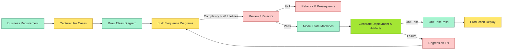
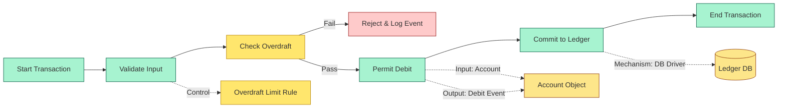

# [C2-07] UML — DETAIL
> **Category:** C2 — Frameworks & Methods · **Difficulty:** ●★★ · **Banking-relevant:** yes
> **Companion brief:** `[briefs/C2-07-uml.md](./briefs/C2-07-uml.md)`
>
> **Target reader:** enterprise architect who must *explain, justify, and defend* the topic — not just recite it.

---

## 1. Precise definition
**UML (Unified Modeling Language)** is an OMG (Object Management Group) standard notation for visualizing, specifying, constructing, and documenting software-intensive systems. The current stable branch is **UML 2.5** (with corrigenda and extensions; 2.5.2 / 2.5.1 / 2.5.0 are informally grouped as "UML 2.5").

UML 2.5 reduced the original 14 diagram types (UML 1.x) to a syntactically mandatory subset:
- **Behavioral:** Use Case, Activity, State Machine, Sequence, Communication, Timing, Interaction Overview.
- **Structural:** Class, Object, Component, Composite Structure, Deployment, Package, Profile.
- **General:** Profile (mechanisms to extend UML).

Key point: **UML is notation, not process.** It does not prescribe *when* you model, *who* reviews it, or *how* to evolve it. TOGAF ADM *uses* UML as an output artifact; it does not *replace* TOGAF.

## 2. Why it exists (problem it solves)
Before UML (pre-1997), software architecture was documented in:
- **Pseudocode / English narratives:** No visual contract.
- **Z / VDM:** Formal but unreadable on a whiteboard; no stakeholder buy-in.
- **Incompatible vendor dialects:** Every tool had its own boxes.

UML solved:
1. **Interoperability via XMI:** The "Diagram Interchange" (DI) format lets Rational Rose models import into Sparx without redrawing.
2. **Layer separation:** A business analyst reads a *Use Case*; the Java engineer reads the *Class*; the DevOps engineer sees the *Deployment* diagram.
3. **Traceability:** `<<trace>>` stereotypes link Use Case → Class → Component → Deployment node.
4. **Patterns:** `<<entity>>`, `<<service>>`, `<<repository>>` stereotypes let an EA enforce domain conventions.

Without UML, a bank's "API contract" is an email thread and the "state machine" lives in three heads.

## 3. Core concepts & vocabulary
| Term | Precise meaning |
|------|-----------------|
| Use Case Diagram | External actor perspective: what the system does. |
| Sequence Diagram | Message order between lifelines over time. |
| Activity Diagram | Control flow and data flow between actions. |
| State Machine Diagram | State transitions, triggers, actions (entry / during / exit). |
| Class Diagram | Static structure: classes, attributes, associations, multiplicities, inheritance. |
| Component Diagram | Self-contained, replaceable modules with provided / required interfaces. |
| Deployment Diagram | Nodes (hardware / software), artifacts, and mappings. |
| Profile | Mechanism to extend UML for a domain (e.g., SysML, ArchiMate profile). |
| Stereotype | Extension of a base element (e.g., `<<controller>>`, `<<entity>>`). |
| Constraint (OCL) | Object Constraint Language expression on a class or association (e.g., `self.balance >= 0`). |
| Qualifier | Refinement key on an association end for many-to-many (e.g., `ATMId` qualifies `Account.accounts`). |
| Object Diagram | Snapshot of a specific scenario (one instance per class). |

## 4. How it works (architecture / mechanism)

### 4.1 Diagram A — Core structure

```mermaid
graph TD
    classDef critical fill:#ffe66d,stroke:#b8860b,stroke-width:2px
    classDef decision fill:#a3e634,stroke:#3f6212,stroke-width:1px
    classDef context fill:#dfe6e9,stroke:#636e72
    classDef data fill:#fde68a,stroke:#92400e
    classDef risk fill:#fecaca,stroke:#991b1b
    classDef service fill:#bfdbfe,stroke:#1e40af,stroke-width:1px
    classDef ok fill:#a7f3d0,stroke:#065f46

    UC[Use Case Diagram]:::critical --> Class[Class Diagram]:::critical
    Class --> Seq[Sequence Diagram]:::decision
    UC -->|1: many| Smach[State Machine Diagram]:::decision
    Class -->|1:1| Actf[Activity Diagram]:::context
    Class --> Comp[Component Diagram]:::data
    Comp --> Deploy[Deployment Diagram]:::context
    Seq -->|traces to 1..n| Deploy:::risk
    Class:::ok --> Tag[Tag / Constraint]:::ok
    Smach:::ok --> SmachSt[States: Created | Active | Suspended | Closed]:::ok
```

### 4.2 Diagram B — Lifecycle



### 4.3 Diagram C — Banking (overdraft transfer)



## 5. Variants, options & trade-offs
| Variant | When to pick | When to avoid | Trade-off |
|---|---|---|---|
| UML 2.5 + XMI | Enterprise; model-to-code / code-to-model traceability | Embedded safety-critical; use SysML or AADL | Traceability vs safety |
| UML + ArchiMate / TOGAF profile | Banks wanting code-adjacent EA diagram | Teams treating UML as only layer | Detail vs abstraction |
| UML + OCL | Formal verification / Basel III model risk | Hyper-agile fintech | Correctness vs velocity |
| Minimal UML (no tool) | Single sprint; budget-constrained | Regulated / M&A | Speed vs rigor |

## 6. Relationships to sibling topics
- **TOGAF:** TOGAF is process; UML is implementation output of Phase D.
- **BPMN:** BPMN = process; UML Activity = control-flow counterpart.
- **ArchiMate:** ArchiMate *profiles* UML classes → business / application / technology layers.
- **Zachman:** Zachman cells map loosely to UML diagram types.
- **SysML:** SysML is a UML 1.5 profile for systems engineering (hardware + software).
- **DoDAF / MBSE:** SysML + UML + DoDAF interfaces for defense / aerospace banking.

## 7. Banking / financial-services context
1. **DDD Class models:** `Account` (accountId, balance, overdraftLimit, status) with `AccountHolder` (composition), `Transaction` (association); `<<entity>>` stereotype enforced by EA.
2. **RTGS microservice choreography:** Sequence diagram: Kafka Topic → RTGS Orchestrator → Risk Engine (sidecar) → Reserve Funds → Ledger Service → Clearing Account; dead-letter queue on failure.
3. **Card state machine:** `Targeted → Active → Suspended → Blocked → Expired → Closed → Disputed`; triggers, guards, actions; PCI DSS audit source.
4. **Cloud / hybrid Deployment:** Kubernetes, API Gateway (CDN), Postgres, Redis nodes with latency / failover annotations; GDPR / data residency annotations.
5. **CCAR / model risk traceability:** FRB CCAR requires chain from Board strategy → UML `CreditRiskModel` (Class) → source code (Java/.NET) → test cases (UML Activity → TestCase).

## 8. Reference architecture / worked example
**Problem:** BrightWealth's "15-minute mortgage" product (ExpoMortage) must deliver digital onboarding.

**Decision:** Use UML Use Case → UML Class → Sequence → State Machine → Deployment for tracking.

**ADR:**
```markdown
# ADR-021: UML 2.5 for ExpoMortage Modeling
## Status
Accepted
## Context
Vendor bids require "complete requirements traceability"; current state is PowerPoint + Word.
## Decision
Adopt UML 2.5 with XMI for bidirectional traceability (Model → Code → Test).
## Consequences
- Positive: Single requirements source; automated model-to-code generation; FRB-traceable.
- Negative: Tool cost (£240K); training for 30 architects; 4-week up-front.
- Negative: Weekly sprint changes forced to "update diagrams" before code commit.
## Alternatives
1. Swagger / OpenAPI: Faster; but no state machine support.
2. ArchiMate alone: Board-friendly; but code traceability is manual.
```

## 9. Maturity & adoption signals
- **Adopt when:** Regulated stack; multi-vendor; M&A; code-to-model traceability needed.
- **Anti-signals:** < 10 people; single-cloud nano-service; vendor-provided spec.
- **Failures:** Over-engineered diagrams; "documentation theater"; ignored after sprints start.

## 10. Common confusions
| Confused | Distinction |
|---|---|
| UML vs BPMN | UML = structural/interaction; BPMN = process/event |
| UML vs ArchiMate | UML = implementation; ArchiMate = multi-layer visual |
| UML vs SysML | SysML = hardware + software; UML = software |
| UML vs ISO 20022 | ISO 20022 = message format; UML = concept semantics |

## 11. Tools & standards
- **Standards:** OMG UML 2.5, ISO/IEC 19511, SysML 1.x, ISO 20022, DORA, Basel III.
- **EA tools:** Enterprise Architect, MagicDraw, Visual Paradigm, Sparx, Archi (open-source).
- **BPMN:** Camunda, Signavio, IBM BPM.
- **Semantic:** Neo4j (graph storage).
- **DevOps trace:** GitLab, Confluence, Jira, Linkerd / Istio (service trace).
- **Reading:** "The Handbook of Enterprise Architecture"; "UML 2.5 in a Nutshell".

## 12. ADR template
```markdown
# ADR-XXX: <decision>
## Status
Accepted | Proposed | Deprecated
## Context
...
## Decision
...
## Consequences
- Positive ...
- Negative ...
## Alternatives
1. ...
2. ...
```

## 13. Practice
1. List 6 UML element types and their layers.
2. Draw a Use Case for "Open Account" with 10 classes, 1 state machine, and 1 sequence.
3. AD.R: "Shall we move from Visio to UML 2.5 for regulated digital mortgage?"
4. Roleplay explaining to a CRO why `<<entity>>` is not "an outline."

## 14. Summary
UML is the OMG's standard for software visualization. In banking, it is the *contract* between business analysts and engineers: Use Cases define what, Classes define what is known, Sequences define how messages flow, State Machines define lifecycle, and Deployment diagrams define where it runs. It does not replace TOGAF (process) or ArchiMate (visual); it *completes* them at the implementation layer. The cost is real (tooling, training), but the cost of misaligned integration in settlement / custody / payments is far higher.

---
**Status:** ✅ Covered · **Last updated:** 2026-06-23
