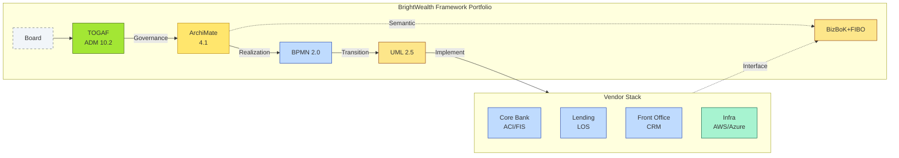

# [C2-08] Framework Selection — DETAIL
> **Category:** C2 — Frameworks & Methods · **Difficulty:** ●★★ · **Banking-relevant:** yes
> **Companion brief:** `[briefs/C2-08-framework-selection.md](./briefs/C2-08-framework-selection.md)`
>
> **Target reader:** enterprise architect who must *explain, justify, and defend* the topic — not just recite it.

---

## 1. Precise definition
**Framework selection** is the strategic practice by which an enterprise architecture (EA) organization chooses which architecture frameworks, methods, and notations to adopt, pilot, or deprecate across its enterprise, and defines the *mapping rules* between them so that artifacts in one framework can be traced, transformed, or interpreted in another.

Unlike a **methodology** (a sequenced process, e.g., TOGAF ADM) or a **notation** (a visual language, e.g., ArchiMate), a **framework** is a *family of concepts* that may include methodology, notation, vocabulary, and sometimes tooling (e.g., the "TOGAF suite" bundles the ADM + the ArchiMate *viewpoint* definitions).

In banking, framework selection is not a one-time procurement decision; it is a *continuous governance activity* because:
- Regulators (FRB, ECB, FCA, OCC) update requirements.
- Vendors (ACI, FIS, Temenos, IBM, SAP) update protocols.
- M&A adds new taxonomies.
- Cloud migration changes the *cost / type* of abstraction the bank needs.

The selection must therefore include:
1. **Coverage mapping:** Which domain does each framework cover? (Business / Application / Technology / Data / Semantic / Compliance)
2. **Traceability mapping:** How do artifacts in Framework A relate to Framework B?
3. **Lifecycle mapping:** Which phase of which process uses which framework?
4. **Obsolescence / sunsetting rules:** When does a framework get deprecated?
5. **Tooling cost-benefit:** Licenses + training + maintenance against compliance value.

## 2. Why it exists (problem it solves)
Before formal framework selection, banks used *ad-hoc stacks*:
- The CIO's team drew architectural "blueprints" in Visio.
- The PMO maintained requirements in Excel.
- The CRO's office used Word + Power BI.
- The vendor's "solution architect" sketched boxes on whiteboard and won the RFP.

The result: **no common reference**, **no traceable artifacts**, **no audit trail**, and **massive rework** when the board wanted to compare two vendor bids.

Framework selection solves three problems:
1. **Semantic interoperability:** A single concept (e.g., "customer") has one definition across all systems — not N definitions in N vendors.
2. **Regulatory defendability:** When the regulator asks "show me the chain from the Board's digital strategy to the deployed software," the framework stack provides the *path* (TOGAF Phase A → ArchiMate View → BPMN Process → UML Class → Deployment Node).
3. **Vendor lock-in reduction:** If the board mandates *interoperability via standard mappings* (e.g., every vendor must map Application Components to ArchiMate), the bank avoids bespoke integration.

## 3. Core concepts & vocabulary
| Term | Precise meaning |
|------|-----------------|
| **Framework stack** | The set of frameworks adopted in sequence or in parallel (e.g., TOGAF + ArchiMate + BPMN + UML). |
| **Coverage** | The extent to which a domain (business, application, technology, data, semantic, compliance) is represented by a framework. |
| **Traceability** | The ability to follow an artifact / requirement / decision across frameworks or lifecycle phases. |
| **Mapping** | A defined rule or rule set that relates concepts in one framework to concepts in another (e.g., TOGAF Capability → ArchiMate Business Service). |
| **Profile** | A lightweight extension of a framework that adds constraints or stereotypes for a specific domain (e.g., ArchiMate Profile for DoDAF, ArchiMate Profile for BPMN). |
| **Subscription model (EAM)** | Licensing / support for frameworks that includes updates (e.g., The Open Group's ArchiMate 4.x updates, OMG standards maintenance). |
| **Version lock** | The risk that a framework update (e.g., BPMN 3.0) breaks existing mappings or tooling; requires a *migration plan* in the selection decision. |
| **lleness / Resource Profile (R-I-A-C)** | A practical framework-selection rubric: **I**nformation (what), **A**ction (how), **C**ommunication (who), **R**esources (where). |
| **Ah-ha moment vs. maintenance cost** | The moment of insight (e.g., "ArchiMate is the lingua franca") vs. the ongoing cost of maintaining it. |
| **Maturity model (CMMI-like)** | A staged adoption of a framework: 0=No model, 1=Ad-hoc, 2=Repeatable, 3=Defined, 4=Managed, 5=Optimizing — applied to each framework in the stack. |

## 4. How it works (architecture / mechanism)

### 4.1 Diagram A — Core structure (highlight the load-bearing parts = amber, supporting = grey)

```mermaid
graph TD
    classDef critical fill:#ffe66d,stroke:#b8860b,stroke-width:2px
    classDef decision fill:#a3e634,stroke:#3f6212,stroke-width:1px
    classDef context fill:#dfe6e9,stroke:#636e72
    classDef data fill:#fde68a,stroke:#92400e
    classDef service fill:#bfdbfe,stroke:#1e40af,stroke-width:1px
    classDef ok fill:#a7f3d0,stroke:#065f46

    Board[Board /<br/>Strategy]:::context --> TOGAF[TOGAF<br/>ADM]:::decision
    TOGAF -->|Process| PAM[Phase A /<br/>B / C / D]:::ok
    PNGrad[PMO /<br/>Planning]:::ok -->|Governance| PAM:::critical
    PAM -->|Viewpoint| Archi[ArchiMate<br/>Viewpoints]:::critical
    Archi -->|Models via| BPMN[BPMN 2.0<br/>Processes]:::service
    BPMN -->|Implemented as| UML[UML 2.5<br/>Software]:::data
    UML -->|Mapped to| Deploy[Technology<br/>Deployment]:::critical
    Deploy -->|Observed by| Monitor[Monitoring /<br/>SLA]:::context
    ARChemny[BizBoK+FIBO<br/>Ontology]:::data -.->|Semantic| Archi:::ok
    classDef decision fill:#a3e634,stroke:#3f6212,stroke-width:1px
    class DefPar[DoDAF /<br/>Gov't]:::decision -.->|Special Case| Archi
    classDef risk fill:#fecaca,stroke:#991b1b
    DefPar:::risk -.->|If Contract| Govt[Gov Contract<br/>Defined]:::risk
```

### 4.2 Diagram B — Lifecycle / flow (highlight decision points = green, failures = red)

```mermaid
flowchart LR
    classDef ok fill:#a7f3d0,stroke:#065f46
    classDef decision fill:#a3e634,stroke:#3f6212
    classDef critical fill:#ffe66d,stroke:#b8860b
    classDef risk fill:#fecaca,stroke:#991b1b

    Start[EAM<br/>Program Start]:::ok --> Audit[Audit<br/>& Needs]:::critical
    Audit -->|Scope| Map[Coverage<br/>Mapping]:::decision
    Map -->|Gaps| Identify[Add /<br/>Do Not Add]:::context
    Identify -->|Pilot| Pilot[Pilot /<br/>Evidence]:::ok
    Pilot -->|Success (3-6 mo)| Adopt[Adopt /<br/>Mandate]:::critical
    Pilot -->|Failure| Evaluate[Evaluate /<br/>Deprecate]:::risk
    Adopt -->|Ongoing| Maintain[Maintain<br/>& Govern]:::ok
    Maintain -->|Reg Change| Update[Version /<br/>Update]:::decision
    Update -->|Cost ><br/>Value| Evaluate:::risk
    Update -->|Value| Maintain
    classDef boundary fill:#f1f5f9,stroke:#475569,stroke-dasharray: 5
    class Start boundary
```

### 4.3 Diagram C — Bank-specific framework stack



## 5. Variants, options & trade-offs

| Framework Configuration | When to pick | When to avoid | Key trade-off axis |
|-------------------------|--------------|---------------|--------------------|
| **Minimal stack (BPMN + Visio)** | Small bank (branch / ATM); 3 IT staff; no regulatory complexity | Multi-jurisdiction; M&A; Fed / ECB audit | Simplicity vs coverage |
| **Standard stack (TOGAF + ArchiMate + BPMN + UML)** | Large universal bank; distributed IT; multi-vendor; regulatory filings required | Hyper-agile fintech; single-cloud / Mail-chimp stack | Comprehensive vs overhead |
| **Enterprise stack (add BizBoK + FIBO + DoDAF)** | Global investment bank with trading-floor tech, government contracts, cross-border reporting | Monobank with 300 branches and no exports | Coverage vs maintenance cost |
| **Bank-specific profile (TOGAF + ArchiMate + BPMN + UML + internal) ** | Bank that has invested in Archi Stimulus / ArchiPack and wants deep, community-maintained profiles | Bank budget under $500K / year | Community vs support |
| **All-in (every framework)** | Defense-sector embedded bank; EU DORA + OCC + Fed all in scope 24/7 | Any agile startup; complexity kills velocity | Exhaustiveness vs speed |
| **Frontier stack (UML + SysML + AADL + ISO/IEC 26262)** | Automotive-embedded payments (EMV, chip cards, contactless) | Cloud-only; no hardware | Safety-critical vs software-only |

## 6. Relationships to sibling topics
- **TOGAF:** The *process* layer; ArchiMate, BPMN, UML are *views* generated during ADM phases. TOGAF determines *when* to produce them; they determine *what* the artifacts are.
- **ArchiMate:** The *lingua franca*; maps TOGAF capabilities to business services and UML components to application components.
- **BPMN:** The *process* notation; TOGAF's "Architecture Vision" is a use-case; BPMN is its *operational* decomposition.
- **UML:** The *implementation* notation; TOGAF's "Building Blocks" are the UML components + classes + state machines.
- **Zachman:** The *matrix* (cells = questions; rows = scope levels = frameworks in the stack). A bank can align each row to a framework: Row 1 = TOGAF / Board; Row 2 = ArchiMate / Application; Row 3 = UML / Implementation.
- **DoDAF:** The *government* layer; only adopted if the bank is in FedRAMP / CMMC / VA scope; otherwise, it is a *competing* notation, not a required mapping point.
- **IDEF:** The *decomposition* layer; used when a process must be verbally verifiable (D0 rule) or when a data model must be formally checked (IDEF1X).
- **BizBoK:** The *semantic* layer; TOGAF Buildings Blocks can *instantiate* BizBoK concepts but do not *require* them.

## 7. Banking / financial-services context 💳
**Concrete applications:**

1. **RFP response / vendor alignment:**
   A bank's procurement team receives 12 RFPs for a "digital mortgage platform." Without a framework stack, each RFP demands a different "architecture artifact" (JSON schema, Visio, BlueOn.x). With a *mandated stack* (ArchiMate for visual, UML for technical payload, BizBoK for product semantics), every RFP uses the same input format. The EA produces a *single* ArchiMate portfolio that all vendors must *realize* from — reducing comparison time from 18 weeks to 4.

2. **CCAR / DORA / EBA regulatory submission (traceability path):**
   The FRB requests: "Show the relationship between the Board's digital strategy and the deployed software."
   - Board strategy → TOGAF Phase A (As-Is / To-Be) →
   - Architecture Vision (UML Use Cases) →
   - Application Architecture (ArchiMate Application Layer) →
   - Data Architecture (UML Class + IDEF1X sample) →
   - Technology Architecture (ArchiMate Technology Layer + Deployment) →
   - Source Code (UML Class → Reverse-engineer to Java) →
   - Test Cases (UML Activity → Test Engineer traceability).
   The framework stack is the *chain*; without it, the bank submits *four separate documents* that cannot be cross-checked.

3. **M&A due diligence (ontology alignment):**
   Bank A acquires Bank B. Bank A uses ArchiMate + BizBoK; Bank B uses Visio + Word glossaries. The EA runs a *mapping*:
   - ArchiMate Business Service `Retail Mortgage` → B's Word `Retail Mortgage` (exact match).
   - ArchiMate Application Component `Digital App` → B's Visio `App` (minor scope gap).
   - ArchiMate `CustomerRiskProfile` (semantic) → B's `Risk Score` (different granularity).
   The gap is *monetaryized*: $8M integration override for re-tagging.

4. **Cloud/container adoption (architecture decision):**
   A bank decides to move from on-premise cores to a hybrid cloud (Azure + AWS). The EA evaluates frameworks:
   - TOGAF ADM is *agnostic* (holds regardless of cloud location).
   - ArchiMate updates: new symbols for Container (via ArchiPack), Edge Node.
   - UML Deployment: new nodes (Kubernetes, Service Mesh) generated via forward engineering.
   - BPMN: new swim lane `Cloud Ops` for failure mode (Pod CrashLoopBackOff → manual failover).
   - **Decision:** Adopt the cloud-oriented profile of ArchiMate and UML; keeping legacy on-premise nodes as "legacy" (dashed, grey) to preserve baseline for compliance.

5. **Distributed / multi-cloud (single source of truth):**
   A fintech-fintech bank (BrightWealth) spans 3 jurisdictions (U.S. / UK / EU) with 12 vendors. The EA enforces a *single* framework stack so that a UK Open Banking diagram (ISO 20022) and a U.S. ACH diagram (NACHA) can both reference the Umbrella `GlobalPaymentService` (ArchiMate Business Service) with a BizBoK-defined `Payment` concept; the difference is a *profile* (U.S. vs UK), not a *rename*.

## 8. Reference architecture / worked example
**Problem:** BrightWealth Bank must choose a architecture framework portfolio for a 3-year digital transformation (2026-2029) that includes:
- A Basel III / DORA-compliant platform.
- A partnership with a VA-mortgage servicer (potential DoDAF requirement).
- An M&A target (Bank B) using ad-hoc Visio + Word.

**Decision:** A 4-tier framework portfolio:
- **Tier 1 (Strategic / Governance):** TOGAF ADM 10.2.
- **Tier 2 (Visual / Stakeholder):** ArchiMate 4.1 + ArchiPack (cloud, data flow, BPMN Profile, DoDAF Profile as *optional*).
- **Tier 3 (Process / Workflow):** BPMN 2.0 (with IDEF overlay for D0-checked decomposition).
- **Tier 4 (Software / Implementation):** UML 2.5 + SysML (images, safety if embedded payments).
- **Semantic / Ontology:** BizBoK + FIBO (for product / risk taxonomy).
- **Regulatory Bridge:** DoDAF AV-6 / AV-2 only if VA contract is signed.

**Mapping rules (summary):**
- TOGAF Phase B Building Block ↔ ArchiMate Application Component (via `<<realization>>`).
- ArchiMate Business Service ↔ BPMN Deployment Artifact (process service).
- BPMN Lane ↔ UML Artifact (class or sequence fragment).
- BPMN Data Object ↔ UML DataStore / Class (semantic: FIBO mapping).
- Implementation Detail (UML) ↔ Deployment Node (Technology part).

**Resulting diagram:**

```mermaid
graph TB
    classDef critical fill:#ffe66d,stroke:#b8860b
    classDef decision fill:#a3e634,stroke:#3f6212
    classDef data fill:#fde68a,stroke:#92400e
    classDef service fill:#bfdbfe,stroke:#1e40af
    classDef ok fill:#a7f3d0,stroke:#065f46
    classDef context fill:#dfe6e9,stroke:#636e72
    classDef boundary fill:#f1f5f9,stroke:#475569,stroke-dasharray: 5
    classDef risk fill:#fecaca,stroke:#991b1b

    subgraph Gov[Governance Layer]
        direction LR
        TOGAF[TOGAF<br/>ADM]:::critical
        audit[Audit<br/>Requirements]:::ok
    end

    subgraph Vis[Visual Layer]
        direction LR
        Arch[ArchiMate<br/>4.1]:::decision
        ArchiPack[ArchiPack<br/>Cloud + BPMN Profile]:::context
    end

    subgraph Proc[Process Layer]
        direction LR
        BP[BPMN<br/>2.0]:::service
        IDEF[IDEF3<br/>Overlay]:::ok
    end

    subgraph Soft[Software Layer]
        direction LR
        UML[UML 2.5]:::data
        SysML[SysML]:::data
    end

    subgraph Sem[Semantic Layer]
        direction LR
        BizB[BizBoK+FIBO]:::data
    end

    subgraph GovT[Government Layer]
        direction LR
        DoD[DoDAF<br/>(Conditional)]:::risk
        Govt[VA/DoD<br/>Contract]:::context
    end

    audit -->|Governance Signal| TOGAF
    TOGAF -->|Phase A - C| Arch
    Arch -->|Realization| BP
    BP -->|Implemented as| UML
    UML -->|Refers to| SysML
    Arch -.->|Maps via Profile| ArchiPack
    BP -.->|Deployment| IDEF
    Arch -.->|Links to| BizB
    Arch -.->|Conditional| DoD
    Govt -->|Triggers| DoD
    classDef ok fill:#a7f3d0,stroke:#065f46
    class GovT ok
```

**ADR applied:**

```markdown
# ADR-041: BrightWealth Framework Portfolio (2026-2029)
## Status
Accepted
## Context
A £1.2bn 3-year transformation with Basel III, DORA, VA/DoD (as-yet-potential), and an M&A target with no standard library. Current state: ad-hoc Visio + Word + Excel; no cross-jurisdiction traceability; 6-month regulatory submission prep.
## Decision
Adopt a 4-tier framework portfolio: TOGAF ADM 10.2 (governance) + ArchiMate 4.1 (visual) + BPMN 2.0 (process) + UML 2.5 / SysML (software) + BizBoK + FIBO (semantic). DoDAF (AV-2, AV-6) only if a VA contract is signed. Remove Visio/Word as primary sources.
## Consequences
- Positive: Single source of truth for Board / CRO / auditor; faster vendor alignment; M&A target already ArchiMate-ready → 80% faster due diligence.
- Negative: £480K tool / license cost over 3 years; 8-week training for 30 architects.
- Negative: Rmutable risk of framework drift if enforcement weakens; must budget £60K/year for annual update and re-training.
## Alternatives considered
1. **Keep Visio + add ArchiMate:** Cheaper (£200K); but no governance process (TOGAF), so the "visuals" are not traceable.
2. **Adopt only UML + BPMN:** Faster for software; but board and CRO cannot read the diagrams.
3. **Go doDAF now:** Avoids "if we win a VA contract" emergency re-scoping; but 18-month overhead with no near-term payoff.
```

## 9. Maturity & adoption signals
- **Adopt when:**
  - The bank has ≥3 vendors / jurisdictions / regulators that need a common language.
  - There is an M&A target or a major RFP where *architecture alignment* is a bid criterion.
  - The C-suite has explicitly requested "best-practice architecture" (e.g., "If Bank A has it, we will have it too").
  - The compliance backlog includes CCAR / DORA / EBA / FCA where traceability is an explicit requirement.
- **Anti-signals (don't adopt yet):**
  - "We are a 20-person fintech; we decide by Slack thread."
  - The primary customer for architecture is the architects themselves.
  - The bank has not yet *defined* its own "architecture" (no Architecture Board, no phase gates).
  - The "framework" does not exist in the org chart; no budget line.
- **Common failure modes:**
  1. **Framework bloat:** Adopting all 12 frameworks and under-investing in 1 — the "non-zero" problem; bank-specific profile = 0 frameworks.
  2. **Staleness:** Not updating the stack when a newer BPMN or UML specification emerges — the 5-year-old ArchiMate 3.x diagram does not support `:5` for container icons.
  3. **Staffing gap:** Having the diagrams but no one can *read* them (e.g., an auditor who knows only DoDAF trying to read ArchiMate).

## 10. Common confusions — the "don't mix" list
| Often confused | Real distinction |
|----------------|----------------|
| Framework selection vs. tool selection | Selection = *what* to model and *when*; Tool = *how* to draw it. |
| Adopting a framework vs. running ADM | You can *run* ADM in Word; the *framework* is the ADM process. Similar for ArchiMate: you can *draw* ArchiMate on paper, but the *framework* is the definitions (layers, elements, rules). |
| Single-framework dominance vs. portfolio | A bank can "own" TOGAF for governance and use BPMN only for vendor process diagrams — they play different roles. |
| Coverage vs. management | Coverage = *which domain* a framework touches; management = *how well* it is maintained (training, tool updates, versioning). A framework with 100% coverage and 0% management is a tomb. |
| ArchiMate as tool vs. ArchiMate as standard | Archi is a tool; ArchiMate is the *standard* (The Open Group). Use ArchiMate with any tool; Archi is just the most common. |

## 11. Tools & standards to know
- **Standards/Frameworks:** The Open Group ArchiMate 4.1.1, OMG UML 2.5.2, OMG BPMN 2.0, OMG BizBoK / FIBO, ISO 42010, TOGAF 10.2, DoDAF 2.02, SysML 1.x, ARIS 10, CMMI.
- **Common tooling (EA):** Archi (open-source), Sparx Enterprise Architect, IBM OpenPages (ArchiMate with SWO / CIEM), BiZZdesign Architect, MagicDraw, Ca.AD (ArchiMate profile), ArchiMate.org (profiles), draw.io, Visio.
- **Common tooling (BPMN):** Camunda Modeler, Signavio, IBM BPM, Bizagi, Activiti, YAWL.
- **Common tooling (UML):** Enterprise Architect, MagicDraw, Visual Paradigm, Poseidon, Papyrus (Eclipse).
- **Common tooling (Semantic):** Neo4j, Stardog, Ontotext GraphDB, Allegrograph, Apache Jena.
- **Common tooling (DevOps / traceability):** GitLab (code-level trace), Confluence (document-level trace), Jira (requirement-level trace), Linkerd / Istio (service-level trace).
- **Mandatory reading (if any):**
  - "The Open Group ArchiMate 4.1 Specification."
  - "TOGAF 10.2: Main Guide" (for ADM alignment).
  - "The Handbook of Enterprise Architecture" (for banking-domain framework selection).

## 12. ADR template (ready to fill in)
```markdown
# ADR-XXX: <decision>
## Status
Accepted | Proposed | Deprecated

## Context
...

## Decision
...

## Consequences
- Positive ...
- Negative ...
- ...

## Alternatives considered
1. ...
2. ...
```

## 13. Practice — apply it
1. **Recall:** In 60 seconds, list the 4-tier framework stack (Governance, Visual, Process, Software).
2. **Map:** Draw a compact 2x2 grid: *Coverage* (vertical: Business, Application, Technology, Data, Semantic) vs *Management* (horizontal: High, Low). Place each framework you know in the grid.
3. **ADR:** Write a decision doc: "Shall we replace all Visio architecture diagrams with ArchiMate?"
4. **Defend:** Roleplay explaining to a CRO / CIO why "using ArchiMate is not about making prettier pictures — it's about a single source of truth that an auditor can read without calling the IT team."

## 14. Summary (1 paragraph)
Framework selection is the *budget, governance, and compliance decision* that determines which architecture language tells which story to which stakeholder. In banking, it is the backbone of traceability — the ability to follow a Board strategy down to a Deployment Node in code. The optimal stack is not "all of them" ( Sprint). It is a *slender, principled portfolio*: TOGAF for governance, ArchiMate for visual common ground, BPMN for process, UML for software, and BizBoK for semantic interoperability. The cost is real (tooling, training, update budget — typically £300K-£600K/year for a mid-to-large bank), but the cost of *no* stack is higher: regulatory rejections, failed M&A due diligence, and vendor lock-in.

---
**Status:** ✅ Covered · **Last updated:** 2026-06-23
