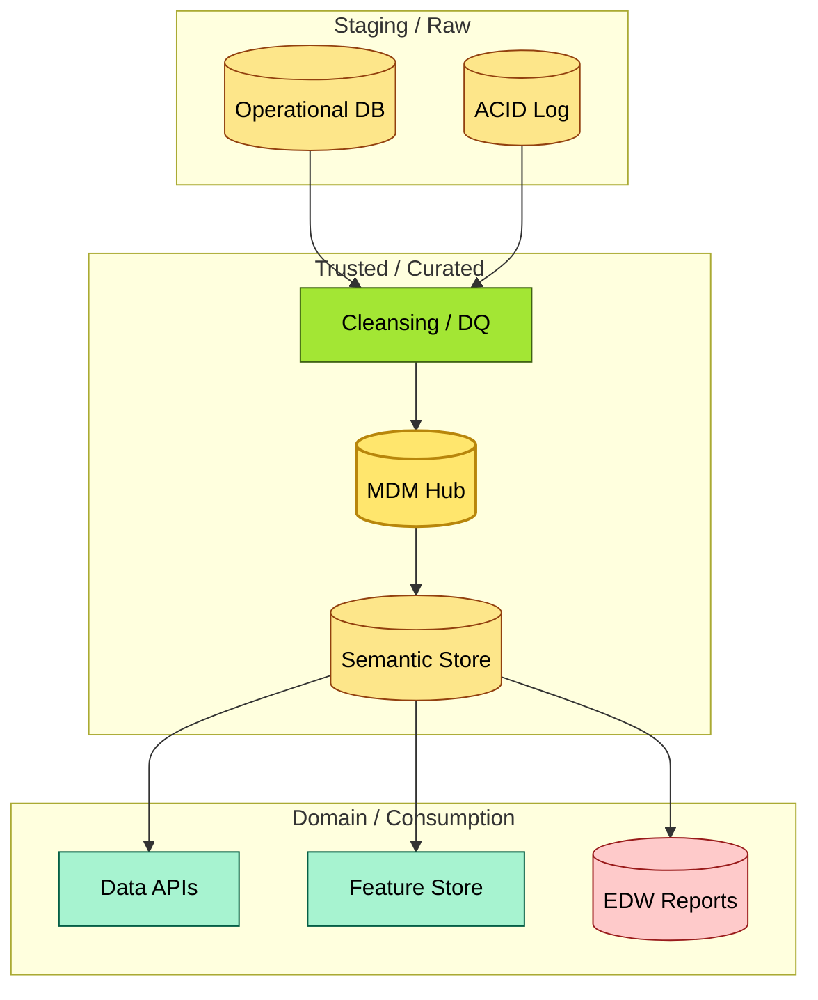
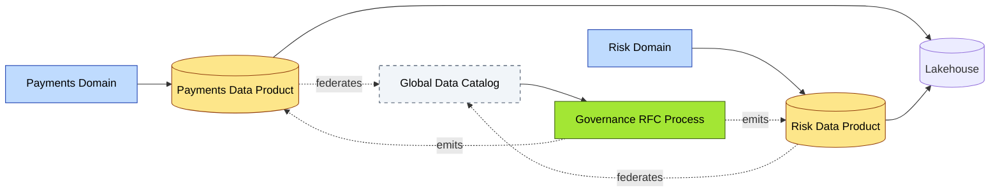
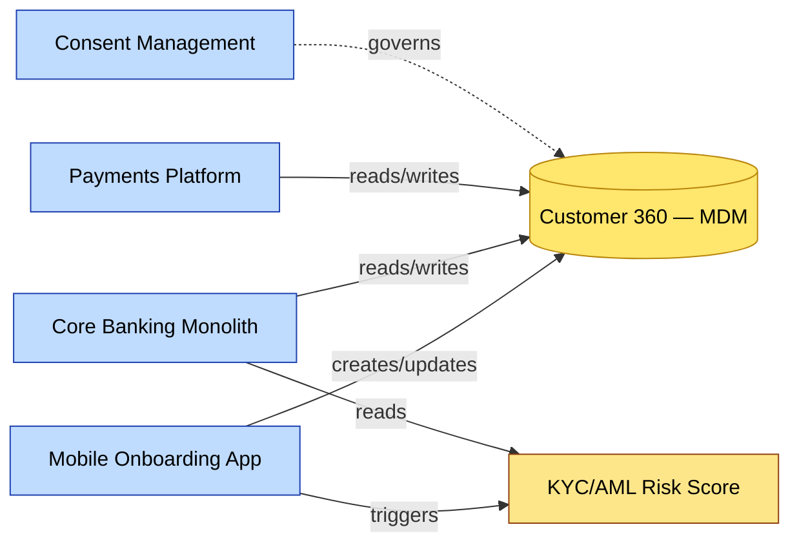

# C3-02 Data Architecture — DETAIL
> **Category:** C3 — Architecture Domains · **Difficulty:** ◑ · **Banking-relevant:** yes
> **Companion brief:** `briefs/C3-02-data-arch.md`
> **Target reader:** enterprise architect who must *explain, justify, and defend* the topic — not just recite it.

---

## 1. Precise definition
**Data architecture** is the structural engineering of data assets across an enterprise. It determines which data entities exist, how they are related, where they reside (staged, trusted, and consumption layers), how quality is enforced, and how consumers access them.

ISO/IEC 20221:2022 defines data architecture as an area of interest within enterprise architecture that describes “the formal and informal structures, the design principles, conventions, and standards for the storage, processing, and retrieval of data elements.” Within banking, this includes regulated ledger data, PII, and electronic representations of payments (e.g., ISO 20022).

It is distinct from **information architecture** (how people interact with information) and **system architecture** (implementation-level design).

## 2. Why it exists (problem it solves)
Before formalized data architecture, 💳 banks built siloed data marts and point-to-point ETLs. The result: duplicate customer records, conflicting credit-score calculations, audit failures during SOX examinations, and the inability to generate a regulator-required daily liquidity report from two independent sources. Data architecture emerged to impose semantic consistency and lineage visibility so that every downstream system reads from trusted, governed representations.

## 3. Core concepts & vocabulary
| Term | Precise meaning |
|------|-----------------|
| **Data Domain** | A bounded context of related data entities and rules, owned by a domain team. |
| **Data Product** | An accessible, trusted, documented abstraction of underlying data for a specific consumer need. |
| **Semantic Consistency** | Shared, modeled definitions (ontologies, business glossaries) that prevent “same word, different meaning” across systems. |
| **Data Mesh** | A decentralized organizational and architectural pattern where domains own their data as products, federated via a shared platform. |
| **Data Lakehouse** | A unified analytics architecture layer on object storage that supports both raw and transformed data, with ACID transactions and schema enforcement. |
| **Customer Data Platform (CDP)** | A destination in the data architecture for aggregate, deduplicated customer profiles used for personalization and marketing. |
| **Lineage** | The provenance of a data element from source to sink, critical for audit and impact analysis. |

## 4. How it works (architecture / mechanism)
Data architecture operates in three canonical layers:

1. **Staging / Ingestion:** Raw capture from core banking, card networks, and third-party feeds.
2. **Trusted / Curated:** Cleansed, de-duplicated, and semantically harmonized data with QoS controls.
3. **Consumption / Domain:** REST/Event-driven APIs, analytical data marts, and ML feature stores.

Data mesh adds a governance overlay: domains (e.g., Payments, Risk, Corporate Lending) own their data products; a central platform team provides tooling (catalogs, pipelines, security).

### 4.1 Diagrams
**Diagram A — Three-layer data architecture with domains:**



**Diagram B — Domain data product in a mesh: Payments vs Risk:**



## 5. Variants, options & trade-offs
| Variant | When to pick | When to avoid | Key trade-off axis |
|---------|--------------|---------------|--------------------|
| **Centralized / Data Vault** | Small-to-mid bank (1–5 regions), strong compliance requirement, limited domain maturity. | Mature multi-brand bank with competing domain teams and product charters. | Central control vs domain autonomy; faster integration vs consumer speed |
| **Data Mesh** | Large, federated commodity bank; many business lines (retail, corporate, wealth, treasury) with distinct KPIs. | Organization without clear domain ownership; immature data engineering culture. | Scalable governance vs overhead in platform-team investment |
| **Lakehouse-first** | Heavy ML/AI: fraud detection, recommender systems, KYC automation. | Strict row-level security and financial reporting where columnar warehouseing still dominates. | Flexible schema on raw data vs cost-optimized analytics queries |
| **Event-Streaming-native** | Real-time payments, positive pay, and risk scoring at t+0. | Regulatory reporting that can be batch-tolerant (monthly). | Latency vs cost and complexity of stream processing |

## 6. Relationships to sibling topics
- **Application Architecture:** Applications generate and consume data; a shared data domain decouples apps from each other.
- **Integration Architecture:** Integration patterns (API gateway, CDC) are the *channels* that data architecture governs for movement between domains.
- **Data Governance:** Governance sets the rules of the road that data architecture materializes in flows, quality gates, and catalog entries.
- **Technology Architecture:** Cloud / on-premises choices for lakehouse products, data catalogs, and MDM tooling.
- **Security Architecture:** Classification, encryption, masking, and access policies are enforced at the data architecture layer.

## 7. Banking / financial-services context 💳
A 💳 universal bank in Europe must satisfy PSD2, DORA, and the ECB’s reporting standards (SDIs). The bank’s data architecture must:
- **Integrate** domestic SEPA Instant Credit Transfer (SCT Inst) with legacy Swift and CHIPS feeds.
- **Harmonize** a KYC data product across onboarding, KYC refresh, and card issuance (anti-fraud, AML).
- **Govern** the distinction between "internal operational data" and "regulatory report" data, so that a production incident does not corrupt an ECB submission file (lineage-guarded).
- **Expose** a real-time risk signal to expected-credit-loss (ECL) provisioning without a batch re-computation at quarter-end.

## 8. Reference architecture / worked example
**Problem:** The bank’s card-issuance platform (legacy COBOL/Java monolith) and its new mobile onboarding app both maintain independent customer records, causing sanction-screening mismatches and complaints.

**Decision:** Adopt a domain-oriented data architecture: Retail Banking owns a "Customer" data product; Payments owns "Payment" products; a thin MDM hub resolves identity via biometric and government-ID references.

**Result:** A semantic graph where each customer record is a node keyed to an internal CustomerID, with edges to biometric hashes, KYC status, and consent events.



**ADR:**

```markdown
# ADR-003: Customer 360 as Boundary-Governed Data Product
## Status
Accepted
## Context
Onboarding, core banking, and payments maintain separate views of customer identity, causing reporting discrepancies and regulatory scrutiny over KYC timeliness.
## Decision
Create a federated Customer 360 data product owned by Retail Banking, exposed via streaming APIs, with an MDM hub as the identity golden record; payments and core consume via API with no direct database access.
## Consequences
- Positive: One source of truth; faster KYC; easier audit.
- Negative: Upfront investment in MDM platform; initial latency for onboarding flows.
- ...
## Alternatives considered
1. Full MDM monolith centralization ...
2. Eventual consistency with local caches ...
```

## 9. Maturity & adoption signals
- **Adopt when:** You have >3 business lines with distinct data consumers; regulators ask for data lineage; or you exceed 50 data marts with >30% schema redundancy.
- **Anti-signals (don't adopt yet):** Fewer than 3 data domains; all data currently lives in one operational system; no dedicated data-engineering team.
- **Common failure modes:** 
  1. Mesh without a shared platform team (chaos);
  2. Pushing all analytics into the lakehouse and starving the warehouse of trusted aggregated data;
  3. Ignoring semantic consistency, leading to duplicate metrics across BI tools.

## 10. Common confusions — the "don't mix" list
| Often confused | Real distinction |
|----------------|------------------|
| Data Mesh vs Data Lakehouse | A lakehouse is a *storage/query* pattern; mesh is an *organizational* pattern for domain ownership. They can coexist. |
| Data Lake vs Data Warehouse vs Lakehouse | Lake = cheap object storage; warehouse = OLAP with tables/BI; lakehouse = both, with transactional guarantees, still maturing. |
| CDC vs Integration | CDC listens to database transaction logs; integration includes transformation, enrichment, and routing. |

## 11. Tools & standards to know
- **Standards/Frameworks:** ISO/IEC 20221, TOGAF Architecture Domain (Data), DAMA-DMBOK, ISO 19115 (geospatial metadata, sometimes adapted for payments), IT4IT.
- **Common tooling:** 
  - MDM: Reltio, Semarchy, Talend MDM, Neo4j (for graph MDM)
  - Lakehouse / Analytics: Databricks (Delta Lake), Snowflake, Databricks, Triofox
  - Catalogs: Apache Atlas, Amundsen, DataHub, Collibra
  - Lineage: Apache Atlas, dbt docs, Purview
  - Governance: OpenLineage, Apache Ranger, Satori
- **Mandatory reading:** 
  - *Data Mesh* by Zhamak Dehghani (O'Reilly, 2021)
  - *The Lakehouse Architecture* — Databricks whitepaper
  - DAMA-DMBOK 3rd edition, Chapter 8 (Data Architecture).

## 12. ADR template (ready to fill in)
```markdown
# ADR-XXX: <decision>
## Status
Accepted | Proposed | Deprecated
## Context
...
## Decision
...
## Consequences
- Positive ...
- Negative ...
- ...
## Alternatives considered
1. ...
2. ...
```

## 13. Practice — apply it
1. **Recall:** Define data architecture in 2 min without notes.
2. **Model:** Produce an ArchiMate/UML diagram of three data domains and their relationships to one core banking system and one analytical platform.
3. **ADR:** Write a decision doc for adopting data mesh in a retail 💳 bank with Allegro / Acquiring and SME segments.
4. **Defend:** Roleplay explaining to a non-technical CRO why a customer 360 is a data product, not just a bigger database.

## 14. Summary (1 paragraph)
Data architecture is the structural discipline that turns raw information from disparate banking systems into trusted, governed, and reusable assets; it layers raw ingestion, curated MDM, and domain products so that payments, risk, and compliance can all draw from a coherent foundation rather than fighting over inconsistent copies of the same truth.

---
**Status:** ✅ Covered
