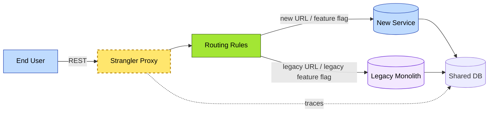
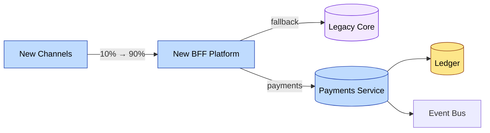

# C3-03 Application Architecture — DETAIL
> **Category:** C3 — Architecture Domains · **Difficulty:** ◑ · **Banking-relevant:** yes
> **Companion brief:** `briefs/C3-03-application-arch.md`
> **Target reader:** enterprise architect who must *explain, justify, and defend* the topic — not just recite it.

---

## 1. Precise definition
**Application architecture** is the structural engineering of software subsystems in context: it addresses the runtime environment, deployment topology, integration style, library and platform dependencies, workload partitions, and the systematic mapping between business services and technical components.

TOGAF defines application architecture (ADM Phase B and F) as the design of applications to implement business architecture, alongside data, technology, and security architectures. ISO/IEC/IEEE 42010 defines it via “design concepts” whose behavior is specifiable against requirements.

It is distinct from **software architecture**, which is often scoped to a single application, and from **system architecture**, which includes hardware and infrastructure.

## 2. Why it exists (problem it solves)
In the early 2000s, 💳 banks built monolithic applications (often green-plate COBOL, wrapping CICS or mainframe COBOL). As channels multiplied—branch, ATM, SWIFT, online, mobile—point-to-point integrations replaced shared business logic, creating a “spaghetti architecture” of interconnected modules. Application architecture emerged to impose boundaries (services), contracts (APIs), and deployment autonomy (DevOps) so that changes in one capability (e.g., tellers) do not accidentally break another (e.g., call-center ACH).

## 3. Core concepts & vocabulary
| Term | Precise meaning |
|------|-----------------|
| **Service** | A logically distinct, independently deployable capability that exposes a contract (API, events) and consumes/produces data. |
| **Bounded Context** | A Martin Fowler DDD term: the boundary within which a particular domain model is consistent and unambiguous. |
| **Circuit Breaker** | A resilience pattern that stops calls to an unavailable dependent service after a threshold of failures, preventing cascade outages. |
| **Saga** | A distributed transaction pattern that replaces ACID transactions with a sequence of local transactions, each compensating on failure. |
| **BFF (Backend-for-Frontend)** | An architectural pattern where a thin proxy service aggregates multiple backend services to optimize a specific user interface (web or mobile). |
| **Strangler Fig** | An incremental migration pattern that routes traffic from a legacy system to a new system via a proxy/facade until the legacy is deprecated. |
| **CpC (Continuous Platform for Change)** | A platform team that provides the tooling, CI/CD, security guardrails, and observability so application teams can change safely and frequently. |
| **N-Layer** | A logical separation of concerns (e.g., presentation, business rules, persistence, integration) within a monolithic or single-service unit. |
| **Event-Driven** | Communication via immutable events published to a message bus, processed asynchronously by interested subscribers. |

## 4. How it works (architecture / mechanism)
Application architecture is typically expressed via:
- **Runtime Context Diagram:** What hardware/VM/container, what OS/runtime (Java, Python, Go), what data store does each service use?
- **Build & Deployment Diagram:** How is the app built, tested, deployed (CI, container registry, cluster)?
- **Failure Mode Diagram:** Where do circuit breakers, retries, timeouts, and circuit-open events exist?
- **Integration Contracts Diagram:** REST, gRPC, AMQP, Kafka topics, correlation IDs.
- **Deployment Topology Diagram:** Dev, test, staging, production, canary, blue-green, or rolling deployments.

### 4.1 Diagrams
**Diagram A — Service-to-service with resilience:**

```mermaid
graph TD
    classDef critical fill:#ffe66d,stroke:#b8860b,stroke-width:2px,color:#000
    classDef decision fill:#a3e634,stroke:#3f6212,stroke-width:1px,color:#000
    classDef context fill:#dfe6e9,stroke:#636e72,color:#000
    classDef ok fill:#a7f3d0,stroke:#065f46,color:#000
    classDef risk fill:#fecaca,stroke:#991b1b,color:#000
    classDef service fill:#bfdbfe,stroke:#1e40af,color:#000
    classDef boundary fill:#f1f5f9,stroke:#475569,stroke-dasharray: 5,color:#000

    Mobile[Mobile 💳 App]:::service
    BFF[Mobile BFF]:::boundary
    Auth[(Auth Service)]:::service
    Payments[(Payments Service)]:::service
    FraudWatch[Fraud Watch Service]:::service
    DTW[(DTW / Ledger)]:::data
    Circuit1{Circuit Breaker}:::decision
    Circuit2{Circuit Breaker}:::decision
    Events[Event Bus]:::context

    Mobile -->|HTTPS| BFF
    BFF -->|token| Auth
    Auth --> AuthDB[(Auth DB)]:::data
    BFF -->|verify| Auth
    BFF -->|payment| Payments
    Payments --> Circuit1
    FraudWatch --> Events
    Payments --> =>> Circuit1
    Auth --> =>> Circuit2
    Circuit1 --> DTW
    Circuit1 --> |failure| Events
    Circuit2 --> |failure| Events

    class Auth critical
    class Circuit1 decision
```

**Diagram B — Migration via Strangler Fig:**



## 5. Variants, options & trade-offs
| Variant | When to pick | When to avoid | Key trade-off axis |
|---------|--------------|---------------|--------------------|
| **Monolith** | Greenfield with small team (<5 devs), early-stage product, or regulatory requirement for single deployable unit. | Large team, multiple channels, or frequent independent releases. | Simplicity vs scalability; faster initial dev vs organizational friction |
| **Microservices** | Large organization, multiple domain teams, high deployment frequency, or domain separation is already established. | Small team, low engineering maturity, or low complexity. | Autonomy / resilience vs operational overhead (observability, testing, deployment) |
| **Event-Driven Services** | High-volume async workflows (payments, loan processing batches), and eventual-consistency needs. | Strong ACID / transactional guarantees required. | Decoupling / throughput vs debugging complexity and ordering guarantees |
| **BFF** | Multiple frontends (mobile, web, call-center, partner API) with different data-shapes and UI requirements. | Single frontend, or when every channel can tolerate identical contracts. | UX optimization vs duplicate code and governance |
| **Strangler Fig** | Legacy system is high-risk to replace upfront; you need incremental revenue or compliance wins. | You have budget for a greenfield and a hard cutoff date. | Lower risk / incremental value vs slower time-to-market |

## 6. Relationships to sibling topics
- **Data Architecture:** Services *consume* data products; application boundaries must match data domain boundaries (especially in mesh).
- **Integration Architecture:** Application architecture *chooses* integration patterns (REST, EDA, CDC), while integration architecture *provides* the middleware and policies.
- **Security Architecture:** Authentication, authorization (RBAC/ABAC), and mTLS are enforced at the application layer; application architecture must expose hooks for security cross-cutting concerns.
- **Technology Architecture:** Runtime platforms, container runtimes, JVM vs Go vs .NET decisions live in technology; application architecture decides *which* are appropriate for which services.
- **Cloud Architecture:** Deployment model (lift-and-shift vs refactor vs re-architect) is a choice application architecture makes based on cloud-platform capabilities.

## 7. Banking / financial-services context 💳
A universal bank’s omnichannel application architecture must satisfy:
- **Regulated certification:** Every payment-critical service must be independently deployable without breaking the ledger (Saga + compensating transactions).
- **Latency requirements:** Account balance queries from a 💳 mobile app must return in <500 ms; if the ledger is unavailable, a cached read-model (eventual consistency) is acceptable per banking policy.
- **Channel parity:** Web, mobile, ATM, and call-center share a consistent view of the customer via a BFF, not three different adaptations of the same backend.
- **Compliance traceability:** Every API call and event must carry a correlation ID and be auditable by regulatory inspectors under DORA / Basel III.

## 8. Reference architecture / worked example
**Problem:** The bank wants to replace its legacy core-banking platform with a modern real-time API stack without a 5-year outage window.

**Decision:** Strangler Fig migration: build the new platform as independent microservices (Auth, Customer, Accounts, Payments, Overseas), with a proxy that routes 10% of traffic initially, doubling every 6 weeks.

**Result:** After 6 months, the legacy system is read-only; the new platform handles 90% of volume; payments continue with existing ledger guarantees via saga-pattern compensation.

**ADR:**

```markdown
# ADR-007: Strangler Fig Migration of Core Banking
## Status
Accepted
## Context
Greenfield rewrite of core banking is 48 months and requires 200+ new roles; DORA mandates a max 72-hour outage window.
## Decision
Build a BFF + microservice platform behind a proxy; migrate by feature-flag to 90% of traffic; keep the monolith for archival until all payment volumes transfer.
## Consequences
- Positive: Reduced blast radius; SLA maintained; faster incremental feature delivery.
- Negative: Two codebases to operate for ~18 months; integration complexity in the proxy.
- ...
## Alternatives considered
1. Big-bang replacement (rejected due to downtime risk).
2. Pure API wrapper around monolith (rejected: latency and cost).
```



## 9. Maturity & adoption signals
- **Adopt when:** You have multiple domain teams; release velocity <1 per month; or external channel variety (mobile, web, agent) exceeds one frontend.
- **Anti-signals (don't adopt yet):** You have fewer than 3 services; the team is <6 developers; or the domain has less complexity than a 3-tier monolith can handle.
- **Common failure modes:** 
  1. Distributed monolith: services not truly decoupled; deployment remains coupled via shared DB or tight session state.
  2. Premature optimization: introducing microservices before domain boundaries are clear.
  3. Missing observability: “It works in dev” but cannot diagnose latency spikes in production because there is no centralized tracing.

## 10. Common confusions — the "don't mix" list
| Often confused | Real distinction |
|----------------|------------------|
| Microservices vs EDA | Microservices can use sync (REST/gRPC) or async (Event-Driven); EDA is a communication *style*, not an architecture *scale*. |
| API Gateway vs BFF | API Gateway is a technical proxy for auth/routing; BFF is an architectural pattern for frontend-specific aggregation. |
| Monolith vs Modular Monolith | A monolith with internal module boundaries can be refactored without a distributed complexity tax. |

## 11. Tools & standards to know
- **Standards/Frameworks:** TOGAF ADM (Phases B/F), ISO/IEC/IEEE 42010, C4 Model, Domain-Driven Design (Evans), FINOS APIs (for open banking).
- **Common tooling:** 
  - UML/ArchiMate: Sparx EA, Archi, Draw.io, PlantUML
  - Architecture decision records: ADRs (Tyler McGinnis), ArchUnit, C4 PlantUML
  - Integration: Kong, Apigee, Red Hat 3scale, MuleSoft, Azure API Management
  - Observability: Datadog, Dynatrace, OpenTelemetry, Jaeger
  - Containerization: Kubernetes, Docker, Helm
  - Event: Apache Kafka, Kafka Connect, Confluent Platform, IBM MQ
- **Mandatory reading:** 
  - *Software Architecture in Practice* — Len Bass, Paul Clements, Rick Kazman
  - *Microservices Patterns* (O'Reilly, 2015)
  - *Domain-Driven Design* (Evans, Addison-Wesley)

## 12. ADR template (ready to fill in)
```markdown
# ADR-XXX: <decision>
## Status
Accepted | Proposed | Deprecated
## Context
...
## Decision
...
## Consequences
- Positive ...
- Negative ...
- ...
## Alternatives considered
1. ...
2. ...
```

## 13. Practice — apply it
1. **Recall:** Define application architecture and contrast with software architecture in 2 min.
2. **Model:** Draw a C4 Level 2 container diagram for a 💳 bank’s deposit-account opening flow (web → API Gateway → BFF → Customer Service + Payment Service + Fraud Service).
3. **ADR:** Write a decision doc for splitting a monolithic loan-origination system into microservices.
4. **Defend:** Roleplay explaining to a non-technical CIO why a BFF for mobile banking is worth the extra engineering cost.

## 14. Summary (1 paragraph)
Application architecture is the engine room of the 💳 bank’s digital transformation: by structuring services with clear boundaries, resilient communication, and deployment autonomy, it turns a brittle monolith into a portfolio of reliable, independently changeable capabilities that satisfy customers, regulators, and the business without compromising uptime.
