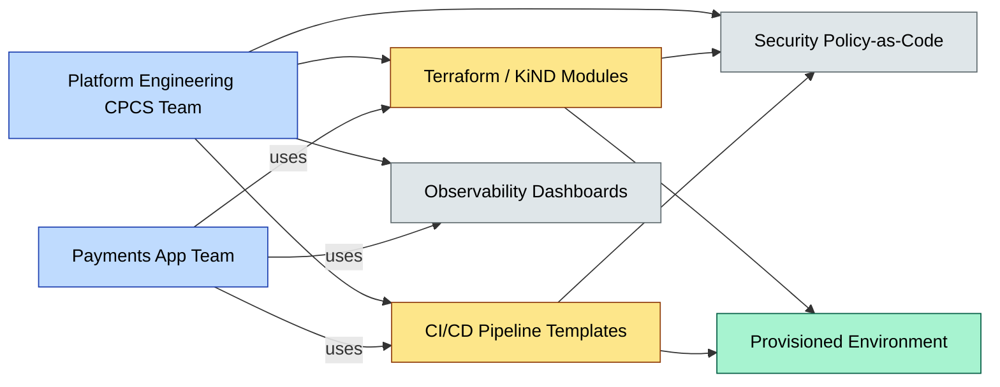
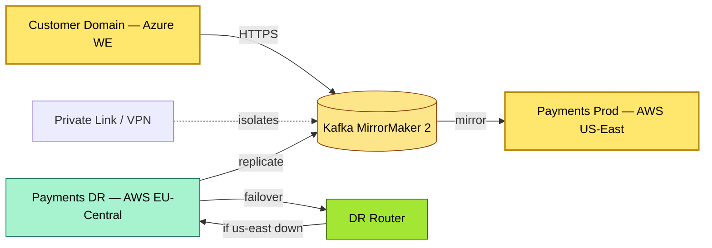

# C3-04 Technology Architecture — DETAIL
> **Category:** C3 — Architecture Domains · **Difficulty:** ◑ · **Banking-relevant:** yes
> **Companion brief:** `briefs/C3-04-technology-arch.md`
> **Target reader:** enterprise architect who must *explain, justify, and defend* the topic — not just recite it.

---

## 1. Precise definition
**Technology architecture** is the engineering discipline that selects, standardizes, and governs the concrete forms of the platform layer that applications rely upon: cloud providers, regions, kiosks, container runtimes, programming languages, operating systems, middleware, containers, databases, middleware, IaC tools, observability stacks, and runtime security.

TOGAF 9.2 defines technology architecture (Phase D) as the design of the technology infrastructure required to implement the application portfolio, including hardware, software, networking, and data management.

It is distinct from **software architecture** (single-application concern) and **infrastructure architecture** (compute/network fiber), though modern EA practice (e.g., Basetronics/Cloud Native) conflates them at the platform level.

## 2. Why it exists (problem it solves)
Historically, 💳 banks bought racks, rack cabinet servers, and OS licenses; every application upgrade required a change control ticket to operations, and disaster recovery meant shipping tapes. Technology architecture emerged to introduce agility (someone changes the platform once, many apps benefit), resilience (multi-region design), and compliance (data never leaves permitted geography).

## 3. Core concepts & vocabulary
| Term | Precise meaning |
|------|-----------------|
| **CpC / Platform Engineering** | A team that builds an internal developer platform (IDP) providing self-service CI/CD, IaC templates, security guardrails, and observability, enabling app teams to deploy rapidly without platform chaos. |
| **Polyglot Persistence** | Choosing diverse stores (relational, document, graph, time-series, cache) per workload rather than a single "one size fits all" database. |
| **Infrastructure as Code (IaC)** | Declarative version-controlled definitions of cloud resources (VPC, subnets, IAM, DB instances) via Terraform, CloudFormation, or KiND (Kubernetes-in-Docker). |
| **Cloud-Native** | Designing around cloud abstractions: auto-scaling, managed services, secrets rotation, ephemeral compute. |
| **Edge Computing** | Running lightweight application logic at the network edge (CDN, local VMs, or XR/IoT gateways) to serve low-latency or disconnected consumers (e.g., 💳 ATM, POS). |
| **Confidential Computing** | Cryptographic isolation of data in use (e.g., attestation, TEEs) for sensitive financial computations, not just at rest / in transit. |
| **Service Mesh** | A dedicated infrastructure layer (e.g., Istio, Linkerd) managing service-to-service communication, mTLS, observability, and traffic management independent of app code. |
| **Days 3-7 Operations** | Platform reliability patterns: runbooks, chaos engineering, and incident response after initial deployment. |

## 4. How it works (architecture / mechanism)
Technology architecture is expressed through:
- **Platform Standards:** Approved list of languages, frameworks, container images, and runtime versions.
- **Regional Topology:** Geography of active-active and DR sites with latency-incompatible SLAs.
- ** weakly-coupled release:** Deployment pipelines per service (canary, blue-green, rolling).
- **Security guardrails:** Runtime scanning, secrets injection via Vault/AWS Secrets Manager, mTLS.

A platform engineering team typically provides a **Customer Headless Platform (CHP)** or **Internal Developer Platform (IDP)** delivering:
1. CLI/CLI wrapper for app teams
2. CI/CD pipeline templates
3. IaC modules
4. Observability dashboard
5. Security policy-as-code

### 4.1 Diagrams
**Diagram A — Multi-region active-active banking topology:**

```mermaid
graph TD
    classDef critical fill:#ffe66d,stroke:#b8860b,stroke-width:2px,color:#000
    classDef decision fill:#a3e634,stroke:#3f6212,stroke-width:1px,color:#000
    classDef ok fill:#a7f3d0,stroke:#065f46,color:#000
    classDef risk fill:#fecaca,stroke:#991b1b,color:#000
    classDef context fill:#dfe6e9,stroke:#636e72,color:#000
    classDef data fill:#fde68a,stroke:#92400e,color:#000
    classDef service fill:#bfdbfe,stroke:#1e40af,color:#000
    classDef boundary fill:#f1f5f9,stroke:#475569,stroke-dasharray: 5,color:#000

    USWest[AWS us-west-2]:::critical
    EUWest[Azure West Europe]:::critical
    USEast[AWS eu-central-1]:::context
    APSouth[Azure South East Asia]:::context
    USWest -->|dr| USEast
    EUWest -->|dr| APSouth
    USEast -->|edge| EdgeUS[Edge Compute (Cloudflare Workers)]:::ok
    APSouth -->|edge| EdgeAP[Edge Compute]:::ok
    EdgeUS -->|low-latency| MobileUS[Mobile 💳 Users US]:::service
    EdgeAP -->|low-latency| MobileAP[Mobile 💳 Users AP]:::service

    class USWest critical
    class EUWest critical
    class EdgeUS ok
```

**Diagram B — Platform engineering: internal developer platform (IDP) abstraction:**



## 5. Variants, options & trade-offs
| Variant | When to pick | When to avoid | Key trade-off axis |
|---------|--------------|---------------|--------------------|
| **Single- cloud (monoculture)** | Simple stack, small budget, team with deep expertise. | Multi-cloud resilience requirement; vendor lock-in risk; geopolitical / data-sovereignty. | Lower cost vs vendor-failure blast radius |
| **Multi-cloud** | Regulated 💳 bank with region-specific requirements; need for disaster recovery and negotiation leverage. | Immature FinOps; teams without hybrid cloud ops expertise; complex security model. | Resilience / compliance vs operational complexity / cost |
| **On-prem / hybrid** | Sensitive data that cannot leave a sovereign boundary; legacy banking systems integrated with off-chain ledgers. | Cloud-native velocity; need for steep cost reduction. | Data control / compliance vs agility / lower capex |
| **IaaS vs PaaS vs SaaS** | IaaS for full control; PaaS for reduced ops; SaaS for COTS compliance (e.g., ISO 20022 SWIFT adapters). | Overloading IaaS with too much custom ops; or SaaS where customization is required. | Control vs speed / total cost of ownership |
| **Managed DB vs self-managed** | Managed for DB scaling, backups, patching; self-managed for fine-tuning (e.g., Oracle for complex banking schema). | Self-managed without dedicated DBA/engineering team. | OpEx/efficiency vs tuning / specialized support |
| **Serverless / FaaS** | Event-driven, spiky workloads (real-time fraud scoring); cost efficiency at low-to-medium scale. | Long-running, stateful batch; cold-start sensitivity; regulatory audit of AWS Lambda vs on-prem. | Cost efficiency vs latency / control / maturity |

## 6. Relationships to sibling topics
- **Cloud Architecture:** Technology architecture *selects* the cloud model (IaaS/PaaS/SaaS); cloud architecture *specializes* it for banking (multi-region, sovereign, DORA compliance).
- **Security Architecture:** Threat modeling, zero-trust network, and secrets management are enforced at the technology layer; technology architecture decides the underlying controls.
- **Data Architecture:** Polyglot persistence decisions and database selection live in technology; data architecture decides the conceptual models.
- **Application Architecture:** The application’s language and runtime choices are constrained by technology standards; technology architecture provides the approved runtime environment.
- **Infrastructure Architecture:** Lower-level (rack, switch, fiber, hypervisor); technology architecture decides how to consume it (cloud, edge, on-prem).

## 7. Banking / financial-services context 💳
A universal bank’s technology architecture must address:
- **Data residency:** Payments data for UK customers must land on Azure UK South; EU KYC data on EU regions; no cross-contamination.
- **Performance at scale:** 💳 peak payment volumes (Black Friday, holiday season) require auto-scaling and connection pooling; single-region collapse could block SEPA Inst.
- **Dated system integration:** A greenfield microservices architecture must interoperate with a 30-year-old mainframe COBOL system (via CDC or screen scraping) without forcing the legacy to change.
- **DORA compliance:** Technology architecture includes continuous testing, incident logging, and third-party risk management as non-functional requirements.
- **Open banking:** A public / partner 💳 API gateway requires rate limiting, API keys, OAuth2/OpenID Connect, and 24/7 monitoring.

## 8. Reference architecture / worked example
**Problem:** A neobank wants to host customer data in the EU but payments in the US to minimize latency, while maintaining regulatory separation via DORA.

**Decision:** Dual-cloud topology: customer-domain on Azure West Europe (GDPR), payments-domain on AWS EU-Central-1 and us-east-1, connected via a dedicated backbone and Kafka MirrorMaker 2.

**Result:** <50 ms intra-EU, <80 ms US payments; customer PII never replicated to US; payments ledger replicated to DR region; all infrastructure provisioned via Terraform in a governed GitOps repo (ArgoCD).

**ADR:**

```markdown
# ADR-012: Dual-Cloud EU-US Technology Topology for DORA
## Status
Accepted
## Context
UK GDPR requires customer data in the EU; US latency for global payments is acceptable; DORA mandates IT resilience and third-party monitoring.
## Decision
Host user data in Azure West Europe; host payments lattice in AWS EU-Central-1 and us-east-1; replicate via Kafka MirrorMaker 2; provision all with Terraform in a locked Git repo.
## Consequences
- Positive: Region-locked data; sub-50 ms WAN; blast-radius containment; automated DR.
- Negative: Higher network cost; two sets of operational runbooks; cross-cloud IAM complexity.
- ...
## Alternatives considered
1. Single-cloud (rejected: data-sovereignty conflict with US processing).
2. Pure on-prem (rejected: cost, scale, DORA resilience requirements).
```



## 9. Maturity & adoption signals
- **Adopt when:** You have cloud-migration programs, stand-up a platform team, or face regulatory latency / residency requirements.
- **Anti-signals (don't adopt yet):** Team <3 engineers; no CI/CD; compliance is paper-only; cost tracking is spreadsheet-based.
- **Common failure modes:** 
  1. Technology decisions without a decision log (ADR); emergent sprawl.
  2. Overriding standards without escalation (security debt accumulates).
  3. Ignoring cloud cost governance (e.g., forgotten EBS volumes or Kafka cluster scaling).

## 10. Common confusions — the "don't mix" list
| Often confused | Real distinction |
|----------------|------------------|
| Technology vs. Infrastructure architecture | Technology = platforms, languages, runtimes; Infrastructure = servers, switches, racks, fiber, hypervisors. |
| Infrastructure as Code vs CI/CD | IaC codes *what* (AWS resources); CI/CD codes *how* (build, test, deploy pipelines). |
| Cloud-native vs. multi-cloud | Cloud-native is an architectural *style* (elastic, API-driven); multi-cloud is a sourcing *strategy* for providers. |

## 11. Tools & standards to know
- **Standards/Frameworks:** TOGAF Phase D, AWS Well-Architected, Azure Well-Architected, DAMA-DMBOK, IT4IT, FINOS.
- **Common tooling:** 
  - IaC: Terraform, CloudFormation, Azure Bicep, Pulumi, Basetronics.
  - Kubernetes / PaaS: Kubernetes, OpenShift, EKS, AKS, GKE / Cloud Run, HashiCorp Nomad.
  - Observability: Datadog, Dynatrace, Prometheus, Grafana, OpenTelemetry, Jaeger.
  - Security: AWS IAM, Azure AD, HashiCorp Vault, IaC security scanning (Checkov, tfsec).
  - Platform: Backstage, Cortex, ArgoCD, Crossplane, Pinniped.
  - Database: PostgreSQL, MySQL, Redis, Amazon Aurora, ElasticSearch, CockroachDB.
- **Mandatory reading:** 
  - *Designing Data-Intensive Applications* — Martin Kleppmann
  - *Team Topologies* — Matthew Skelton & Manuel Pais (for CpC vs app-team boundaries)
  - DORA DORA Regulatory framework (DORA) and NIST CSF for financial services.

## 12. ADR template (ready to fill in)
```markdown
# ADR-XXX: <decision>
## Status
Accepted | Proposed | Deprecated
## Context
...
## Decision
...
## Consequences
- Positive ...
- Negative ...
- ...
## Alternatives considered
1. ...
2. ...
```

## 13. Practice — apply it
1. **Recall:** Define technology architecture and contrast with infrastructure architecture in 2 min.
2. **Model:** Draw a platform engineering service-to-service topology for a 💳 neobank with multi-region requirements and a platform team.
3. **ADR:** Write a decision doc for adopting Kubernetes + ArgoCD vs. managed PaaS (EKS / AKS) for a payments service.
4. **Defend:** Roleplay explaining to a non-technical CFO why a dual-cloud topology is worth the extra spend.

## 14. Summary (1 paragraph)
Technology architecture is the concrete engineering of the 💳 bank’s digital foundation: by binding applications to the right cloud, region, runtime, and observability stack, and by elevating a platform team to enforce standards, it enables regulated, resilient, and cost-efficient delivery without drowning every application in operational noise.
