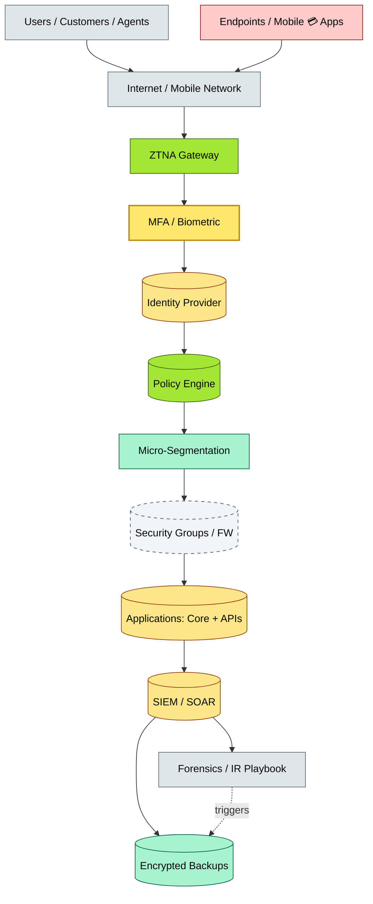
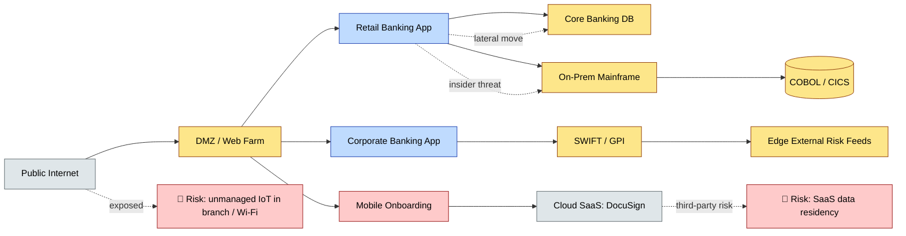
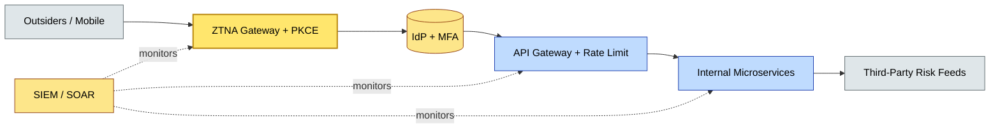

# C3-05 Security Architecture — DETAIL
> **Category:** C3 — Architecture Domains · **Difficulty:** ● · **Banking-relevant:** yes
> **Companion brief:** `briefs/C3-05-security-arch.md`
> **Target reader:** enterprise architect who must *explain, justify, and defend* the topic — not just recite it.

---

## 1. Precise definition
**Security Architecture** is the systematic engineering of protective, detective, preventive, and responsive mechanisms across an enterprise information system to ensure confidentiality, integrity, and availability of assets.

Definition (adapted from TOGAF 9.2 Supplement: The Security Perspective): Security architecture designs the overall protection strategy, including security policies, access controls, encryption, monitoring, and incident response, as first-class concerns in system design—not post-hoc additions.

ISO/IEC 27001:2022 defines an information security management system (ISMS), but security *architecture* goes further by specifying the *technical controls* that implement policies (e.g., network segmentation, encryption protocols, HSMs).

## 2. Why it exists (problem it solves)
Legacy 💳 banks assumed a hardened perimeter (firewall + DMZ + internal trust). When business users browsed 💳 retail banking from home on unmanaged devices, that trust boundary collapsed. When the SWIFT network was targeted (e.g., Bangladesh Bank 2016, Akira, LockBit 2023), no perimeter could stop lateral movement once credentials were stolen.

Security architecture emerged to answer: *How do we design the bank’s estate so that compromise in one domain does not cascade to another, and so that regulators see verifiable, continuous enforcement?*

## 3. Core concepts & vocabulary
| Term | Precise meaning |
|------|-----------------|
| **Zero Trust Architecture (ZTA)** | A security model assuming no implicit trust based on network location; every session is authenticated, authorized, and encrypted. |
| **Defense in Depth** | Layered security controls (e.g., cloud security groups + WAF + application-level checks + endpoint agent). |
| **Identity-Centric Defense** | All decisions are based on verified identity (user or workload), not network zone. |
| **Compensating Control** | When a control cannot be implemented directly, an alternative measure achieves the same risk reduction (e.g., manual review instead of automated DLP). |
| **Attack Surface Mapping** | Continuous identification of exposed log(e(n)), outbound, internal, and cloud assets to feed risk prioritization. |
| **Cryptography & Key Management** | Encryption of data at rest, in transit, and in use; hardware security modules (HSM) or cloud KMS for root-of-trust. |
| **Security Operations (SecOps) / SOC** | Security Information and Event Management (SIEM), Security Orchestration, Automation, and Response (SOAR), threat intelligence. |
| **Incident Response (IR) Playbooks** | Pre-written runbooks for breach detection, evidence preservation, containment, eradication, and recovery. |
| **High-Assurance Security** | Programs (e.g., NIST SP 800-53, STAMP, CMMC) for environments where failure could cause catastrophic or safety-critical harm. |
| **Post-Quantum Cryptography (PQC) Readiness** | Transition planning for cryptographic systems vulnerable to quantum computing (e.g., Shor's algorithm impact on ECC/RSA). |

## 4. How it works (architecture / mechanism)
Security architecture operates across four axes:
1. **Prevention:** Authentication (MFA), authorization (ABAC), encryption, access controls, secure coding.
2. **Detection:** Logging, SIEM alerts, anomaly detection, UEBA (user-entity behavior analytics).
3. **Response:** IR playbooks, incident command structure, forensics, containment, communication.
4. **Recovery:** Backup encryption, disaster recovery testing, ransomware resilience.

A modern 💳 bank’s security architecture typically includes:
- **Signals layer:** Cloud-native agents (e.g., Falco, Datadog) streaming to SIEM.
- **Identity fabric:** Federation with IdP, LDAP, Active Directory, and certificate-based device auth.
- **Network segmentation:** Micro-segmentation (e.g., VMware NSX, Gremlin) and zero-trust network access (ZTNA) for privileged access.
- **Data protection:** DLP (data loss prevention), CMRR (customer master record redaction), tokenization for PANs.
- **API security:** OWASP API Top 10 protection (rate limiting, OAuth2).

### 4.1 Diagrams
**Diagram A — Zero Trust layered architecture for banking:**



**Diagram B — Attack surface mapping for a fragmented 💳 bank:**



## 5. Variants, options & trade-offs
| Variant | When to pick | When to avoid | Key trade-off axis |
|---------|--------------|---------------|--------------------|
| **Zero Trust** | Cloud-first, remote workers, third-party access; regulatory mandate for least privilege. | Small legacy network with star topology and no cloud, where perimeter-only is adequate. | Reduced risk surface vs higher latency / cost / complexity |
| **Perimeter-only (Legacy)** | Historically common; simple LAN; no remote access; low internet exposure. | Any cloud migration, remote workforce, or mobile banking. | Low cost vs massive breach exposure |
| **Compliance-First Security** | Immediate regulatory audit pressure (e.g., DORA, PCI-DSS); need to pass audit fast. | Long-term, sustainable security program. | Short-term audit pass vs sustainable architecture |
| **High-Assurance (NIST 800-53)** | Defense contracts, critical infrastructure; where breach causes catastrophic harm. | General retail banking with lower systemic risk. | Security rigor vs operational cost |
| **Micro-segmentation** | Multi-cloud, containerized, or multi-tenant environments; need to contain lateral movement. | Small environment with <5 workloads; single trust domain. | Blast-radius minimization vs management overhead |

## 6. Relationships to sibling topics
- **Cloud Architecture:** Security architecture is enforced by cloud controls (security groups, WAF, GuardDuty), but cloud architecture also exposes new attack surfaces (misconfigured S3, open security groups).
- **Application Architecture:** Security must be designed at the application boundary (OWASP API Security, secure coding, dependency scanning); application architecture decides how to embed auth/authz.
- **Identity Architecture:** A prerequisite for Zero Trust; identity is the gatekeeper logic.
- **Integration Architecture:** Every integration point is an attack surface; API gateways and WAFs are integration-security layers.
- **Data Architecture:** Confidential computing, encryption-at-rest, and masking are data-architecture concerns enforced by security architecture.

## 7. Banking / financial-services context 💳
A 💳 universal bank’s security architecture must address:
- **PCI-DSS:** PAN (Primary Account Number) must be masked, tokenized, or encrypted end-to-end; weak cryptography (e.g., SHA-1) is banned; annual QSA.
- **DORA (EU):** Four pillars: ICT risk management, incident reporting, digital operational resilience testing, and third-party risk. Security architecture includes quarterly penetration testing, continuous monitoring, and 72-hour incident reporting.
- **AML/KYC:** Positive pay and dual-control for outbound wires; watch-list screening (OFAC, EU, UN); any exception triggers a manual review workflow.
- **Mobile 💳 security:** App attestation, device binding, biometric MFA, and iOS/Android Enterprise programs to prevent device theft from leading to account takeover.
- **Third-party dependency risk:** SIFMA / FSOC guidance on critical fintech dependencies (e.g., cloud provider, IDP, SWIFT); supply-chain attacks (SolarWinds, Okta) require vendor-security questionnaires and SBOM.

## 8. Reference architecture / worked example
**Problem:** A 💳 neobank’s mobile app suffered a man-in-the-middle attack on a newly deployed API because the TLS certificate pinning was insufficient and the API lacked OAuth2 scope restrictions.

**Decision:** Implement a security architecture with:
- ZTNA for all external access
- OAuth2 + PKCE + short-lived JWTs (15-minute expiry)
- Certificate pinning for mobile 💳 apps
- API gateways with rate limiting, geo-fencing, and client-certificate for internal services
- SIEM integration with Forensics playbook (forensic image preservation before patching)

**Result:** Compromised credentials alone cannot access the API; lateral movement is blocked; SOC can auto-contain and escalate within 10 minutes.

**ADR:**

```markdown
# ADR-009: Zero Trust Security Architecture for 💳 Neobank
## Status
Accepted
## Context
MITM on mobile API due to weak TLS pinning; legacy auth allows session hijacking; DORA requires demonstrable reduction of TO (threat occurrences).
## Decision
Redesign external access with ZTNA, micro-segmentation, OAuth2 with pkce, 15-minute JWT expiry, certificate pinning, and SIEM+SOAR integration.
## Consequences
- Positive: Reduced blast radius; DORA-aligned; better customer trust.
- Negative: Higher SSL certificate management; mobile development complexity; onboarding friction for low-tech users.
- ...
## Alternatives considered
1. Continue with VPN + LB (rejected: does not meet DORA remote-access requirements).
2. FIDO2 only for desktop (rejected: excludes mobile users).
```



## 9. Maturity & adoption signals
- **Adopt when:** You are moving core financial systems to cloud (where trust boundaries are fluid), have remote workers, or face DORA / PCI-DSS audit pressure.
- **Anti-signals (don't adopt yet):** No security team; technology is running on a single flat network; you have no incident playbook or logging.
- **Common failure modes:** 
  1. Buying a SIEM but ignoring log quality / false positives (alert fatigue);
  2. Implementing Zero Trust without identity-fabric maturity (MTTR becomes worse);
  3. Encrypting data but losing keys (key-rotation and recovery breaking).

## 10. Common confusions — the "don't mix" list
| Often confused | Real distinction |
|----------------|------------------|
| Security Architecture vs Application Security | Security architecture is estate-wide; application security is code-level (SAST/DAST/dependency scanning). |
| Zero Trust vs Network Segmentation | Segmentation groups assets by zone; Zero Trust authenticates every request regardless of zone. |
| DORA vs PCI-DSS | DORA is a EU operational resilience regulation; PCI-DSS is a global card-security standard. DORA covers ICT risk; PCI-DSS covers card data. |

## 11. Tools & standards to know
- **Standards/Frameworks:** TOGAF 9.2 Security Perspective, ISO/IEC 27001:2022, NIST SP 800-53 v5, DORA, PCI-DSS v4.0, CIS Controls v8, MITRE ATT&CK for Financial Services, SANS Top 20.
- **Common tooling:**
  - Identity: Okta, Azure AD, Ping, CyberArk, HashiCorp Vault, Delinea
  - ZTNA / micro-segmentation: Zscaler, Palo Alto Prisma Access, Cloudflare Zero Trust, VMware NSX
  - SIEM / SOAR: Splunk, QRadar, Sentinel, Devo, Cortex XDR, Swimlane
  - Cloud security: AWS GuardDuty, Azure Sentinel, Prisma Cloud, Wiz
  - API security: API Gateway (Kong, Apigee), Idaptive, Postman, OWASP ZAP
  - Container security: Trivy, Falco, Prisma Cloud, Sysdig
  - HSM: AWS CloudHSM, Thales nCipher, Azure Dedicated HSM
  - FIDO2 / MFA: Okta Verify, Duo, Yubikey
- **Mandatory reading:**
  - *Building Secure Software* (Ch. 1, OWASP)
  - *Zero Trust Networks* — Evan Gilman et al.
  - DORA regulatory text (EU/ECB)
  - *The Phoenix Project* (for bridging Sec/Dev/Ops).

## 12. ADR template (ready to fill in)
```markdown
# ADR-XXX: <decision>
## Status
Accepted | Proposed | Deprecated
## Context
...
## Decision
...
## Consequences
- Positive ...
- Negative ...
- ...
## Alternatives considered
1. ...
2. ...
```

## 13. Practice — apply it
1. **Recall:** Define security architecture and contrast with application security in 2 min.
2. **Model:** Draw the Zero Trust layered architecture for a 💳 bank with branch, cloud, and mainframe.
3. **ADR:** Write a decision doc for implementing mTLS between all internal services and a SIEM for SOC automation.
4. **Defend:** Roleplay explaining to a non-technical CRO why Zero Trust is a regulatory requirement under DORA, not just best practice.

## 14. Summary (1 paragraph)
Security architecture is the deliberate engineering of the 💳 bank’s immune system: by assuming no implicit trust, layering prevention with detection and response, and anchoring every access to verifiable identity, it transforms security from a reactive cost into a continuous, regulator-validated capability.
