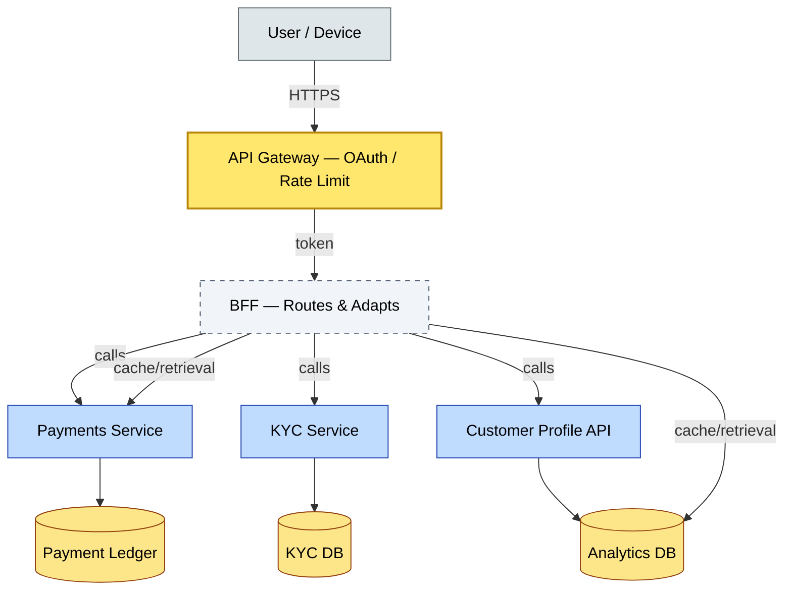
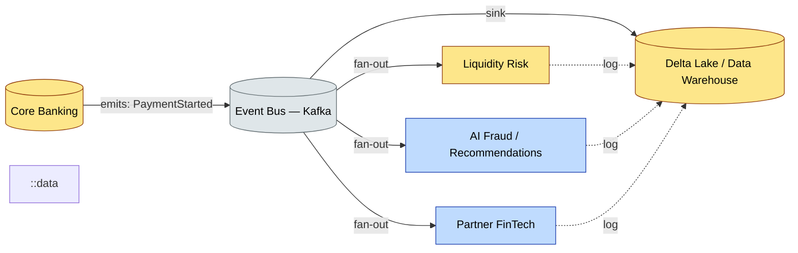

# C3-06 Integration Architecture — DETAIL
> **Category:** C3 — Architecture Domains · **Difficulty:** ◑ · **Banking-relevant:** yes
> **Companion brief:** `briefs/C3-06-integration-arch.md`
> **Target reader:** enterprise architect who must *explain, justify, and defend* the topic — not just recite it.

---

## 1. Precise definition
**Integration Architecture** is the engineering of the set of integration mechanisms, platforms, and standards that enable interoperability between applications, systems, and data stores within an enterprise.

TOGAF 9.2 defines it within the Technology Architecture domain as the design of the integration infrastructure (middleware, APIs, messaging, service bus, adapters) to satisfy the data and application architecture adopted for the enterprise.

ISO/IEC 20030:2021 (IT service management) references integration as the process of combining and harmonizing software so it works together to meet a specified requirement.

It is distinct from **Application Architecture** (internal app design) and **Data Architecture** (conceptual data model), though it overlaps with both.

## 2. Why it exists (problem it solves)
Legacy 💳 banks ran dozens of core banking, card, and settlement systems that did not communicate. Integration architecture emerged to replace point-to-point adapters (each pair with custom logic) with a governed bus, APIs, or event backbone—reducing cost, improving traceability, and enabling digital channels to reach systems that were originally designed for batch mainframe jobs.

Without it: "point-to-point spaghetti" where every new system requires n-1 adapters, change requests, and no one knows the impact of a schema change.

## 3. Core concepts & vocabulary
| Term | Precise meaning |
|------|-----------------|
| **Canonical Data Model (CDM)** | A shared, domain-wide data representation (ontological model) that each system maps to, reducing the number of pairwise transformations from n*(n-1)/2 to n. |
| **Enterprise Service Bus (ESB)** | Centralized integration platform providing routing, transformation, mediation, queuing, and protocol bridging (often heavy, versioned, and vendor-locked). |
| **Integration Platform as a Service (iPaaS)** | Cloud-native integration platform offering connectors, mappings, and workflow orchestration (e.g., MuleSoft, Dell Boomi, Zapier). |
| **Enterprise Integration Patterns (EIP)** | The Digital Patterns Library: 65 patterns for solving integration challenges (Content-Based Router, Saga, Pipe-and-Filter, Synchronous/Asynchronous Communication, etc.). |
| **API Composition / Backend-for-Frontend (BFF)** | A dedicated integration layer that aggregates multiple backend services to fit a specific frontend (mobile, web, partner) contract. |
| **Event-Driven Architecture (EDA)** | Integration via immutable events on a message bus (Kafka, RabbitMQ, Pulsar, BizTalk), enabling decoupled, scalable, async workflows. |
| **Event Sourcing / CQRS** | An architecture where state is a function of events; read models are constructed from event streams rather than a database of current state. |
| **Integration Platform (Middleware)** | Software that mediates between disparate systems, providing protocol translation, mapping, routing, and protocol bridging. |
| **Message-Driven Tetration (MDT)** | A pattern where a message queue can persist to an external durable store, preventing data loss if the broker crashes. |
| **Mediation Layer** | A tier that sits between a consumer and a provider, transforming, validating, and routing messages without touching consumer or provider logic.
| **Open Banking / Third-Party Access** | API standardized via PSD2/Open Banking: account-information services (AIS), payment initiation services (PIS), consent-driven, OAuth2. |

## 4. How it works (architecture / mechanism)
Integration architecture is realized through:
- **Integration Patterns:** EIP (publish/subscribe, message channel, competing consumers, etc.).
- **Platform:** ESB, iPaaS, API Gateway, or event bus (Kafka).
- **Data Model:** Canonical models + semantic mappings between domain models.
- **Governance:** API lifecycle management (design → publish → monitor → deprecate); contracts (OpenAPI, AsyncAPI); version control; consumer registries.
- **Security:** OAuth2 for APIs, mTLS for inter-service, API keys for B2B, consent for third-party.
- **Observability:** Correlation IDs, distributed tracing, message tracing, API metrics, billing (for open banking).

### 4.1 Diagrams
**Diagram A — Synchronous API gateway with BFF composition:**



**Diagram B — Event-driven integration: core bank to analytics and partner:**



## 5. Variants, options & trade-offs
| Variant | When to pick | When to avoid | Key trade-off axis |
|---------|--------------|---------------|--------------------|
| **Synchronous REST / gRPC** | Real-time user-facing calls (balance check, payment authorization) where immediate response is required. | High-volume batch; need for resilience; or long-running async workflows. | Latency vs resilience; tight coupling vs flexibility |
| **Event-Driven / Kafka** | High volumes, decoupled workflows, event sourcing, analytical pipelines, digital payments. | Need for strict transactional consistency; or <100 ms order processing with strong atomicity. | Loose coupling / throughput vs ordering complexity |
| **ESB / iPaaS** | Heterogeneous environments with many legacy systems; rapid connector development; managed service preference. | Cloud-native native; need for API-first; or high-performance low-latency. | Rapid integration vs vendor lock-in; abstraction vs performance |
| **BFF / API Composition** | Multiple frontends (mobile, web, partner) with distinct data-shapes or contracts. | Single frontend; or when every consumer can use identical backend contracts. | Tailored UX vs duplicated logic / governance |
| **MDT / Message Queue with Persistence** | Systems that cannot fall behind during outages; guarantee at-least-once delivery. | Simple fire-and-forget; or when broker downtime is unacceptable globally. | Durability vs complexity / broker management |

## 6. Relationships to sibling topics
- **Data Architecture:** Integration moves data between domains; canonical models and semantic consistency reduce integration cost.
- **Integration Architecture vs Application Architecture:** Integration is *between* apps; app is *within* an app. Data contracts (implied integration) live with both.
- **Security Architecture:** API management includes auth/rate limiting; integration patterns must embed identity, encryption, and audit.
- **Technology Architecture:** The choice of ESB vs Kafka vs iPaaS is a technology decision; the routing/mapping logic is integration.
- **Cloud Architecture:** Event streaming at cloud scale (Kafka Galaxy, MS Managed Event Grid) is an integration pattern supported by the cloud platform.

## 7. Banking / financial-services context 💳
A 💳 bank’s integration architecture must include:
- **Open Banking (PSD2 / UK):** Account-information services (AIS) and payment initiation services (PIS) exposed via standardized APIs (OBIE / FDX).
- **SWIFT / GPI:** Integration with the Society for Worldwide Interbank Financial Telecommunication network for cross-border payments; message transformation (ISO 20022) and rust.
- **EFT / Automated Clearing:** NACHA / ACH integration for domestic payments; need for error handling, status tracking, and reconciliation.
- **SFTP / Bank Client File Transfers:** Nightly settlement and regulatory reporting from core to SWIFT or ERP (SAP, Oracle).
- **Partner / Fintech Ecosystem:** Secure API exposure (OAuth2, mutual TLS, rate limits) for third-party card issuers, wealth managers, and regtech KYC providers.
- **Real-time gateway:** Integration with card networks (Visa, Mastercard) for pre-authorization and settlement.

## 8. Reference architecture / worked example
**Problem:** The bank needs to launch areal-time savings-account opening journey that pulls identity, KYC, product, and ledger info—spanning a legacy mainframe, a microservices stack, and a cloud SaaS (e.g., Plaid for KYC), without adding 12 point-to-point adapters.

**Decision:** Build a BFF that:
- Synchronously calls Customer Profile (microservice), Products (microservice), and KYC (SaaS via API).
- Gathers merchant / account records to render a single JSON object for the mobile app.
- Asynchronously publishes an AccountOpened event to Kafka, triggering ledger provisioning and analytics ingestion.
- Uses API Gateway for auth and rate limiting.
- Uses a canonical Customer/Account model, mapping each service model to it.

**Result:** 4 direct integration points (public) instead of 42; mobile app gets one contract; ledger provisioning is async and fault-tolerant via MDT.

**ADR:**

```markdown
# ADR-010: BFF-First Integration for Real-Time Account Opening
## Status
Accepted
## Context
Legacy monolith + SaaS KYC + microservices; 12 point-to-point integrations to support 💳 mobile opening; need <2s latency.
## Decision
Build a Mobile BFF behind API Gateway; compose Customer, Product, KYC synchronously; publish AccountOpened event async to Kafka.
## Consequences
- Positive: Single mobile contract; fault-tolerantAsync ledger; audit trail via events.
- Negative: 3+1 complexity in the BFF; SaaS KYC dependency; cooldown on account opened if Kafka lag exceeds 5s.
- ...
## Alternatives considered
1. ESB-based orchestration (rejected: latency too high; vendor lock-in).
2. Direct service-to-service calls from mobile (rejected: consumer couples to every service; no caching).
```

```mermaid
graph LR
    classDef critical fill:#ffe66d,stroke:#b8860b,stroke-width:2px,color:#000
    classDef decision fill:#a3e634,stroke:#3f6212,stroke-width:1px,color:#000
    classDef ok fill:#a7f3d0,stroke:#065f46,color:#000
    classDef risk fill:#fecaca,stroke:#991b1b,color:#000
    classDef context fill:#dfe6e9,stroke:#636e72,color:#000
    classDef data fill:#fde68a,stroke:#92400e,color:#000
    classDef service fill:#bfdbfe,stroke:#1e40af,color:#000
    classDef boundary fill:#f1f5f9,stroke:#475569,stroke-dasharray: 5,color:#000

    Mobile[Mobile 💳 App]:::service
     Gateway[API Gateway + OAuth]:::boundary
     BFF[BFF — Account 💳 Opening]:::boundary
    Customer[Customer Service]:::service
    Product[Product Service]:::service
    KYC[KYC SaaS (Plaid / Jumio)]:::service
    Ledger[(Account Ledger)]:::data
    Kafka[(Kafka — AccountOpened)]:::context
    Analytics[(Data Lake / Analytics)]:::data

    Mobile --> Gateway
    Gateway --> BFF
    BFF --> Customer
    BFF --> Product
    BFF --> KYC
    BFF --> Ledger
    BFF --> Kafka
    Kafka --> Analytics

    class Gateway critical
    class BFF boundary
    class Ledger data
    class Kafka context
```

## 9. Maturity & adoption signals
- **Adopt when:** You have >3 systems that integrate; need to expose >1 of them externally; or adopting open banking/PSD2.
- **Anti-signals (don't adopt yet):** <2 systems with integration needs; all integrations are manual or email-based.
- **Common failure modes:**
  1. "Integration zombies": adapters that have no owner and break silently.
  2. Forcing synchronous patterns on everything (fragile blocking calls).
  3. Not governing API contracts → consumer/provider drift with no CI validation.

## 10. Common confusions — the "don't mix" list
| Often confused | Real distinction |
|----------------|------------------|
| EIP vs API Management | EIP are design patterns (saga, router); API management is the operational platform that hosts, secures, and monitors APIs. |
| ESB vs iPaaS | ESB is on-prem / heavy appliance; iPaaS is cloud-managed connectors + workflow (often iPaas used loosely for ESB-like behavior). |
| Synchronous vs Asynchronous | Sync = immediate request/response; Async = decoupled via messages/events; some workflows need both (choreography vs orchestration). |
| API Gateway vs BFF | API Gateway is the front door (auth, routing); BFF is the application that *consumes* services to satisfy a specific frontend (composition). |
| Event Sourcing vs CQRS | They are often paired but distinct: event sourcing means state = events; CQRS means separate read and write models for performance. |

## 11. Tools & standards to know
- **Standards/Frameworks:** TOGAF ADM (Phases B/D), ISO/IEC 20030, OpenAPI Specification (3.1), AsyncAPI, EIP (ESB / Digital Patterns Library), PSD2 / Open Banking UK (UK OBDB), FinTS / HBCI (German), FIX (FIX Protocol Ltd), CITI (API Security).
- **Common tooling:**
  - API Gateway / Management: Kong, Apigee, MuleSoft, Azure API Management, 3scale, Tyk
  - iPaaS: MuleSoft, Dell Boomi, Workato, Zapier, Workato
  - Event Bus: Apache Kafka, Kafka Connect, confluent, IBM MQ, RabbitMQ, Azure Event Hubs, AWS EventBridge
  - ESB (Legacy): IBM ESB, TIBCO BE, SAP CPI
  - Connectivity / File: SFTP (FleetFTP / GoAnywhere), SFTP as Code, AS2 adapters (Kofax), SWIFT MQ
  - Mapping / Mediation: Anypoint DataWeave, Mirth Connect, Opalis, FME
  - Modeling: ArchiMate (for integration domains), UCM (UML Component / Activity), BPMN
  - Canonical Modeling: OAGIS, ACORD, FIBO, EDM
- **Mandatory reading:**
  - *Enterprise Integration Patterns* — Hohpe & Woolf (O'Reilly)
  - *Building Microservices* — Newman (O'Reilly, 2015)
  - *Designing Event-Driven Systems* — Newman
  - *The Digital Patterns Library* — Digital for Architects.

## 12. ADR template (ready to fill in)
```markdown
# ADR-XXX: <decision>
## Status
Accepted | Proposed | Deprecated
## Context
...
## Decision
...
## Consequences
- Positive ...
- Negative ...
- ...
## Alternatives considered
1. ...
2. ...
```

## 13. Practice — apply it
1. **Recall:** Define integration architecture and contrast with application architecture in 2 min.
2. **Model:** Draw an ArchiMate-style integration map for 💳 account opening: mobile → API Gateway → BFF → Customer + Product + KYC + Ledger.
3. **ADR:** Write a decision doc adopting Kafka over an ESB for payment-event streaming.
4. **Defend:** Roleplay explaining to a non-technical CRO why the BFF is safer than mobile directly calling 4 backends.

## 14. Summary (1 paragraph)
Integration architecture is the regulated, controlled bridge between a 💳 bank’s systems—whether modern JSON services, legacy mainframe files, or partner fintech APIs. By governing patterns, contracts, and middleware, it turns a tangled web of point-to-point spaghetti into an auditable, resilient, and observable interchange network that powers digital banking and payments.
