# C3-07 Data Governance — DETAIL
> **Category:** C3 — Architecture Domains · **Difficulty:** ◑ · **Banking-relevant:** yes
> **Companion brief:** `briefs/C3-07-data-governance.md`
> **Target reader:** enterprise architect who must *explain, justify, and defend* the topic — not just recite it.

---

## 1. Precise definition
**Data Governance** is the set of formalized processes, standards, and organizational structures—centered on data ownership, stewardship, quality, and compliance—that govern how data is acquired, classified, stored, protected, maintained, and retired across an enterprise.

DAMA-DMBOK 3rd Edition (Chapter 2, Data Governance) defines it as "the practice of managing the availability, usability, integrity, and security of data used in an enterprise."

The Data Governance Institute (DGI) framework includes: governance bodies, standards, roles, policy, procedures, communications, metrics, and tools.

It is the *policy and accountability* layer; data *management* (cleansing, migration, storage) is operational execution.

## 2. Why it exists (problem it solves)
Before formalized governance, 💳 banks "owned" data implicitly: IT bought the database, operations owned the data, business owned the process. This produced:
- Duplicate customer records (different names/DOB in core vs CRM)
- Missed sanctions (different customer IDs in KYC vs payments)
- Regulatory fines (incomplete or inaccurate capital-adequacy reporting)
- Failed analytics (managers distrusted dashboards because definitions drifted)

Data governance emerged to make data *legally and operationally* accountable, with stewards who can enforce correction and auditors who can verify.

## 3. Core concepts & vocabulary
| Term | Precise meaning |
|------|-----------------|
| **Data Governance Framework** | The DAMA-DMBOK-inspired structure: governance bodies, standards, roles, policy, procedures, metrics, communications, and tools. |
| **Data Quality (DQ)** | Dimension-based fitness: completeness, validity, consistency, timeliness, uniqueness, accuracy, reference integrity. |
| **Data Classification** | Tiering assets: Public, Internal, Confidential, Restricted—enforced via labels, encryption, and access policies. |
| **Master Data Management (MDM)** | The operational discipline of creating and maintaining a single, trusted master record per domain (Customer, Product, Counterparty). |
| **Data Steward** | A person with matching rights and obligations to interact with a dataset; responsible for quality and line-of-business definition. |
| **Data Owner** | An individual accountable for a data domain (e.g., CDO, CIO, CRO); approves lifecycle and policy; holds cyber liability. |
| **Privacy Engineering** | Engineering privacy into the architecture: data minimization, purpose limitation, anonymization, consent management. |
| **Policy-as-Code** | Machine-readable governance rules (e.g., Open Policy Engine, OPA) enforced automatically in CI/CD, access control, and data platforms. |
| **Data Masking / Redaction** | Obfuscating PII for development/testing while preserving structural validity (e.g., tokenization, format-preserving encryption). |
| **Retention / Disposition** | Rules for how long data is stored, archived, and securely destroyed; required by GDPR, DORA, SOX. |
| **Metadata Management** | The systematic collection, storage, and management of data about data (schemas, business definitions, lineage, sensitivity). |
| **Federated Governance** | Governance that balances central policy with decentralized domain autonomy (common in data mesh). |

## 4. How it works (architecture / mechanism)
Data governance operates through:
1. **Policy definition:** Classification schemes, quality thresholds, privacy notice, consent models (e.g., GDPR art. 6 lawful basis).
2. **Role assignment:** Data owners (business accountability); data stewards (subject-level accountability); DPO (EU privacy law); platform owners (technical).
3. **Tools & processes:**
   - Data catalog (discovery + lineage + ownership metadata)
   - DQ dashboard (thresholds, exception workflow)
   - Cataloging + tagging (sensitivity, PII, classification labels)
   - Policy engines (automated enforcement, e.g., mask PII in non-prod)
4. **Lifecycle management:** Classification at ingestion → storage → consumption → archival → destruction.
5. **Audit & compliance:** Third-party audits, regulator-requested reports, DORA ICT resilience testing.

### 4.1 Diagrams
**Diagram A — Governance lifecycle and role structure:**

```mermaid
graph TD
    classDef critical fill:#ffe66d,stroke:#b8860b,stroke-width:2px,color:#000
    classDef decision fill:#a3e634,stroke:#3f6212,stroke-width:1px,color:#000
    classDef ok fill:#a7f3d0,stroke:#065f46,color:#000
    classDef risk fill:#fecaca,stroke:#991b1b,color:#000
    classDef context fill:#dfe6e9,stroke:#636e72,color:#000
    classDef data fill:#fde68a,stroke:#92400e,color:#000
    classDef service fill:#bfdbfe,stroke:#1e40af,color:#000
    classDef boundary fill:#f1f5f9,stroke:#475569,stroke-dasharray: 5,color:#000

    Ingest[Data Ingestion / Source]:::context
    Catalog[(Data Catalog / Discovery)]:::data
    DQ[(DQ Rules / Metrics)]:::data
    Policy[(Policy / Classification)]:::data
    Owner[Data Owner / Steward]:::critical
    DPO[Data Protection Officer (GDPR)]:::critical
    Dataset[(Dataset — Golden Record)]:::data
    QA[Quality Presets]:::ok
    Masking[Masking / Redaction]:::decision
    Consumption[Consumption / Analytics]:::context
    Retention[Retention / Destruction]:::risk

    Ingest --> Catalog
    Catalog --> DQ
    Catalog --> Policy
    Policy --> Owner
    DQ --> Quality
    Owner --> Quality
    Quality --> Dataset
    Dataset --> Consumption
    Dataset --> Retention
    Retention --> Masking
    Masking -->|non-prod data| QA

    class Owner critical
    class DPO critical
    class Catalog data
    class Dataset data
```

**Diagram B — DORA/PCI compliance test pipeline for governance:**

```mermaid
graph LR
    classDef critical fill:#ffe66d,stroke:#b8860b,stroke-width:2px,color:#000
    classDef decision fill:#a3e634,stroke:#3f6212,stroke-width:1px,color:#000
    classDef ok fill:#a7f3d0,stroke:#065f46,color:#000
    classDef risk fill:#fecaca,stroke:#991b1b,color:#000
    classDef context fill:#dfe6e9,stroke:#636e72,color:#000
    classDef data fill:#fde68a,stroke:#92400e,color:#000
    classDef service fill:#bfdbfe,stroke:#1e40af,color:#000
    classDef boundary fill:#f1f5f9,stroke:#475569,stroke-dasharray: 5,color:#000

    Source[Source Systems]:::context -->|change event| Lineage[Lineage Capture]:::data
    Lineage --> Metadata[Metadata / Catalog]:::data
    Metadata --> Risk[Risk Engine]:::service
    Risk -->|score| Ticket[ALM / Ticket]:::ok
    Ticket --> Review[Compliance Review]:::decision
    Review -->|pass| Approve[Approved for Change]:::ok
    Review -->|fail| Block[Block / Escalate]:::risk
    Block --> Audits[Regulatory Audit]:::data
    Approve --> Deploy[Deploy to Production]:::ok

    class Risk service
    class Review decision
    class Block risk
    class Deploy ok
```



## 5. Variants, options & trade-offs
| Variant | When to pick | When to avoid | Key trade-off axis |
|---------|--------------|---------------|--------------------|
| **Centralized Governance (Data Vault)** | Small-to-mid bank; single technology environment; strong compliance requirement. | Large multi-domain bank with competing business lines. | Consistency / oversight vs domain autonomy / speed |
| **Federated Governance (Data Mesh)** | Multi-brand or multi-region bank; distinct domain leaders with data products. | Organization without clear domain charters or shared perception of "data as product." | Scalability / ownership vs governance overhead |
| **Self-Service Governance** | Mature platform engineering; automated cataloging, masking, policy-as-code. | Immature data engineering; high PII exposure risk; immature tooling. | Agility vs mature automation / trust |
| **Compliance-Driven Governance** | Regulatory audit imminent (DORA, SOX, PCI-DSS); need to pass quickly. | Long-term sustainable data quality program. | Fast audit pass vs sustainable quality investment |
| **Privacy-Engineering-First** | GDPR / DORA / consumer-privacy laws require minimization, consent, and impact assessments. | Systems where consent is always implied / bulk-collected. | Legal robustness vs operational overhead |

## 6. Relationships to sibling topics
- **Data Architecture:** Governance defines the *policies* (classification, quality) that architecture *enforces* (catalog, MDM, masking, retention).
- **Data Management:** Management does the operational work (cleansing, migration, backup); governance sets the rules and measures success.
- **MDM / Master Data Management:** In governance, MDM *is* the governance mechanism; without it, you cannot enforce consistency.
- **Data Governance vs Data Quality:** Quality is a *characteristic*; governance is the *oversight* and *continuous improvement* of that characteristic.
- **Security Architecture:** Governance sets data classification and access policy; security architecture enforces it via encryption, IAM, and network controls.
- **Integration Architecture:** Governance ensures that every data movement (sync, async, file) carries the right classification and consent lineage.

## 7. Banking / financial-services context
A universal bank must satisfy:
- **DORA (EU):** ICT risk management, third-party risk, incident reporting (72 hours), annual testing; governance must prove "process maturity" to regulators.
- **PCI-DSS v4.0:** PAN masking, encrypting PAN everywhere, tokenization; governance defines Data Security Standards (DSS).
- **GDPR / CCPA:** Right to be forgotten; data minimization; consent management; DPIAs (data protection impact assessments) communicated to DPO.
- **Basel II/III / SR 11-7:** Model risk management; bank must validate data used in credit-risk models; governance ensures data provenance for model validation.
- **mPVA / iPSP / KYC:** Customer data completeness for onboarding; golden-record consistency prevents duplicate sanctions hits.
- **MiFID II / B2B:** Transaction reporting reliable data; governance ensures data used for SFTR/TR reporting is accurate and matched.
- **Consent Management:** Every marketing interaction is governed by consent; governance runs consent-state as a first-class data asset.

## 8. Reference architecture / worked example
**Problem:** The bank's KYC data is spread across 8 systems (originator, CDD, onboarding, payments, AML, marketing, branch, CRM), each with different customer IDs, phone formats, and statuses. Sanction screening misses blocked IDs. Monthly KYC report fails.

**Decision:** Implement a governance-first data product:
- **Data Owner:** Head of Onboarding (business)
- **Data Steward:** KYC Product Manager
- **Policy:** Customer record must have: legal name, birth date, national ID, NINO/SSN, address, passport, and consent timestamp.
- **Quality rule:** 99% completeness; 5% missing-phone tolerated with branch override; >10% missing triggers Escalate to management.
- **MDM:** Hub-and-spoke MDM (Gold record + golden customer view), federated from 8 sources via CDC + matching (fuzzy + deterministic + ML).
- **Architecture:** Data catalog (Alation, Atlan, Collibra) + lineage + DQ dashboard + policy-as-code (Open Policy Agent) on the lakehouse; automated masking in non-prod.

**Result:** Single golden KYC record; sanction screening coverage improves from 87% to 99.3%; audit passes on first evidence package.

**ADR:**

```markdown
# ADR-013: Federated Governance with MDM for KYC Golden Record
## Status
Accepted
## Context
KYC failure: duplicate records, missing fields, incomplete sanctions screening, failing monthly audit. Customer onboarding delayed 45 days; DORA audit flagged data quality gaps.
## Decision
Appoint Head of Onboarding (Business Data Owner); Chief KYC Officer (Steward); MDC data product with MDM listeners; data catalog with DQ rules; policy-as-code for field completeness in OPA; automated masking in non-prod.
## Consequences
- Positive: Single golden KYC; improved sanctions coverage; faster onboarding; regulator confidence at audit.
- Negative: 18-month investment; 8 source integration + matching; resolving existing duplicates requires manual curation.
- ...
## Alternatives considered
1. Centralized data vault (rejected: slower business delivery; KYC is regionsensitive).
2. Fix the source systems (rejected: all 8 have no product owner; something).
```

```mermaid
graph LR
    classDef critical fill:#ffe66d,stroke:#b8860b,stroke-width:2px,color:#000
    classDef decision fill:#a3e634,stroke:#3f6212,stroke-width:1px,color:#000
    classDef ok fill:#a7f3d0,stroke:#065f46,color:#000
    classDef risk fill:#fecaca,stroke:#991b1b,color:#000
    classDef context fill:#dfe6e9,stroke:#636e72,color:#000
    classDef data fill:#fde68a,stroke:#92400e,color:#000
    classDef service fill:#bfdbfe,stroke:#1e40af,color:#000
    classDef boundary fill:#f1f5f9,stroke:#475569,stroke-dasharray: 5,color:#000

    Owner[Business Data Owner (Onboarding)]:::critical
    Steward[Data Steward (KYC PM)]:::critical
    Policy[(Policy-as-Code / OPA)]:::critical
    Catalog[(Data Catalog - Alation)]:::data
    Sources[8 Source Systems]:::context
    MDM[(MDM Hub / Golden KYC)]:::data
    DQ[(DQ Rules + Dashboard)]:::data
    Mask[Masking in Non-Prod]:::decision
    Consumption[AML / Screening / RPA]:::service
    Audit[(Regulatory Audit)]:::risk

    Owner --> Policy
    Steward --> Policy
    Policy --> MDM
    Sources -->|CDC| MDM
    MDM -->|lineage| Catalog
    Catalog --> DQ
    MDM --> Mask
    MDM --> Consumption
    Consumption --> Audit
    DQ --> Consumption

    class Owner critical
    class Steward critical
    class Policy critical
    class MDM data
    class Catalog data
```

## 9. Maturity & adoption signals
- **Adopt when:** You have multiple data consumers; regulators ask for metadata/lineage; or you have >30% data-quality incidents.
- **Anti-signals (don't adopt yet):** <3 systems with data affected; no dedicated data personnel; budget for only a data lineage tool.
- **Common failure modes:**
  1. "Governance by committee" without clear owners/stewards (everyone is accountable -> no one is accountable).
  2. Catalog without DQ rules (pretty pictures, no action).
  3. Over-centralization: one team trying to govern everything, causing bottlenecks and resentment.

## 10. Common confusions - the "don't mix" list
| Often confused | Real distinction |
|----------------|------------------|
| Data Governance vs Data Management | Governance = policy & accountability; Management = operational execution. |
| Data Governance vs Data Architecture | Governance = *who owns*, *how is it classified*, *what quality*; Architecture = *how is it stored*, *how does it move*. |
| MDM vs Data Lake | MDM is the business-logic of master records (matching, survivorship); data lake is the storage of raw/structured data. |
| Federated vs Centralized Governance | Federated = domains own their data products (mesh); Centralized = hub holds canonical models. |
| Data Quality vs Data Cleansing | Quality is measured and governed; cleansing is the remediation action. |

## 11. Tools & standards to know
- **Standards/Frameworks:** DAMA-DMBOK 3rd edition, Data Governance Framework (DGI), Axonius, ISO/IEC 38502, GDPR, PCI-DSS v4.0, DORA, Basel SR 11-7, NIST Privacy Framework.
- **Common tooling:**
  - Catalog + Lineage: Alation, Collibra, Atlan, DataHub, Apache Atlas, dbt docs
  - MDM: Semarchy, Reltio, Profiline, MDM Hub (IBM), Informatica MDM
  - Policy: Open Policy Agent (OPA), OPA Gatekeeper, (HashiCorp Sentinel)
  - DQ: Great Expectations, Deequ (AWS), Ataccama, Talend
  - Masking: Anonymizer, Delphix, Perspectium
  - Workflow / Ticketing: Jira, ServiceNow, PagerDuty
  - Privacy: OneTrust, TrustArc, Securiti.ai, dbt privacy
- **Mandatory reading:**
  - DAMA-DMBOK 3rd ed., Ch. 2 (Data Governance), Ch. 10 (Data Stewardship)
  - *The Data Governance Handbook* - Mostafa El-hemary, Manuel Laguna
  - *Data Mesh* - Zhamak Dehghani (for federated governance)
  - *DAMA-DMBOK* - Pierre Smart

## 12. ADR template (ready to fill in)
```markdown
# ADR-XXX: <decision>
## Status
Accepted | Proposed | Deprecated
## Context
...
## Decision
...
## Consequences
- Positive ...
- Negative ...
- ...
## Alternatives considered
1. ...
2. ...
```

## 13. Practice - apply it
1. **Recall:** Define data governance and contrast with data management in 2 min.
2. **Model:** Draw a data governance lifecycle with roles (owner, steward, DPO, risk) for a bank's KYC golden record.
3. **ADR:** Write a decision doc for adopting DAMA-DMBOK governance framework in a neobank.
4. **Defend:** Roleplay explaining to a non-technical CRO why a data steward is an executive accountability role, not an IT support function.

## 14. Summary
Data governance is the parliamentary process of an enterprise: stable laws (policies), independent judges (stewards), and elected representatives (owners) keep the data estate coherent, compliant, and trustworthy. Without it, a bank's data becomes a wild west of duplicates, stale records, and regulatory penalties.
---
**Status:** Covered
